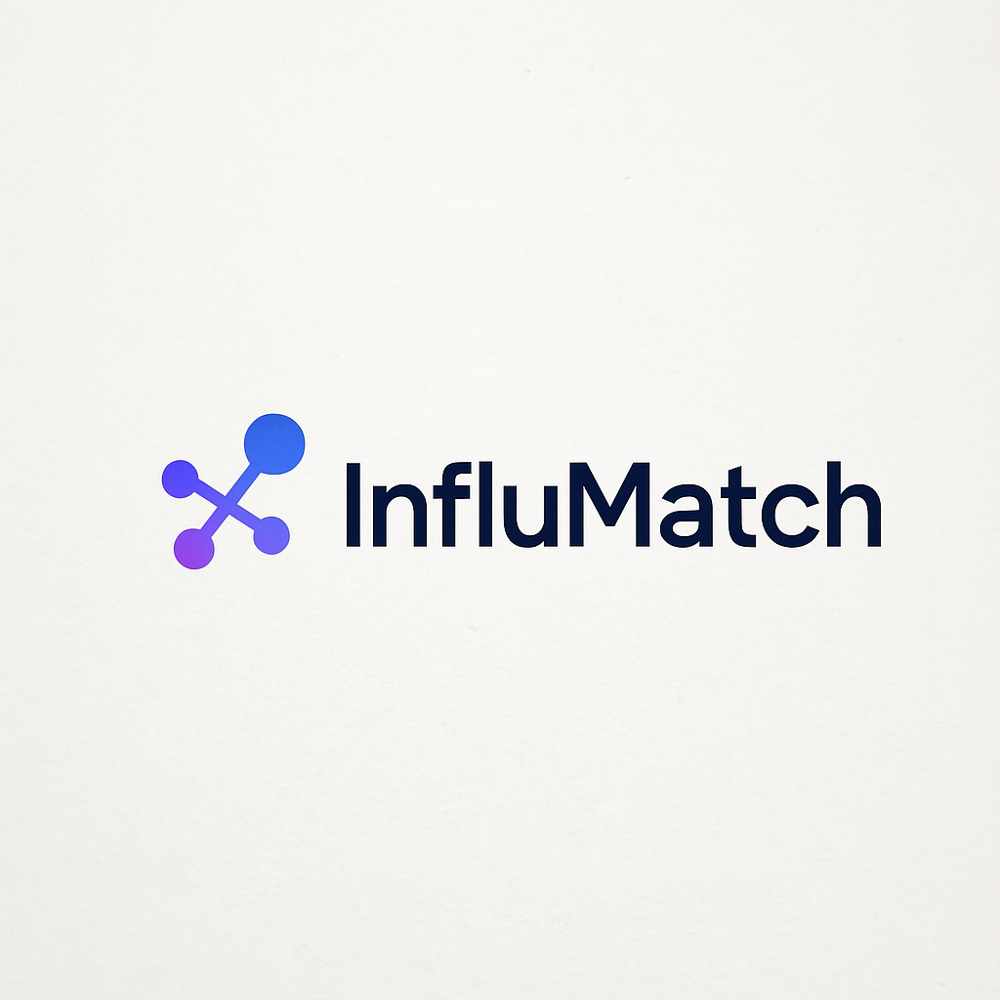

# **Capítulo I: Introducción**

## 1.1. Startup Profile
 En esta sección se presenta la descripción del startup y los perfiles de los miembros del equipo.

### 1.1.1. Descripción de la Startup
InfluMatch es una plataforma web innovadora que redefine la forma en que las marcas y los influencers colaboran. A través de un ecosistema digital basado en inteligencia artificial, Internet de las Cosas (IoT) y análisis en tiempo real, InfluMatch optimiza las estrategias de marketing de influencia para hacerlas más eficientes, transparentes y medibles.

Dirigida tanto a marcas de todos los tamaños (desde startups hasta grandes corporaciones) como a influencers de diversos niveles (micro, medianos, macro y celebridades), la plataforma permite gestionar colaboraciones desde un solo lugar, con herramientas inteligentes que automatizan la validación, contratación, monitoreo y evaluación del impacto de cada campaña.

Lo que hace única a InfluMatch es su capacidad de cerrar la brecha entre el mundo digital y el físico: mediante dispositivos IoT como sensores de tráfico en tiendas, cámaras o smart tags, se puede rastrear el impacto real de una campaña digital en el entorno offline. Esto permite a las marcas tomar decisiones basadas en datos concretos y evaluar el retorno de inversión de manera más precisa.

Además, la plataforma cuenta con funcionalidades diferenciales como búsqueda avanzada de perfiles, contratos digitales con firma electrónica, sistema de mensajería interna, reputación gamificada, y mecanismos de seguridad avanzados que previenen el fraude y fomentan relaciones confiables.

- **Misión:** Empoderar a marcas e influencers mediante una plataforma inteligente que fomente colaboraciones auténticas, éticas y sostenibles. Buscamos facilitar conexiones basadas en datos reales, donde ambas partes puedan crecer de forma transparente, midiendo resultados tangibles y generando valor mutuo a largo plazo.

- **Visión:** Ser la plataforma líder en la evolución del marketing de influencia, integrando lo digital con lo físico a través de tecnologías emergentes. Aspiramos a transformar la manera en que se construyen las campañas de marketing, convirtiéndonos en el estándar global para colaboraciones estratégicas entre marcas e influencers, impulsadas por datos, tecnología y confianza.

**Logotipo del servicio**

### 1.1.2. Perfiles de integrantes del equipo

|                                             **Integrantes**                                              |                                                                                                                                                                                            **Descripción del Perfil**                                                                                                                                                                                            |
| :------------------------------------------------------------------------------------------------------: | :--------------------------------------------------------------------------------------------------------------------------------------------------------------------------------------------------------------------------------------------------------------------------------------------------------------------------------------------------------------------------------------------------------------: |
| **Fabrizzio Pereira Vásquez(U202417468)**  | 
Me llamo Fabrizzio Pereira Vásquez, soy estudiante de Ingeniería de Software y actualmente curso el sexto ciclo. Me apasiona el desarrollo web, especialmente con tecnologías como React y disfruto  aprender creando proyectos prácticos. Me considero una persona dedicada, con muchas ganas de seguir mejorando y siempre dispuesto a ayudar a mis compañeros cuando lo necesiten.
 |
|                     **Sebastian Matias Escobar Palomino (U202125968)**                      |          
Me llamo Sebastian Matias Escobar Palomino  , soy estudiante de Ingeniería de Software, me propongo aportar activamente al trabajo en equipo, respetar los plazos de entrega y mantener una comunicación constante y clara con mis compañeros, utilizando mis conocimientos para cumplir con las responsabilidades del proyecto..
                                                                                                                                                                                                                                                                                                                                                                                                         |
|                     **Luis Sebastián Rubio Ortiz (U202310349)**                      | 
Me llamo Luis Sebastián Rubio ortiz, soy estudiante de Ingeniería de Software y actualmente estoy cursando el quinto ciclo. Considero que soy una persona responsable, me gusta aprender cosas nuevas constantemente y me gusta apoyar a mis compañeros con cualquier cosa que necesiten.
 |
|                     **Nombre Apellido 4 (UXXXXXXXXX)**                      |                                                                                                                                                                                                                                                                                                                                                                                                                  |
|                     **Nombre Apellido 5 (UXXXXXXXXX)**                      |                                                                                                                                                                                                                                                                                                                                                                                                                  |

## 1.2. Solution Profile

### 1.2.1. Antecedentes y problemática

En los últimos años, el marketing de influencers se ha consolidado como una de las estrategias más poderosas para alcanzar audiencias específicas en redes sociales. Sin embargo, a pesar de su crecimiento, muchas marcas enfrentan dificultades para medir el verdadero impacto de sus colaboraciones, identificar perfiles auténticos y asegurar relaciones que generen valor real y sostenible. Al mismo tiempo, influencers con contenido genuino y comunidades activas encuentran limitaciones para acceder a oportunidades transparentes y relevantes. Esto ha generado un entorno donde abundan las campañas poco efectivas, con métricas superficiales y escasa trazabilidad.

En este contexto, se hace necesario repensar la forma en que se gestionan las relaciones entre marcas e influencers, integrando herramientas tecnológicas que permitan validar datos, automatizar procesos y conectar el marketing digital con el mundo físico. Aquí es donde surge la oportunidad de crear una solución que no solo intermedie, sino que también aporte inteligencia, seguridad y medición objetiva a cada colaboración.

**What** 
**¿Cuál es el problema?**
El problema central es la falta de transparencia, autenticidad y medición real en el marketing de influencia. Muchas marcas invierten sin saber si su colaboración realmente tuvo un efecto concreto en las ventas o en la interacción física con su marca. Por otro lado, también hay fraude en métricas, como seguidores falsos o engagement inflado, lo que afecta la confianza en este tipo de campañas.

**When** 
**¿Cuándo sucede el problema?**
El problema sucede durante todas las etapas de una campaña: desde la búsqueda de influencers, validación de su alcance, ejecución de la campaña, hasta la medición de resultados. Especialmente se manifiesta cuando se requiere evaluar resultados tangibles fuera del entorno digital, como visitas a tiendas o escaneo de productos físicos.

**Where** 
**¿Dónde surge el problema?** 
Este problema es global, pero se acentúa en mercados emergentes donde aún no existen plataformas maduras que integren tecnologías de validación avanzada. Las campañas pueden ejecutarse digitalmente en redes sociales, pero el impacto esperado muchas veces debe reflejarse en puntos físicos de venta o interacción con el producto.

**Who** 
**¿Quiénes están involucrados? ¿Quién lo utilizará?** 
Los principales involucrados son las empresas o marcas (especialmente PYMEs, startups y agencias de marketing) que buscan impulsar sus productos mediante colaboraciones auténticas, y los influencers (desde micro hasta celebridades) que desean monetizar su contenido de forma profesional. Además, equipos de marketing digital y analistas de datos también utilizarán esta plataforma para gestionar y optimizar campañas.

**Why (Por qué)** 
**¿Cuál es la causa del problema?** 
La raíz del problema está en la desconexión entre el entorno digital y físico, la falta de herramientas que permitan medir el impacto real de una campaña, y la ausencia de filtros automáticos que validen datos antes de cerrar un acuerdo. Esto genera inversiones riesgosas y desconfianza en el ecosistema.

**¿Cuáles son las 2H?** 

**How (Cómo)** 
**¿Cómo se utilizará el producto?** 
**InfluMatch** se utilizará como una plataforma web con módulos que integran APIs de redes sociales para la validación automática de perfiles, herramientas de contratación y comunicación, y un sistema IoT que conecta campañas online con medición offline. El desarrollo se realizará combinando tecnologías web, machine learning, procesamiento de datos en tiempo real y hardware de sensores IoT para tiendas físicas o eventos.

**How much (Cuánto)** 
**¿Cuál es la magnitud del problema?** 
El impacto económico puede medirse en términos de eficiencia y retorno de inversión. Para las marcas, se traduce en campañas más rentables, segmentadas y basadas en resultados medibles. Para los influencers, en acceso a oportunidades legítimas y remuneradas. El modelo de negocio basado en comisiones, suscripciones y servicios avanzados garantiza la sostenibilidad y escalabilidad de la plataforma.

## 1.2.2. Lean UX Process

### 1.2.2.1. Lean UX Problem Statements

**Problem Statement**

Hoy en día, muchas marcas, startups y agencias utilizan el marketing de influencers para promocionar sus productos o servicios. Sin embargo, en la práctica, estas campañas no siempre logran el impacto esperado.

Uno de los principales problemas es que no existen herramientas adecuadas que permitan conectar de forma confiable a las marcas con los influencers correctos, verificar si los perfiles son auténticos, ni medir con claridad los resultados que generan las colaboraciones. Esto genera incertidumbre sobre si realmente la inversión funcionará o no.

A menudo, las marcas se basan en datos poco confiables, como la cantidad de seguidores o los "likes", sin poder comprobar si una campaña ayudó a aumentar las visitas, las ventas o el interés real por su producto, especialmente en espacios físicos como tiendas o eventos.

Al mismo tiempo, muchos influencers, sobre todo los que están creciendo, no tienen cómo demostrar el valor real de su comunidad ni acceder fácilmente a colaboraciones serias y transparentes. Esto los limita y los deja fuera de oportunidades importantes.

Como resultado, existe una gran brecha entre lo que se hace actualmente y lo que se espera lograr. Por un lado, el proceso de encontrar y contratar influencers es lento, poco seguro y muchas veces ineficiente. Por otro lado, las campañas no siempre tienen seguimiento ni herramientas que ayuden a entender su verdadero impacto. Esta situación afecta directamente a las marcas, que pierden dinero en campañas poco efectivas, y a los influencers, que no consiguen crecer profesionalmente.

Además, si este problema continúa sin resolverse, el marketing de influencers se volverá menos confiable, menos rentable y más riesgoso para todos los involucrados.

Resolver este problema es clave para mejorar la forma en que marcas e influencers trabajan juntos. Si se logra contar con una plataforma que conecte a ambos de manera segura, transparente y basada en datos reales, se podrá crear un ecosistema más justo, eficiente y con mejores resultados para todos.

### 1.2.2.2. Lean UX Assumptions

**Business Assumptions**

- Creemos que nuestros usuarios necesitan una forma más confiable, rápida y basada en datos para conectar marcas con influencers que realmente generen impacto en sus campañas.
- Estas necesidades pueden satisfacerse con el desarrollo de una plataforma web que automatice la búsqueda, validación, gestión y medición de resultados en las colaboraciones de marketing de influencia.
- Nuestros primeros clientes serán pequeñas y medianas empresas, startups en crecimiento y agencias de marketing digital que desean lanzar campañas efectivas con creadores de contenido con audiencias reales.
- El valor más importante que un cliente quiere de nuestra solución es poder identificar influencers legítimos, automatizar los acuerdos y comprobar con datos concretos el impacto real de sus campañas, tanto en el entorno digital como en el físico.
- Los clientes también obtendrán beneficios adicionales como informes detallados de engagement, reputación de los influencers, trazabilidad en campañas y análisis de datos recogidos por dispositivos IoT.
- Vamos a adquirir la mayoría de nuestros clientes mediante publicidad digital, alianzas con agencias de marketing, estrategias inbound y participación en ferias o eventos de tecnología publicitaria y startups.
- Obtendremos ingresos principalmente mediante un modelo de comisión por campaña, complementado por suscripciones premium que otorguen acceso a funciones avanzadas y visibilidad destacada dentro de la plataforma.
- Nuestra competencia directa incluye plataformas como Heepsy, CreatorIQ y otras soluciones parciales enfocadas en la gestión de influencers, pero sin conexión real con el impacto físico ni validación a través de IoT.
- Nuestra ventaja competitiva es que **InfluMatch** no solo automatiza las colaboraciones, sino que las conecta con el mundo físico mediante tecnologías IoT, permitiendo una medición real del impacto de una campaña, algo que actualmente no ofrecen otras plataformas.

- El mayor riesgo es que las marcas no estén dispuestas a adoptar nuevas herramientas tecnológicas si ya tienen métodos tradicionales o relaciones informales con influencers.
- También existe el riesgo de baja adopción por parte de influencers que desconfíen de nuevos sistemas de validación.
- Este riesgo se abordará diseñando una plataforma con una interfaz amigable, procesos claros, confianza en la privacidad de los datos y mostrando casos de éxito que evidencien el valor generado para ambas partes.

**User Assumptions**

**¿Quién es el usuario?**

Nuestros usuarios son responsables de marketing y comunicación en empresas, startups y agencias que desean lanzar campañas con creadores de contenido. También lo son los influencers (micro, medianos y macro) que buscan oportunidades legítimas para colaborar con marcas alineadas a su estilo y comunidad.

**¿Qué problemas tiene nuestro usuario que el producto debe resolver?**

Las marcas enfrentan dificultad para encontrar perfiles confiables, validar métricas reales y medir el impacto fuera de las redes. Los influencers, por su parte, no siempre acceden a colaboraciones justas ni tienen herramientas para demostrar el valor de su comunidad.

**¿Qué características son importantes?**

Los usuarios valoran funcionalidades como:

- Búsqueda avanzada de influencers
- Verificación automática de perfiles mediante APIs
- Gestión de contratos digitales
- Comunicación directa
- Reportes de rendimiento
- Métricas reales generadas por tecnologías IoT

**¿Dónde encaja el producto en su trabajo o vida diaria?**

La plataforma será una herramienta esencial en el flujo de trabajo de campañas digitales. Permitirá planificar, ejecutar y medir colaboraciones sin salir del entorno digital, agilizando tareas que antes se hacían de forma separada o manual.

**¿Cuándo y cómo se usará el producto?**

Se usará al momento de planificar campañas, seleccionar perfiles, enviar propuestas, firmar contratos, lanzar publicaciones, hacer seguimiento de resultados y obtener métricas de rendimiento en tiempo real.

**¿Cómo debe verse y comportarse el producto?**

Debe tener una interfaz moderna, intuitiva y profesional. La experiencia debe transmitir confianza, facilidad de uso y eficiencia. El sistema debe ser seguro, proteger la información de ambas partes y permitir personalización según el tipo de usuario (marca o influencer).

**Future Assumptions** 

- **Creemos que** la plataforma debe contar con una búsqueda avanzada y filtros inteligentes.
- **Creemos que** debe ofrecer verificación automática de perfiles con APIs de redes sociales.
- **Creemos que** debe incluir herramientas para redactar, firmar y rastrear acuerdos digitales.
- **Creemos que** debe integrar sensores IoT para medición del impacto físico y reportes visuales.
- **Creemos que** debe tener un sistema de reputación y badges basado en desempeño.
- **Creemos que** debe incorporar paneles visuales para seguimiento de KPIs y métricas clave.

---

### 1.2.2.3. Lean UX Hypothesis Statements

#### Hypothesis Statement 01

Creemos que los responsables de marketing en startups, PYMEs y agencias estarán dispuestos a adoptar la plataforma InfluMatch para encontrar y validar influencers de forma automatizada y basada en datos reales.

Sabremos que hemos tenido éxito

Cuando al menos el 70% de los usuarios registrados completen el proceso de búsqueda y selección de influencers utilizando los filtros y validaciones automáticas durante el primer mes de uso.

#### Hypothesis Statement 02

Creemos que los influencers (especialmente micro y medianos) estarán interesados en registrarse y verificar sus perfiles dentro de InfluMatch para acceder a oportunidades legítimas de colaboración con marcas.

Sabremos que hemos tenido éxito

Cuando al menos el 60% de los influencers registrados conecten sus redes sociales para validación automática y completen su perfil en los primeros 15 días tras el registro.

#### Hypothesis Statement 03

Creemos que la conexión entre el entorno digital y físico mediante tecnologías como sensores IoT o códigos QR permitirá a las marcas medir el impacto real de sus campañas y justificar mejor su inversión.

Sabremos que hemos tenido éxito

Cuando al menos el 30% de las campañas activas integren alguna forma de medición física y el 40% de esas campañas generen reportes consultados por los responsables de marketing.

#### Hypothesis Statement 04

Creemos que la automatización de acuerdos y propuestas mediante contratos digitales con seguimiento reducirá los tiempos y errores en la gestión de colaboraciones entre marcas e influencers.

Sabremos que hemos tenido éxito

Cuando al menos el 80% de las campañas gestionadas en la plataforma utilicen contratos digitales automatizados y se observe una reducción del 40% en el tiempo promedio de cierre de acuerdos en comparación con métodos tradicionales.

#### 1.2.2.4. Lean UX Canvas

  

Este Lean UX Canvas de **InfluMatch** ilustra de forma concisa nuestras hipótesis, las necesidades clave de marcas e influencers, las soluciones propuestas y las métricas esenciales para iterar rápidamente y validar la plataforma de manera colaborativa.

**Enlace para acceder al Canvas:**  
https://miro.com/welcomeonboard/WTJ1T2EwOVdxYndLMGhZb2tIU2I0ckNReWJ5WS8yRlU2ZjBWMDQyQWlHK085MVpuTjl0UmpJZXJkcXp5azNzOWZpRzQ3UXRFdjFSSU9zcUxObjF3R21LNXRvSTA0dU1mZktwcFNxbWdXcFF0TU8vWUhCZ2xuWWc5ODBPYzVscHBQdGo1ZEV3bUdPQWRZUHQzSGl6V2NBPT0hdjE=?share_link_id=286206219531  

## 1.3. Segmentos objetivos.
**Marcas y agencias de marketing digital**   
Este segmento incluye startups, PYMEs, agencias de marketing y grandes corporaciones que destinan presupuestos específicos a colaboraciones con influencers. En 2023, el valor global del mercado de marketing de influencers alcanzó los USD 21,1 mil millones, más del triple que en 2019 (Statista Research Department, 2024). En América Latina, el gasto en publicidad de influencers superó los USD 1,12 mil millones en 2024, con un crecimiento del 12,6 % respecto al año anterior (Statista, 2024). El 86 % de los mercadólogos estadounidenses planea asociarse con influencers en 2025, reflejando la prioridad de este canal en la estrategia digital (Sprout Social, 2024). Además, el 80 % de las empresas de EE. UU. ya utiliza influencers en sus campañas, con un ROI medio del 160 %, lo que demuestra la madurez de estas tácticas entre marcas establecidas (Financial Times, 2024). Se espera que el gasto en EE. UU. alcance los USD 9,29 mil millones en 2025, con un crecimiento interanual del 14,2 % (eMarketer, 2024). Por su parte, el 72 % de las agencias de marketing en Latinoamérica ya emplea al menos dos plataformas dedicadas a la gestión de influencers (eMarketer, 2024).

**Influencers**  
Este segmento agrupa a los creadores de contenido en redes sociales según su tamaño de audiencia y capacidad de engagement. En 2023, los “nano‑influencers” (1 000–10 000 seguidores) obtuvieron la tasa de interacción más alta en Instagram, con un 2,19 % de engagement (Statista Research Department, 2024). En contraste, los influencers de rango medio (50 000–500 000 seguidores) registraron la tasa más baja, destacando la importancia de segmentar adecuadamente las campañas (Statista Research Department, 2024). Una buena tasa de engagement en Instagram se sitúa entre el 2 % y el 3 %, por lo que todo valor superior al 3 % se considera alto (HypeAuditor, 2025). Solo el 0,2 % de los influencers en América Latina supera el millón de seguidores, lo que subraya el nicho y la relevancia de los micro‑ y nano‑influencers en la región (Statista Research Department, 2023).
