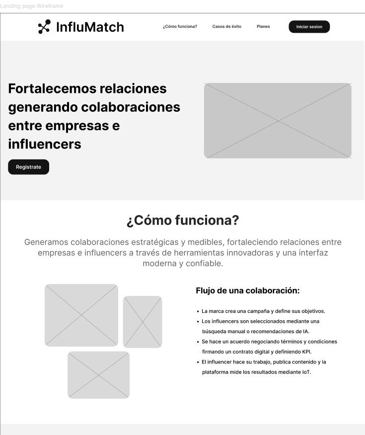
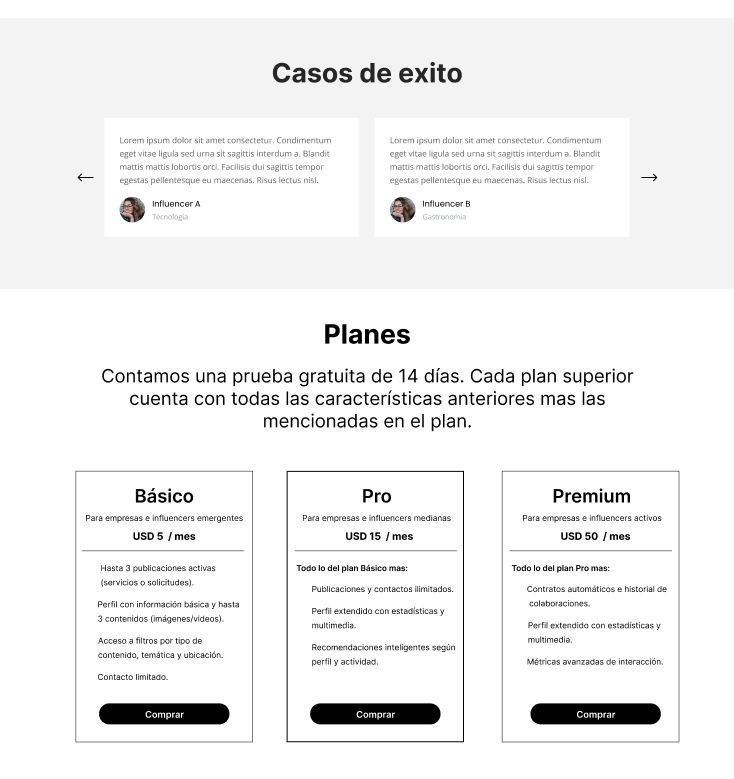
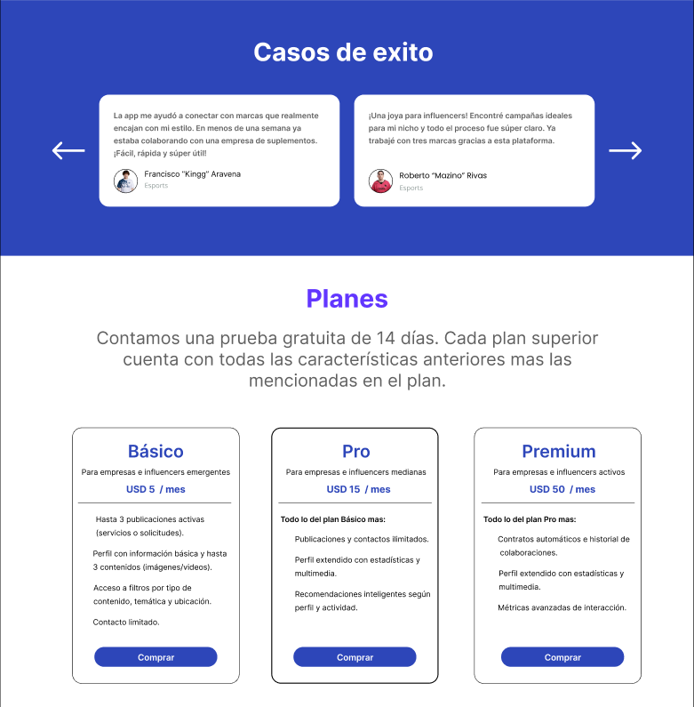
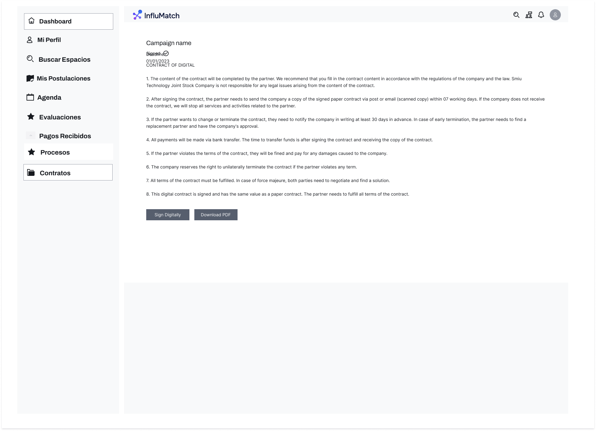
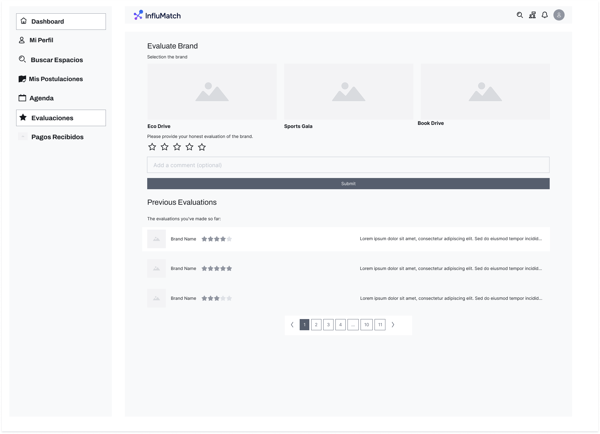
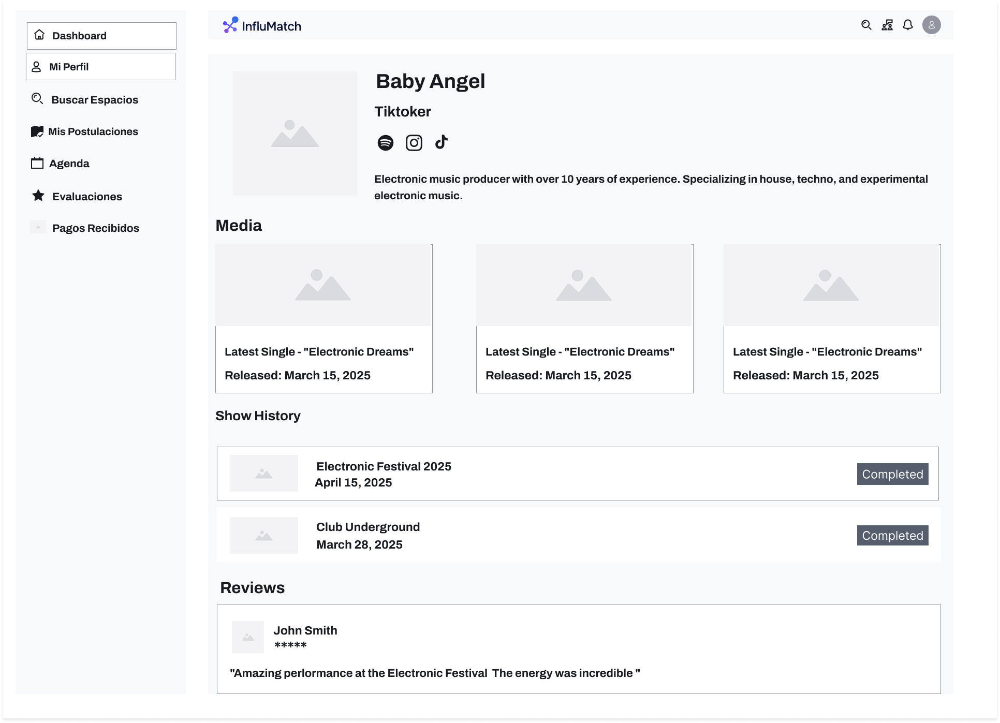
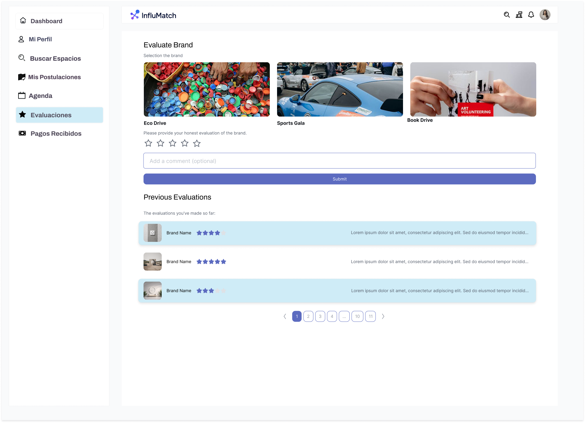
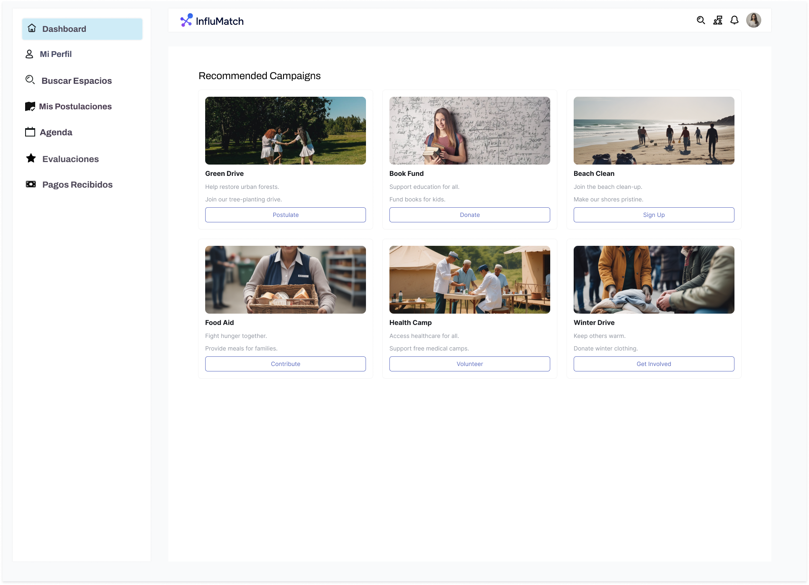
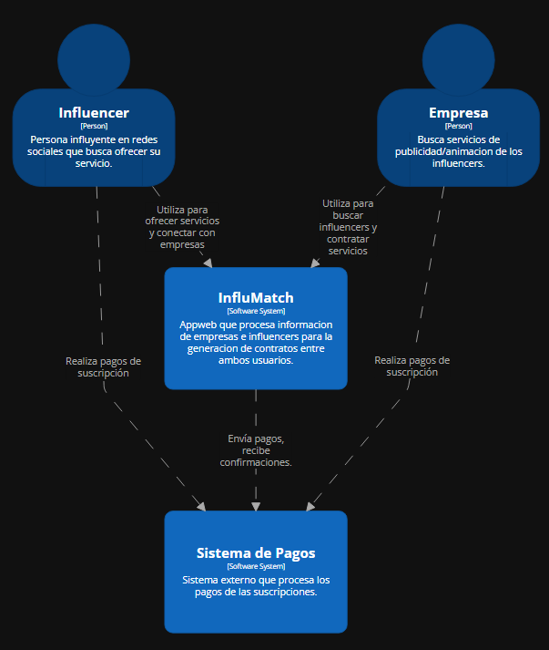
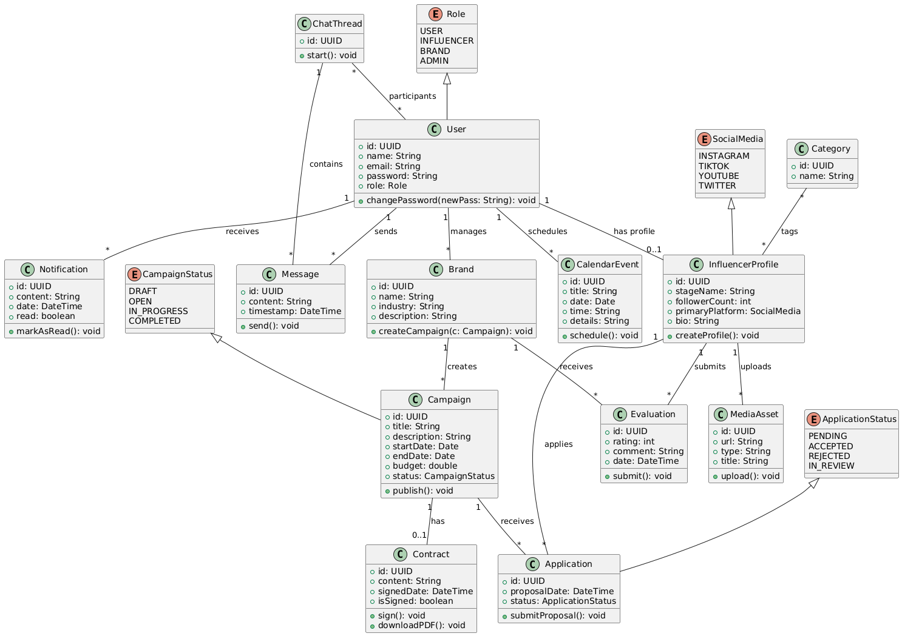

# Capítulo IV: Product Design

## 4.1. Style Guidelines

### 4.1.1. General Style Guidelines

**Branding**

**Brand Overview:**  
El producto digital lleva el nombre de **InfluMatch**, una plataforma web que conecta marcas con influencers mediante el uso de **inteligencia artificial**, **IoT** y **análisis de datos en tiempo real**. El enfoque está en generar colaboraciones estratégicas y medibles, fortaleciendo relaciones entre empresas e influencers a través de herramientas innovadoras y una interfaz moderna y confiable. InfluMatch se posiciona como una solución tecnológica integral que rompe la brecha entre el mundo físico y digital.

**Misión:**  
Revolucionar la forma en que marcas e influencers se conectan, ofreciendo herramientas basadas en datos reales que garanticen colaboraciones auténticas, efectivas y sostenibles.

**Visión:**  
Convertirse en la plataforma líder en Latinoamérica en conectar influencers con marcas a través de tecnología de vanguardia, contribuyendo a un marketing ético, medible y transparente.

**Brand Name:**
El nombre **InfluMatch** surge de la unión de los conceptos *influencer* y *match*, reflejando la esencia del producto: conectar a creadores de contenido con marcas mediante tecnología de emparejamiento inteligente. La marca destaca por su enfoque tecnológico, su lenguaje accesible y su visión colaborativa, posicionándose como una herramienta moderna, confiable y fácil de usar para ambos segmentos.

**Logotipo:**

El logotipo oficial de InfluMatch está compuesto por un isotipo con nodos conectados entre sí —representando redes, datos e interacción social— acompañado de una tipografía sans-serif clara y profesional. La paleta de colores utiliza un **degradado azul-violeta**, que transmite tecnología, creatividad, confianza y modernidad. Su diseño minimalista lo hace fácilmente adaptable a redes sociales, apps, sitios web y presentaciones corporativas.

**Colores**

La identidad visual de **InfluMatch** está diseñada para comunicar tecnología, confianza y creatividad, con una paleta moderna y adaptable a diferentes canales digitales.

**Colores**

**Colores Principales**

* **Azul Confianza** (`#2D46B9`)  
  Transmite autoridad, profesionalismo y tecnología. Ideal para botones primarios y elementos de marca.

* **Púrpura Digital** (`#6236FF`)  
  Representa innovación, creatividad y un enfoque disruptivo. Útil para destacar acciones clave y títulos importantes.

**Colores Secundarios**
 
* **Turquesa Corporativo** (`#056AE1`)  
  Refrescante y moderno, apropiado para gráficos, íconos y elementos visuales dinámicos.

* **Celeste Claro** (`#A6D4F1`)  
  Suave y calmado, utilizado como fondo o en componentes UI menos jerárquicos.

* **Índigo Profesional** (`#FF866D`)  
  Un acento cálido que rompe la frialdad tecnológica, usado para resaltar alertas, KPIs o detalles atractivos.

**Colores para Texto**

* **Azul Confianza** (`#2D46B9`) – Enlaces, títulos secundarios.  
* **Púrpura Digital** (`#6236FF`) – Métricas, énfasis visual.  
* **Negro** (`#000000`) – Texto principal en fondos claros.  
* **Blanco** (`#FFFFFF`) – Texto sobre fondos oscuros o botones primarios.

Esta combinación de colores permite reflejar una plataforma confiable y moderna, donde la tecnología y el diseño convergen para crear experiencias efectivas, elegantes y funcionales.
+
Esta paleta permite expresar una identidad moderna, profesional y tecnológica, adaptable a múltiples canales digitales y dispositivos.

**Tipografía**

Se ha seleccionado la fuente **Inter**, una sans-serif moderna, neutra y de alta legibilidad, ampliamente usada en interfaces digitales por su versatilidad.

Su aplicación está segmentada en jerarquías para mantener una correcta estructura informativa en la landing page.

**Estilos utilizados**

- *Inter Bold* para títulos principales.
- *Inter Semibold* para subtítulos y encabezados medios.
- *Inter Regular* para textos de cuerpo y etiquetas.

**Especificación por jerarquía**

|      Jerarquía      | Tamaño | Altura de línea | Peso     |
| :-----------------: | :----: | :-------------: | -------- |
|      Heading 1      | 48 px  |      60 px      | Bold     |
|      Heading 2      | 32 px  |      42 px      | Semibold |
|      Heading 3      | 20 px  |      30 px      | Medium   |
|      Heading 4      | 16 px  |      24 px      | Medium   |
|   Large Text Bold   | 20 px  |      30 px      | Bold     |
| Medium Text Regular | 18 px  |      28 px      | Regular  |
| Normal Text Regular | 16 px  |      24 px      | Regular  |
| Small Text Regular  | 14 px  |      20 px      | Regular  |

Esta jerarquía tipográfica asegura una experiencia visual clara y accesible, ideal para destacar tanto la funcionalidad como la estética de la plataforma InfluMatch.

**Spacing y Layout**

Se adopta un sistema de espaciado modular basado en múltiplos de **8 px**, lo que permite un diseño limpio, alineado y escalable.

* **Espaciado entre secciones:** 32 px
* **Padding en contenedores:** 24 px
* **Separación entre elementos (inputs, botones):** 16 px
* **Márgenes internos en tarjetas/componentes:** 12 px

**Tono de comunicación**

La voz de la marca influye directamente en la experiencia de usuario y la percepción de la plataforma:

* **Formalidad:** Profesional y accesible.
* **Tono emocional:** Entusiasta, pero sobrio.
* **Lenguaje:** Claro, directo, con vocabulario tecnológico sin excesiva jerga técnica.
* **Relación con el usuario:** Respetuosa, confiable y colaborativa.

### 4.1.2. Web Style Guidelines

El enfoque de **InfluMatch** para la aplicación web se basa en la claridad, tecnología y dinamismo, alineado con su objetivo de conectar marcas con influencers a través de una experiencia intuitiva, profesional y visualmente impactante. La interfaz está diseñada para adaptarse de manera responsiva a distintos dispositivos, garantizando accesibilidad y navegación fluida.

**Tarjetas**

Las tarjetas representan los perfiles de influencers disponibles para colaboración. Cada tarjeta contiene:
- Foto de perfil del influencer.
- Nombre y nicho de influencia.
- Extracto de su comunidad (seguidores, engagement).
- Botón de acción ("Ver perfil") que redirige a su detalle completo.

Estas tarjetas se presentan en una vista de grilla responsiva para explorar fácilmente las opciones disponibles desde cualquier dispositivo.

#### Imágenes
Las imágenes tienen una función clave dentro del diseño, priorizando representaciones claras del influencer y contenido visual que acompañe las campañas:
- **Imagen de perfil** para influencers y empresas.
- **Imagen de encabezado** en el perfil de cada influencer, que puede incluir fotos promocionales o contenido destacado.
- **Banners de campañas activas** visibles en el dashboard de empresas.

No se utilizan imágenes de fondo para evitar distracciones y mantener el foco en el contenido dinámico.

#### Botones
Los botones están diseñados para guiar al usuario en acciones clave:
- **Primarios (Azul Confianza):** iniciar contratación, enviar propuesta, contactar influencer.
- **Secundarios (Púrpura Digital):** ver detalles, compartir perfil, agregar a favoritos.
- **Acciones Críticas (Rojo):** cancelar colaboración, eliminar propuesta.

Todos los botones poseen texto legible, padding generoso y se ubican en la parte inferior derecha o en tarjetas según el flujo.}

**Vistas y Flujo General de Interacción**

  - **Exploración de Influencers:** Vista de múltiples tarjetas con filtros por red social, categoría, país, etc.
  - **Perfil de Influencer:** Página con imagen de portada, video de presentación, estadísticas, historial de campañas y botón para iniciar conversación.
  - **Chat Interno:** Ventana flotante o pantalla dedicada donde marcas e influencers intercambian mensajes, propuestas y archivos.
  - **Dashboard de Marca:** Vista consolidada con influencers contratados, campañas activas y métricas.
  - **Publicación de Requisitos:** Panel donde la empresa crea una "convocatoria" para buscar influencers según sus necesidades (tipo banner, review, unboxing, etc.).

**Pantallas Emergentes (Pop-ups)**
Se utilizan para confirmar acciones como envío de propuestas, aceptar colaboraciones, visualizar precios o condiciones. Incluyen:
- Título claro.
- Ícono representativo.
- Descripción resumida.
- Botones para confirmar o cancelar.

Oscurecen el fondo para centrar la atención en la decisión a tomar.

**Layout General y Responsive**
  - **Header fijo** con logo y navegación rápida.
  - **Sidebar colapsable** con menú de navegación.
  - **Grid responsivo** basado en 2 columnas para tarjetas y formularios.
  - **Diseño mobile-first**, con menús hamburguesa y componentes apilados.
  - **Espaciado basado en 8px** para mantener consistencia visual y legibilidad.

Este sistema garantiza una experiencia moderna, limpia y adaptada a las necesidades del ecosistema digital de InfluMatch.

## 4.2. Information Architecture
Dado que InfluMatch funciona como una plataforma central para la conexión entre marcas e influencers, es fundamental que su arquitectura de información permita una navegación clara, segmentada y adaptable tanto para empresas como para creadores de contenido. Cada flujo y contenido ha sido diseñado para que los usuarios puedan identificar fácilmente sus opciones, comprender su posición dentro del sistema y ejecutar tareas con la menor fricción posible. Tanto en la landing page como en la aplicación web, se ha priorizado una organización orientada al flujo natural de toma de decisiones de los usuarios.

Los perfiles se organizan de forma jerárquica para destacar a influencers verificados y populares. Las convocatorias publicadas por las marcas se estructuran de forma cronológica y etiquetada por categoría de campaña. El área de propuestas y chat permite una navegación secuencial que lleva de la visualización de una tarjeta, al perfil del influencer, al inicio de una conversación y eventualmente al cierre de un contrato. El dashboard muestra vistas matriciales de campañas, métricas e historiales para toma de decisiones estratégicas.

---

### 4.2.1. Organization Systems
La organización visual y lógica del contenido en InfluMatch se estructura mediante los siguientes sistemas según el contexto:

**Organización Jerárquica:** 
Se aplica en las siguientes secciones:

  - **Landing Page:** Prioriza secciones de valor como "¿Cómo funciona?", "Casos de Éxito" y llamados a la acción (CTA) visibles desde el primer scroll.
  - **Perfiles de Influencers:** Resaltan nombre, estadísticas principales, video de presentación y reputación, seguidos de métricas complementarias y detalles históricos.

**Organización Secuencial (Step-by-Step):**
Utilizada principalmente en los flujos de colaboración:

  - **Exploración y Contratación:** Desde la búsqueda de influencers (vista de tarjetas) → redirección al perfil completo → botón para iniciar conversación → chat en tiempo real → acuerdos → pago → reseña.
  - **Publicación de Convocatorias:** Empresas siguen un formulario paso a paso para definir objetivos, públicos, presupuesto y condiciones.

  **Organización Matricial:**
  Se usa en el dashboard principal para ambos tipos de usuarios:
  - Las **empresas** visualizan campañas activas, en revisión y cerradas en tarjetas modulares junto a estadísticas comparativas.
  - Los **influencers** acceden desde el dashboard a solicitudes nuevas, campañas en progreso, historial y recompensas, todos agrupados como bloques informativos.

**Categorización del Contenido:**

  - **Por Tópicos:**
    - Se aplica en la exploración de campañas o búsquedas por categorías como "Moda", "Tecnología", "Alimentos", "Viajes", etc.

  - **Por Audiencia:**
    - Usuarios nuevos (tanto marcas como influencers) son guiados en su primer acceso con contenido personalizado.
    - Las marcas verán como pantalla principal un acceso rápido a convocatorias, mensajes y métricas.
    - Los influencers accederán directamente a su perfil, oportunidades disponibles y su bandeja de entrada.

  - **Cronológica:**
    - Historial de campañas y mensajes se ordena del más reciente al más antiguo, facilitando el seguimiento de actividades.

  - **Alfabética:**
    - Aplicada en el buscador de influencers, permitiendo ordenarlos por nombre o username en redes.

Esta arquitectura de organización garantiza que tanto empresas como influencers encuentren y gestionen la información de forma efectiva, sin perder de vista su objetivo principal: establecer colaboraciones auténticas, rápidas y transparentes.

### 4.2.2. Labeling Systems

Para asegurar claridad y simplicidad en la navegación, InfluMatch implementa un sistema de etiquetado consistente, breve y contextualizado. Las etiquetas están diseñadas para ser intuitivas y reflejar con precisión el contenido que representan, evitando ambigüedades y redundancias.

**En la aplicación se incluyen las siguientes etiquetas principales:**
- **Dashboard:** Inicio personalizado para cada tipo de usuario.
- **Explorar Influencers:** Lista filtrable de perfiles disponibles.
- **Mis Campañas:** Sección que agrupa campañas activas, en revisión y finalizadas.
- **Convocatorias:** Publicaciones creadas por marcas en búsqueda de colaboraciones.
- **Perfil:** Área de visualización y edición de información personal.
- **Chat:** Comunicación directa entre marcas e influencers.
- **Notificaciones:** Alertas sobre nuevas interacciones o actualizaciones.

**Metadatos comunes:**
- `description`: Resumen breve del propósito de cada sección.
- `keywords`: influencer, campaña, colaboración, marca, contrato, propuesta.
- `author`: Nombre de la empresa o influencer correspondiente.

Estas etiquetas también se reflejan en las tarjetas, formularios, menú principal, breadcrumbs y URLs, garantizando consistencia en la experiencia del usuario.

### 4.2.3. SEO Tags and Meta Tags

FUTURE APLICATION

### 4.2.4. Searching Systems

Dado el volumen de perfiles y campañas en InfluMatch, se incorpora un sistema de búsqueda con múltiples niveles de filtrado para facilitar el acceso a la información deseada sin pérdida de tiempo.

**Opciones de búsqueda disponibles:**
- **Por nombre o username** del influencer o empresa.
- **Por red social activa** (Instagram, TikTok, YouTube).
- **Por categoría de influencia** (moda, fitness, gaming, etc.).
- **Por tipo de campaña publicada** (historia, post, reseña, sorteo).

**Filtros adicionales:**
- Rango de seguidores.
- Nivel de engagement.
- País o idioma del influencer.
- Rango de fechas de campañas anteriores.

**Visualización posterior a la búsqueda:**
- Resultados presentados en tarjetas resumidas con imagen de perfil, datos clave y botón para ver más detalles.
- Posibilidad de guardar búsquedas frecuentes o marcar influencers como favoritos.

### 4.2.5. Navigation Systems

La navegación de InfluMatch está centrada en la experiencia fluida del usuario, tanto en la Landing Page como en la plataforma interna. Se utilizan menús claros, enlaces visibles y rutas de interacción optimizadas para que cada acción sea intuitiva.

**Landing Page:**
- **Menú superior sticky:** Permite acceder rápidamente a secciones como "¿Cómo funciona?", "Casos de éxito", "Planes" y "Iniciar sesión".
- **Scroll guiado:** A través de llamadas a la acción distribuidas en bloques temáticos.
- **Botones CTA:** Redireccionan al registro, solicitud de demo o exploración de perfiles.

**Aplicación Web:**
- **Menú lateral (sidebar):** Incluye accesos a secciones principales como Dashboard, Explorar, Campañas, Perfil y Chat.
- **Barra superior:** Muestra íconos de notificaciones, ayuda y perfil de usuario.
- **Breadcrumbs:** Presentes en vistas secundarias para mantener contexto.
- **Componentes interactivos:** Botones, tarjetas, chips y enlaces mantienen consistencia en color y comportamiento.

El sistema permite que tanto empresas como influencers recorran la aplicación sin distracciones, cumpliendo con sus objetivos con la menor cantidad de clics posibles.

## 4.3. Landing Page UI Design

### 4.3.1. Landing Page Wireframe

El siguiente wireframe pertenece a la vista desktop web browser de nuestro landing page. El cual contiene informacion importante como el objetivo principal del producto y el flujo de funcionamiento, el cual presenta a los usuarios la funcionalidad principal que es generar contratos entre influencers y empresas. Adicionalmente, el header contiene accesos directos a diferentes secciones como "Casos de exito" que serian reviews de los usuarios que utilizaron el producto y obtuvieron resultados positivos. Por ultimo, se cuenta con una seccion de "Planes" que muestra cada tipo de plan disponile con sus respectivas funcionalidades, y la seccion de "Contacto" que sirve para que usuarios o personas interesadas obtengan informacion adicional o resuelvan sus dudas.

### 4.3.2. Landing Page Mock-up

En base al Wireframe del landing page, que sirvio para determinar la organizacion de cada elemento, se elaboro el mock-up para ese mismo. Este tiene el mismo contenido y organizacion ademas de aplicar la paleta de colores primarios y secundarios, asi como la tipografia especificada anteriormente.

## 4.4. Diseño UX/UI de Aplicaciones Web

Enlace para acceder al  los Wireframes en Figma: [InfluMatch – Mockups & Wireframes](https://www.figma.com/design/o8mqq96SoWiUWDlFJZYB8T/InfluMatch---Mockups-Wireframes?node-id=0-1&p=f)

### 4.4.1. Wireframes de Aplicaciones Web

**Inicio de sesión**  
La sección de inicio de sesión presenta un formulario centrado en la pantalla con un fondo claro y campos para **correo electrónico** y **contraseña**, acompañados de iconos intuitivos. Incluye validación en tiempo real para formato de email y fuerza de contraseña, mensajes de error debajo de los inputs, un enlace para **recuperar contraseña** en caso de olvido y un botón principal “Iniciar sesión” que destaca en un color sólido. Bajo el botón aparece un texto que invita a **crear cuenta** si el usuario aún no está registrado. El diseño mantiene suficiente espacio entre elementos, tipografía legible y un estilo minimalista que facilita la accesibilidad y la claridad.  

**Agenda**  
La sección de **Agenda** muestra un calendario mensual con navegación mediante flechas izquierda/derecha y un botón “Hoy” para volver a la fecha actual. Ofrece alternancia entre vista **Mensual** y **Semanal** para adaptar la visualización a distintos niveles de detalle. Cada día aparece como una casilla que, al hacer hover o clic, despliega tarjetas con eventos como reuniones con marcas, publicaciones programadas, entregas de contenido y revisiones de proyectos. Un botón flotante “+” permite agregar rápidamente nuevos eventos, y al pie de cada tarjeta queda visible la hora y un resumen. A la izquierda, una barra lateral fija da acceso a todas las secciones principales de la aplicación.  

**Chats**  
En **Chats** el usuario encuentra en la zona superior un carrusel horizontal con **tarjetas de marcas** (logo, nombre y snippet del último mensaje) que permiten cambiar de conversación rápidamente. Bajo este carrusel, cada ventana de chat muestra mensajes entrantes y salientes como burbujas, con timestamps discretos y la capacidad de adjuntar archivos (PDF, imágenes) que aparecen con su propio placeholder y tamaño. A la derecha de cada burbuja puede haber acciones contextuales (descargar, ver detalles). La parte inferior incluye un campo de texto expansible para redactar nuevos mensajes, botones para adjuntar imágenes o documentos y un indicador de estado de envío.  

**Procesos**  
La sección **Procesos** comienza con cuatro **tarjetas de métricas** que muestran el total de solicitudes, cuántas han sido aceptadas, cuántas están pendientes y cuántas rechazadas. Debajo, hay controles de filtro y orden (por estado, fecha de postulación, más recientes) y botones para alternar entre **vista lista** y **vista tarjetas**. El listado de postulaciones incluye para cada ítem un thumbnail de campaña, título y marca, fecha de postulación, una etiqueta de estado con color distintivo y un botón “Ver detalles” que abre un modal o despliega información ampliada. La paginación se sitúa al final, permitiendo navegar fácilmente entre páginas.  

**Contratos**  
En **Contratos** se presenta el nombre de la campaña y la fecha de emisión, seguido del encabezado “CONTRACT OF DIGITAL” y un bloque numerado con todos los términos y condiciones del acuerdo. El texto está organizado en párrafos claros con interlineado adecuado para facilitar la lectura. Al final del contenido, dos botones resaltados permiten al usuario **firmar digitalmente** con un clic o **descargar el PDF** completo. El diseño garantiza que el contrato sea totalmente navegable y compatible con pantallas grandes, manteniendo la barra lateral de navegación siempre accesible.  

**Evaluaciones**  
La pantalla de **Evaluaciones** invita al usuario a elegir una marca de entre varias **tarjetas** presentadas en fila (imagen, nombre). Bajo cada tarjeta, aparece un control de **5 estrellas** que destaca al pasar el cursor, seguido de un campo de texto opcional para comentarios adicionales. Un botón **Submit** en la parte inferior envía la evaluación. Más abajo, la sección **Previous Evaluations** lista las valoraciones ya realizadas con miniaturas de marca, nombre, estrellas rellenadas y un extracto del comentario, todo en una vista paginada que facilita revisar el historial de feedback.  

**Mi Perfil**  
En **Mi Perfil** se muestra un avatar grande y editable, el nombre de usuario en negrita, el rol o descriptor (por ejemplo, “Tiktoker”) y una fila de iconos de redes sociales vinculadas. Debajo, aparece una breve **biografía** con datos destacados. La sección **Media** despliega una cuadrícula de tarjetas con portadas de contenido (título, fecha de lanzamiento). Luego, **Show History** lista eventos pasados con fechas y un badge “Completed”. Finalmente, **Reviews** muestra reseñas de terceros con su nombre, calificación por estrellas y texto del comentario, todo ello en un layout limpio y organizado.  

**Dashboard**  
La sección de **Campañas recomendadas** presenta una **rejilla de seis tarjetas**, cada una con placeholder de imagen, el título de la campaña en negrita y una breve descripción de dos líneas. Debajo de cada descripción se sitúa un botón de acción contextual (por ejemplo, “Postulate”, “Donate”, “Volunteer”), con un estilo outline que al pasar el cursor se rellena y cambia de color, invitando al usuario a involucrarse. El espacio entre tarjetas y los márgenes aseguran una lectura cómoda en pantallas de escritorio.  

### 4.4.2. Web Applications Wireflow Diagrams

## 4.4. Diseño UX/UI de Aplicaciones Web

Enlace para acceder al  los Mockups en Figma: [InfluMatch – Mockups & Wireframes](https://www.figma.com/design/o8mqq96SoWiUWDlFJZYB8T/InfluMatch---Mockups-Wireframes?node-id=0-1&p=f)

### 4.4.1. Mockups de Aplicaciones Web

**Inicio de sesión**  
La sección de inicio de sesión presenta un formulario centrado en la pantalla con un fondo claro y campos para **correo electrónico** y **contraseña**, acompañados de iconos intuitivos. Incluye validación en tiempo real para formato de email y fuerza de contraseña, mensajes de error debajo de los inputs, un enlace para **recuperar contraseña** en caso de olvido y un botón principal “Iniciar sesión” que destaca en un color sólido. Bajo el botón aparece un texto que invita a **crear cuenta** si el usuario aún no está registrado. El diseño mantiene suficiente espacio entre elementos, tipografía legible y un estilo minimalista que facilita la accesibilidad y la claridad.  

**Agenda**  
La sección de **Agenda** muestra un calendario mensual con navegación mediante flechas izquierda/derecha y un botón “Hoy” para volver a la fecha actual. Ofrece alternancia entre vista **Mensual** y **Semanal** para adaptar la visualización a distintos niveles de detalle. Cada día aparece como una casilla que, al hacer hover o clic, despliega tarjetas con eventos como reuniones con marcas, publicaciones programadas, entregas de contenido y revisiones de proyectos. Un botón flotante “+” permite agregar rápidamente nuevos eventos, y al pie de cada tarjeta queda visible la hora y un resumen. A la izquierda, una barra lateral fija da acceso a todas las secciones principales de la aplicación.  

**Chats**  
En **Chats** el usuario encuentra en la zona superior un carrusel horizontal con **tarjetas de marcas** (logo, nombre y snippet del último mensaje) que permiten cambiar de conversación rápidamente. Bajo este carrusel, cada ventana de chat muestra mensajes entrantes y salientes como burbujas, con timestamps discretos y la capacidad de adjuntar archivos (PDF, imágenes) que aparecen con su propio placeholder y tamaño. A la derecha de cada burbuja puede haber acciones contextuales (descargar, ver detalles). La parte inferior incluye un campo de texto expansible para redactar nuevos mensajes, botones para adjuntar imágenes o documentos y un indicador de estado de envío.  

**Procesos**  
La sección **Procesos** comienza con cuatro **tarjetas de métricas** que muestran el total de solicitudes, cuántas han sido aceptadas, cuántas están pendientes y cuántas rechazadas. Debajo, hay controles de filtro y orden (por estado, fecha de postulación, más recientes) y botones para alternar entre **vista lista** y **vista tarjetas**. El listado de postulaciones incluye para cada ítem un thumbnail de campaña, título y marca, fecha de postulación, una etiqueta de estado con color distintivo y un botón “Ver detalles” que abre un modal o despliega información ampliada. La paginación se sitúa al final, permitiendo navegar fácilmente entre páginas.  

**Contratos**  
En **Contratos** se presenta el nombre de la campaña y la fecha de emisión, seguido del encabezado “CONTRACT OF DIGITAL” y un bloque numerado con todos los términos y condiciones del acuerdo. El texto está organizado en párrafos claros con interlineado adecuado para facilitar la lectura. Al final del contenido, dos botones resaltados permiten al usuario **firmar digitalmente** con un clic o **descargar el PDF** completo. El diseño garantiza que el contrato sea totalmente navegable y compatible con pantallas grandes, manteniendo la barra lateral de navegación siempre accesible.  

**Evaluaciones**  
La pantalla de **Evaluaciones** invita al usuario a elegir una marca de entre varias **tarjetas** presentadas en fila (imagen, nombre). Bajo cada tarjeta, aparece un control de **5 estrellas** que destaca al pasar el cursor, seguido de un campo de texto opcional para comentarios adicionales. Un botón **Submit** en la parte inferior envía la evaluación. Más abajo, la sección **Previous Evaluations** lista las valoraciones ya realizadas con miniaturas de marca, nombre, estrellas rellenadas y un extracto del comentario, todo en una vista paginada que facilita revisar el historial de feedback.  

**Mi Perfil**  
En **Mi Perfil** se muestra un avatar grande y editable, el nombre de usuario en negrita, el rol o descriptor (por ejemplo, “Tiktoker”) y una fila de iconos de redes sociales vinculadas. Debajo, aparece una breve **biografía** con datos destacados. La sección **Media** despliega una cuadrícula de tarjetas con portadas de contenido (título, fecha de lanzamiento). Luego, **Show History** lista eventos pasados con fechas y un badge “Completed”. Finalmente, **Reviews** muestra reseñas de terceros con su nombre, calificación por estrellas y texto del comentario, todo ello en un layout limpio y organizado.  

**Dashboard**  
La sección de **Campañas recomendadas** presenta una **rejilla de seis tarjetas**, cada una con placeholder de imagen, el título de la campaña en negrita y una breve descripción de dos líneas. Debajo de cada descripción se sitúa un botón de acción contextual (por ejemplo, “Postulate”, “Donate”, “Volunteer”), con un estilo outline que al pasar el cursor se rellena y cambia de color, invitando al usuario a involucrarse. El espacio entre tarjetas y los márgenes aseguran una lectura cómoda en pantallas de escritorio.  

### 4.4.4. Web Applications User Flow Diagrams

## 4.5. Web Applications Prototyping

Para la elaboración de los prototipos de la interfaz de usuario destinados a **Desktop** y **Mobile Web Browser**, se siguieron una serie de criterios fundamentales:

1. **Claridad y Facilidad de Uso**  
   El objetivo fue que la navegación resultara intuitiva y comprensible, de modo que los usuarios pudieran familiarizarse rápidamente con las funcionalidades clave (registro de procesos, visualización de reportes estadísticos, gestión de agendas, etc.) sin necesidad de formación previa.

2. **Diseño Responsive**  
   Se priorizó un enfoque “mobile‑first” y se aplicaron **breakpoints** adecuados para garantizar que el prototipo se adaptara fluidamente a distintos tamaños de pantalla, desde smartphones hasta monitores de escritorio, sin perder legibilidad ni usabilidad.

3. **Priorización de Información Relevante**  
   Cada pantalla muestra únicamente los elementos esenciales para la tarea en curso, minimizando el “ruido” visual. Se utilizaron jerarquías tipográficas y espacios en blanco estratégicos para resaltar acciones primarias y datos críticos.

4. **Consistencia Visual y de Interacción**  
   Se definieron y aplicaron **componentes reutilizables** (botones, formularios, tarjetas, modales) con un estilo unificado de color, tipografía y espaciado, de modo que el usuario mantenga una experiencia coherente a lo largo de todo el prototipo.

5. **Feedback Inmediato y Accesibilidad**  
   Todos los elementos interactivos incorporan estados (hover, foco, error) y mensajes de validación claros. Se siguieron pautas de contraste y navegación con teclado para asegurar el cumplimiento de estándares de accesibilidad.

**Enlace para acceder al video de explicación del Web Applications Prototyping:**  
[Ver video explicativo](https://www.ejemplo.com/video-prototyping)

**Enlace para acceder al flujo de navegación (Flow):**  
[Ver diagrama de flujo](https://www.ejemplo.com/flujo-prototyping)

## 4.6. Domain-Driven Software Architecture

### 4.6.1. Software Architecture Context Diagram

En el diagrama de contexto mostramos en alto nivel como se relaciona el sistema de InfluMatch con los usuarios y sistemas externos.

### 4.6.2. Software Architecture Container Diagrams

En el diagrama de contenedores se muestra en alto nivel las relaciones entre la webapp/landing con las fuentes de datos del sistema InfluMatch.

### 4.6.3. Software Architecture Components Diagrams

## 4.7. Software Object-Oriented Design

En esta sección se describen los diagramas de clases que modelan las entidades y relaciones principales del sistema, junto con un diccionario de clases que detalla sus atributos y métodos, sentando las bases para una implementación clara y mantenible basada en principios de diseño orientado a objetos.

### 4.7.1. Class Diagrams

**Consultar diagrama de clases en PlantUML:**  
[Ver en PlantUML](https://uml.planttext.com/plantuml/png/bLPRRzis57uNeFz0v6LPXnRRgx27Eh8IQArbGPPRx6cW9Tec9f42IIK8slxt7bAKJKjqvlaXuULSldFvZlXHAYnKtpPXy0jAMDyIWIlA6P6ebxZ6CWm8dAA2DmHz2mE4jfkaqF_JxF7pDidYOVTGBBAbNYoMgpGBWnzMByPjX-c1RHHMlHmiB8l5OwaNwpp91bF_vCNwgKWs6xsDrwlySr8coxEPHTSrjC8AaBcMG7-PPa_6RnmdkT51g4Z-IcAx1jj5yYLDlfwDRNX5SRCYDSM3cJJRb8kdOh7IcpBzLAu_wTNVwssvVKZCuTUqB7MaO4DdAcwmX1HrWhAAThWXaASApYJQIY86gxyXMaTekqsNmuxXbaHeeq3dC9oG5jFcygW36ozSr9Ud0h8VcHeC--g8sO7aLlQUaHUz7dL-ZT0pfxK5Ey1AsRxf2Qk8o0NVqx6OKupG3GUIpO3kUTFm5o9YtZCL8SgKHIjeYyLhtc2rvwADtDGE4ZlABqrLWc15B8Xx7zG7WLbzQmefgtkfnElbQKra9MYdsyNdVMpA-oewDQWFoNZd1wEeQiYDVWtBbk0wGlglBJ-hfqUxlZuGo73D-zrOR6aQFffGoHO0nAWyUlFeSCOVG2TunoLkpY1AsawSpeXdh_jTIrLk3NZTnvmfc2NAxxk2Mw9xwI9B41sfVN2et9Yx2Equi02piyBPkQa0Vs4DntM-VFIZEc9L7g4BhdIOAPHNSqMa17ByZt0Km0TxRJTBBbJUwoFZYkxVh9dNKUt9c0vnaYsWwhyBMS25rtdoZ9l-3TS2xjZ1ON_5s_OcB4Et-Ei1ivFLM2JFOEbsdareepCzPQA2sIed_LKTITrV6JjcQ2sa95TWz68ogjLhHwO5do7jEzsDLq9NvC35wosZpdvs2jACNsT8bo2eCj-XC31VdRi_xj3xz-ZkzmyVO3MV-14wOltDChk9phixEtVTNmGjmw3dfVO-N3lof-deo0_p5UJdtXrDTp952EkTrZaPl29gF0XI4VeyG9ef396V9i-WSSI3y9dvZlsHrQS0G1TJDatfJ7AKrrIMbyRVdLIC2KUuWzb2zNk1AGDfwkA2_YSjD-8tq-eGEBASasxTt9zFnNKqXNR9qrFqbb3_ZSrXLsH9OKjeIU2aRMv8-uANYPon0Cg5YFjg3GFpKltpEzZICPoRnBuRpSru5WRpXwKHS8x3m7qlcjiPm33u2Danh-YV)

### 4.7.2. Class Dictionary

**Class User**

| Attribute | Type   | Description                                      |
| --------- | ------ | ------------------------------------------------ |
| id        | UUID   | Unique identifier of the user                    |
| name      | String | Full name of the user                            |
| email     | String | Email address used to log in                     |
| password  | String | Hashed password for authentication               |
| role      | Role   | Role of the user (e.g. INFLUENCER, BRAND, ADMIN) |

#### Class InfluencerProfile

| Attribute       | Type        | Description                                             |
| --------------- | ----------- | ------------------------------------------------------- |
| id              | UUID        | Unique identifier of the influencer profile             |
| stageName       | String      | Public or “stage” name under which the influencer posts |
| followerCount   | int         | Number of followers                                     |
| primaryPlatform | SocialMedia | Main social network (INSTAGRAM, TIKTOK, etc.)           |
| bio             | String      | Short biography or description                          |

#### Class Brand

| Attribute   | Type   | Description                               |
| ----------- | ------ | ----------------------------------------- |
| id          | UUID   | Unique identifier of the brand            |
| name        | String | Official name of the brand                |
| industry    | String | Sector or industry the brand operates in  |
| description | String | Brief description of the brand’s business |

#### Class Campaign

| Attribute   | Type           | Description                                         |
| ----------- | -------------- | --------------------------------------------------- |
| id          | UUID           | Unique identifier of the campaign                   |
| title       | String         | Name or title of the campaign                       |
| description | String         | Detailed description of goals and requirements      |
| startDate   | Date           | Scheduled start date                                |
| endDate     | Date           | Scheduled end date                                  |
| budget      | double         | Allocated budget for the campaign                   |
| status      | CampaignStatus | Current state (DRAFT, OPEN, IN_PROGRESS, COMPLETED) |

#### Class Application

| Attribute    | Type              | Description                                            |
| ------------ | ----------------- | ------------------------------------------------------ |
| id           | UUID              | Unique identifier of the application                   |
| proposalDate | DateTime          | Timestamp when the influencer submitted the proposal   |
| status       | ApplicationStatus | Current state (PENDING, ACCEPTED, REJECTED, IN_REVIEW) |

#### Class Contract

| Attribute  | Type     | Description                                          |
| ---------- | -------- | ---------------------------------------------------- |
| id         | UUID     | Unique identifier of the contract                    |
| content    | String   | Full text or terms of the agreement                  |
| signedDate | DateTime | Date and time when the contract was signed           |
| isSigned   | boolean  | Flag indicating whether the contract has been signed |

#### Class ChatThread

| Attribute | Type | Description                          |
| --------- | ---- | ------------------------------------ |
| id        | UUID | Unique identifier of the chat thread |

#### Class Message

| Attribute | Type     | Description                             |
| --------- | -------- | --------------------------------------- |
| id        | UUID     | Unique identifier of the message        |
| content   | String   | Text content of the message             |
| timestamp | DateTime | Date and time when the message was sent |

#### Class Notification

| Attribute | Type     | Description                                    |
| --------- | -------- | ---------------------------------------------- |
| id        | UUID     | Unique identifier of the notification          |
| content   | String   | Text of the notification                       |
| date      | DateTime | Date and time when the notification was issued |
| read      | boolean  | Flag indicating if the user has read it        |

#### Class Evaluation

| Attribute | Type     | Description                                     |
| --------- | -------- | ----------------------------------------------- |
| id        | UUID     | Unique identifier of the evaluation             |
| rating    | int      | Star rating (1–5)                               |
| comment   | String   | Optional text feedback                          |
| date      | DateTime | Date and time when the evaluation was submitted |

#### Class CalendarEvent

| Attribute | Type   | Description                                    |
| --------- | ------ | ---------------------------------------------- |
| id        | UUID   | Unique identifier of the calendar event        |
| title     | String | Name or title of the event                     |
| date      | Date   | Date on which the event occurs                 |
| time      | String | Time when the event is scheduled               |
| details   | String | Additional information or agenda for the event |

#### Class MediaAsset

| Attribute | Type   | Description                                       |
| --------- | ------ | ------------------------------------------------- |
| id        | UUID   | Unique identifier of the media asset              |
| url       | String | Public URL or path to the uploaded file           |
| type      | String | MIME type or category (image, video, audio, etc.) |
| title     | String | Descriptive title of the media asset              |

#### Class Category

| Attribute | Type   | Description                           |
| --------- | ------ | ------------------------------------- |
| id        | UUID   | Unique identifier of the category     |
| name      | String | Name of the content or niche category |

## 4.8. Database Design

### 4.8.1. Database Diagram
