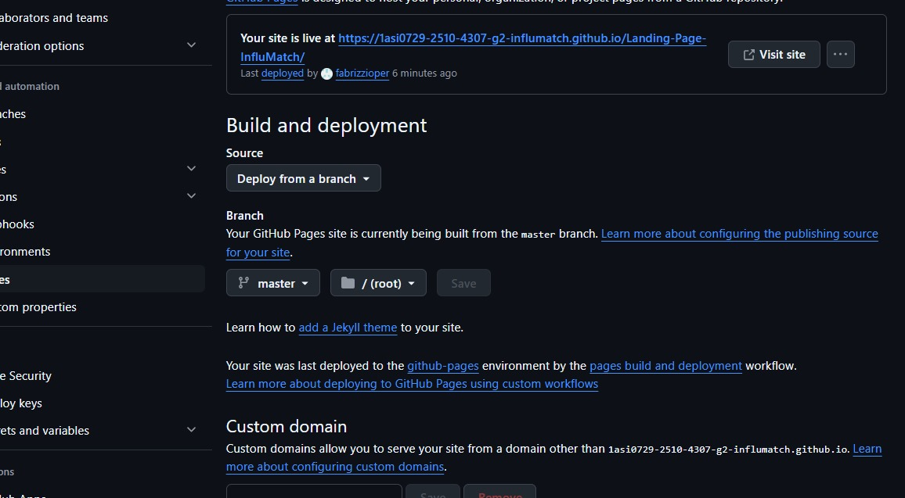

# **Capítulo V: Product Implementation, Validation & Deployment**

## **5.1. Software Configuration Management**
### **5.1.1. Software Development Environment Configuration**

**Product UX/UI Desing**

Figma: Plataforma o aplicación que se usa para la elaboración de todo tipo de prototipos y diseño digital. En nuestro proyecto será utilizado para el desarrollo de los Wireframes y el Wireflow en el landing page, así mismo tmb estara en el diseño de WebApp y MobileApp.
Ruta referencial: https://www.figma.com/

**Software Development**

* Visual Studio Code: Plataforma que se usa como el entorno de desarrollo y compilación del código, usado por el dominio que los miembros del equipo tienen sobre esta herramienta. Esta IDE es de facil acceso, incluye diversas opciones de configuración así como la opción de añadir extensiones y tiene un soporte amplio de diversos lenguajes de programación.
  Ruta referencial: https://code.visualstudio.com/
* HTML5: El HyperText Markup Language es utilizado para el desarrollo de código de etiquetas para páginas web.
  Ruta referencial: https://www.w3schools.com/html/html5_syntax.asp
* CSS: El Cascading Style Sheets maneja el diseño de las páginas web. Este mismo siempre va relacionado y de la mano con HTML.
  Ruta referencial: https://google.github.io/styleguide/htmlcssguide.html
* Javascript: Es un lenguaje de programación interpretado y orientado a objetos. Se utilizará para elaborar la interfaz de usuario dentro de la aplicación.
  Ruta de referencia https://developer.mozilla.org/es/docs/Web/JavaScript

**Software Deployment**

Git: Herramienta que sirve para control de versiones. Permite registrar y gestionar las diferentes versiones del programa. Se utilizará para teber un control en los cambios y reducir la corrección de errores. Los miembros del equipo podrán acceder mediante la línea de comandos en sus sistemas locales.
Ruta de referencia https://git-scm.com/

**Software Documentation and Project Management**

Github: Plataforma que funciona como nube la cual alojará los repositorios de código del proyecto. Facilita la colaboración en tiempo real y la revisión de contribuciones de cada miembro del equipo. Los miembros del equipo pueden acceder a través de sus navegadores web. 
Ruta de referencia https://github.com/

### **5.1.2. Source Code Management**

Para el nuestro proyecto usaremos el flujo de trabajo propuesto por el modelo GitFlow. Github sera usada como plataforma y sistema de control de versiones. Se detallará a continuación como se implementa GitFlow en el repositorio. Así mismo se proporcionaran los URL de los repositorios de GitHub para cada producto: Landing Page, Web Services y Frontend Web Applications.

**Repositorio de Github**

* Repositorio: 
  https://github.com/1ASI0729-2510-4307-G2-InfluMatch/upc-pre-202510-1asi0729-4307-DevForge-report-tf
* Landing Page: https://1asi0729-2510-4307-g2-influmatch.github.io/Landing-Page-InfluMatch/ 
 

**Flujo de trabajo GitFlow**
El flujo de trabajo a utilizar para el desarrollo del proyecto fue el planteado por Vincent Driessen en "A successful Git branching model".

**Estructuras de Branches (Ramas)**
  1. **Master Branch (Rama Principal):** Esta rama esta destinada a la producción de la aplicación, cada cambio deberá tener autorización de un compañero de equipo para evitar cambios sin verificar.
  2. **HotFix Branch:** Esta rama incluye todas las versiones que poseen errores y que, con cada arreglo, se despliegue otra vez a la Main Branch además de implementarla en lo que será Develop Branch.
  3. **Develop Branch:**  Esta rama se añade las constantes implementaciones de los features.
  4. **Feature Branch:** Esta rama incluye cada funcionalidad desarrollada por el equipo. Cuando una funcionalidad esté completamente trabajada, se fusionará con la rama de desarrollo del proyecto.
  5. **Release Branch:** Esta rama se utiliza para mantener una instancia de la rama develop.

### **5.1.3. Source Code Style Guide & Conventions**
Usaremos buenas prácticas en cuanto al código de manera que sea coherente y sostenible.

HTML:
* Cada etiqueta, id, nombre y clase será nombrada usando Lowercase.
* Utilizar UTF-8.
* Redacción en inglés.
* En cada referencia a un archivo, colocar el tipo de archivo (.css, .js).
*Terminar cada etiqueta con />.

CSS:
* Width del body al 100%.
* En cuanto a las imágenes, especificar el ancho (Width) de acuerdo a la etiqueta padre.
* Cada etiqueta, nombre y clase será nombrada de acuerdo al propósito y clasificación del elemento.
* Separación de palabras con un guion "-".
* Margin y padding en "*" con valor de 0.

### **5.1.4. Software Deployment Configuration**
Landing page deployment:
 Para poder desplegar la landing page se necesita realizar pasos especificos. Se necesita una organización y un repositorio. Con ello, es posible comenzar el despliegue de la landing page. A continuación se enuncian los pasos a seguir:
 1. Crear el repositorio para alojar el Landing Page.
 2. Los archivos deben tener las nomenclaturas "index.html", para la landing page; "style.css" para los estilos y una carpeta llamada "img" que contenga las imágenes.
 3. Cargar los archivos al repositorio mediante un commit.
 4. Dirigirse a Settings > Pages y seleccionar la branch correspondiente dentro de la cual se encuentra el proyecto, generalmente se trata de "main" o "master".
 5. Especificar la carpeta "/(root)" como la fuente de la página.
 6. Esperar a que GitHub realice las comprobaciones necesarias. Una vez culminado el proceso, se obtendrá un enlace que llevará al Landing Page desplegado.
 
 En la siguiente sección se expondrá el sprint #1, el cual contiene la versión inicial del proyecto, mostrando la estructura, el diseño y los resultados obtenidos de la landing page.
 
 
 
 
 
## **5.2. Landing Page, Services & Applications Implementation**

### **5.2.1. Sprint 1**
En la siguiente sección se expondrá el sprint #1, el cual contiene la versión inicial del proyecto, mostrando la estructura, el diseño y los resultados obtenidos de la landing page.

#### **5.2.1.1. Sprint Planning 1**

Sprint # |Date |Time |Location |Prepared By |Attendees|
| :- | :- | :- | :- | :- | :- |
|1|10/04/2025 |6:00 pm|Reunión mediante Meet|Nelson Pereira|
Sebastian Escobar. 

Luis Rubio.

Irving Allcca.

Daniel Rodriguez.
|
|Sprint 1 Goal |Sprint 1 Velocity |Sum of Story Points||||
|Diseñar y desarrollar la landing page informativa para la aplicación InfluMatch..|
18

|18||||

#### **5.2.1.2. Aspect Leaders and Collaborators.**
| **Team Member (Last Name, First Name)** | **GitHub Username**  | **Capítulo I: Introducción (L/C)** | **Capítulo II: Requirements Elicitation & Analysis (L/C)** | **Capítulo III: Requirements Specification (L/C)** | **Capítulo IV: Product Design (L/C)** | **Capítulo V: Product Implementation, Validation & Deployment (L/C)** |
|----------------------------------------|----------------------|-----------------------------------|---------------------------------------------------------|----------------------------------------------------|------------------------------------|---------------------------------------------------------------------|
| **Fabrizzio Pereira**                  | fabrizzioper          | **L**                             | **C**                                                   | **C**                                              | **C**                              | **C**                                                               |
| **Luis Sebastián Rubio Ortiz**         | notoriussxd           | **C**                             | **L**                                                   | **C**                                              | **C**                              | **C**                                                               |
| **Sebastian Escobar Palomino**                       | sebasepe              | **C**                             | **C**                                                   | **L**                                              | **C**                              | **C**                                                               |
| **Irving Allca**                         | eviterno17            | **C**                             | **C**                                                   | **C**                                              | **C**                              | **C**                                                               |
| **Daniel Rodriguez**                              | rgd99                 | **C**                             | **C**                                                   | **C**                                              | **C**                              | **C**                                                               |

#### **5.2.1.3. Sprint Backlog 1**
Durante el primer sprint, el equipo centró sus esfuerzos en desarrollar una landing page visualmente atractiva y funcional, distribuyendo las tareas a través del tablero de Sprint de acuerdo con las competencias de cada integrante.
| id     | Title                              | Id     | Title                             | Description                                                                                          | Estimations(Hours) | Assigned To    | Status(To-do/InProcess/ToReview/Done) |
|--------|------------------------------------|--------|-----------------------------------|------------------------------------------------------------------------------------------------------|--------------------|----------------|--------------------------------------|
|US01   | Barra de navegación en la Landing Page  | TS01   | Barra de navegación con enlaces   | Implementación del menú de navegación con enlaces a "¿Cómo funciona?", "Casos de éxito", "Planes" y "Contactos" | 4                 | Sebastian Escobar         | Done                                 |
|US02   | Sección "Casos de éxito"            | TS02   | Testimonios de influencers        | Desarrollo de la sección de testimonios de influencers, con citas y fotos de los influencers destacados | 2                  | Irving Allca          | Done                                 |
|US03   | Sección de Planes                   | TS03   | Planes de suscripción             | Desarrollo de la sección con los planes de suscripción (Básico, Pro, Premium) con detalles de precios y características | 4                  | Luis Rubio        | Done                                 |
|US04   | Sección de Contacto                 | TS04   | Formulario de contacto            | Implementación del formulario de contacto para que los usuarios puedan solicitar más información     | 4                  | Daniel Rodriguez | Done                                 |
|US05   | Sección "¿Cómo funciona?"           | TS05   | Explicación del proceso de colaboración | Desarrollo de la sección que explica el flujo de trabajo desde la creación de la campaña hasta la medición de resultados | 4                 | Nelson Pereira         | Done                                 |

#### **5.2.1.4. Development Evidence for Sprint Review**

| Repository | Branch | Commit Id | Commit Message | Commit Message Body | Committed on (Date) |
|------------|--------|-----------|----------------|---------------------|---------------------|
| 1ASI0729-2510-4307-G2-InfluMatch/Landing-Page-InfluMatch-Public | develop | 671b8dc | feat(images): add new images for project assets | | Apr 26, 2025 |
| 1ASI0729-2510-4307-G2-InfluMatch/Landing-Page-InfluMatch-Public | develop | bfb2010 | Merge branch 'develop' of github.com:1ASI0729-2510-4307-G2-InfluMatch/Landing-Page-InfluMatch-Public into develop | | Apr 26, 2025 |
| 1ASI0729-2510-4307-G2-InfluMatch/Landing-Page-InfluMatch-Public | develop | fa2c951 | feat(index): add plans | | Apr 26, 2025 |
| 1ASI0729-2510-4307-G2-InfluMatch/Landing-Page-InfluMatch-Public | develop | 00b1ce6 | feat(index): update styles and content for 'Casos de éxito' and 'Planes' sections | | Apr 26, 2025 |
| 1ASI0729-2510-4307-G2-InfluMatch/Landing-Page-InfluMatch-Public | develop | da411d9 | feat(style): positions | | Apr 26, 2025 |
| 1ASI0729-2510-4307-G2-InfluMatch/Landing-Page-InfluMatch-Public | develop | 19c8e70 | feat(styles): enhance navigation and sections with responsive design and new styles | | Apr 26, 2025 |
| 1ASI0729-2510-4307-G2-InfluMatch/Landing-Page-InfluMatch-Public | develop | a655de9 | feat(main.js): animation for images | | Apr 26, 2025 |
| 1ASI0729-2510-4307-G2-InfluMatch/Landing-Page-InfluMatch-Public | develop | dc50d08 | fix(index): correct paths for CSS and JavaScript files | | Apr 26, 2025 |
| 1ASI0729-2510-4307-G2-InfluMatch/Landing-Page-InfluMatch-Public | develop | b3b03a3 | Merge branch 'develop' of github.com:1ASI0729-2510-4307-G2-InfluMatch/Landing-Page-InfluMatch-Public into develop | | Apr 26, 2025 |
| 1ASI0729-2510-4307-G2-InfluMatch/Landing-Page-InfluMatch-Public | develop | e2b4c66 | Merge branch 'develop' of github.com:1ASI0729-2510-4307-G2-InfluMatch/Landing-Page-InfluMatch-Public into develop | | Apr 26, 2025 |
| 1ASI0729-2510-4307-G2-InfluMatch/Landing-Page-InfluMatch-Public | develop | 1f55d28 | Merge pull request #1 from 1ASI0729-2510-4307-G2-InfluMatch/develop | | Apr 26, 2025 |

#### **5.2.1.5. Execution Evidence for Sprint Review**
Durante el Sprint 1 se llevó a cabo el desarrollo, diseño e implementación de la landing page. En ella se incluyen las secciones donde los usuarios pueden conocer más sobre la startup y el producto que se ofrecerá. A continuación, se presentan las evidencias.

**Sección de encabezado:**
Esta es la sección principal de la página, donde la plataforma "InfluMatch" presenta su propósito: fortalecer relaciones mediante colaboraciones entre empresas e influencers. También ofrece enlaces de navegación como "¿Cómo funciona?", "Casos de éxito", "Planes" y "Contactanos."

  

**¿Cómo funciona?:**
Esta sección explica el proceso de colaboración a través de la plataforma. Incluye la creación de una campaña, la selección de influencers, la negociación de términos y contratos, y la realización del trabajo por parte de los influencers, con resultados medidos mediante herramientas del Internet de las Cosas (IoT).

  

**Casos de éxito:**
Esta sección muestra un caso de éxito de un influencer, Roberto "Mazino" Rivas, quien destaca cómo la plataforma lo ayudó a encontrar campañas ideales para su nicho. La retroalimentación es positiva, elogiando la claridad del proceso.

  

**Planes de precios:**
Esta sección muestra los planes de suscripción del servicio: "Básico" para empresas e influencers emergentes, "Pro" para empresas medianas, y "Premium" para empresas e influencers activos. Cada plan describe las características que incluyen, como el número de publicaciones, perfiles, estadísticas y opciones multimedia.

  

**Formulario de contacto:**
Se presenta un formulario de contacto para que los usuarios se pongan en contacto con la plataforma. Pide detalles básicos como nombre, correo electrónico y un mensaje. También hay una casilla para aceptar recibir información promocional.

  

#### **5.2.1.6. Services Documentation Evidence for Sprint Review**
En esta entrega del proyecto, el enfoque principal fue el desarrollo de la landing page, por lo que no se requirió la implementación de servicios adicionales.

#### **5.2.1.7. Software Deployment Evidence for Sprint Review**
En esta ocasión se utilizó GitHub Pages para publicar la landing page, lo cual permitió desplegar el sitio directamente desde el código alojado en un repositorio. A continuación se presenta el enlace a la landing page: https://1asi0729-2510-4307-g2-influmatch.github.io/Landing-Page-InfluMatch/

  

#### **5.2.1.8. Team Collaboration Insights during Sprint**
Para el desarrollo de este proyecto se emplearon diversas herramientas, entre las cuales destacan Visual Studio Code y el sistema de control de versiones Git. La landing page presentada fue segmentada en distintas secciones, asignadas a los integrantes del equipo de manera individual. Finalmente, un miembro se encargó de integrar las contribuciones de cada participante, consolidando así el producto final.

  

  

#### **5.2.2. Sprint 2**
#### **5.2.2.1.Sprint Planning 2.**
#### **5.2.2.2. Aspect Leaders and Collaborators.**
#### **5.2.2.3.Sprint Backlog 2.**
#### **5.2.2.4.Development Evidence for Sprint Review.**
#### **5.2.2.5.Execution Evidence for Sprint Review.**
#### **5.2.2.6.Services Documentation Evidence for Sprint Review.**
#### **5.2.2.7.Software Deployment Evidence for Sprint Review.**
#### **5.2.2.8.Team Collaboration Insights during Sprint.**

#### **Avance de Conclusiones**
- Durante el desarrollo de la plataforma InfluMatch, el equipo ha conseguido implementar con éxito las funcionalidades y características previstas, generando una experiencia de usuario eficaz que facilita la vinculación entre influencers y empresas.

- La construcción de InfluMatch ha servido como evidencia de la capacidad del equipo para transformar requerimientos y especificaciones en soluciones funcionales, logrando una estructura sólida y un diseño atractivo que mejora la interacción entre marcas e influencers.

- La colaboración y el trabajo conjunto han sido claves para el logro del proyecto, permitiendo compartir conocimientos y habilidades en el uso de herramientas avanzadas.

- Igualmente, el uso de plataformas de diseño como Figma ha permitido crear una interfaz uniforme y estéticamente agradable que refuerza la imagen profesional de InfluMatch. Por su parte, Trello ha sido útil para mantener una organización eficiente y un seguimiento adecuado de las tareas, lo que ha favorecido el cumplimiento de los objetivos.

- Este primer desarrollo ha establecido una base sólida para la expansión de la plataforma en etapas futuras, garantizando una infraestructura tecnológica estable y con potencial de escalabilidad.

#### **Bibliografia**
1. Aglowid IT Solutions. (2024). **Top 12 Angular best practices to adapt in 2024**. *Aglowid IT Solutions*. [https://aglowiditsolutions.com](https://aglowiditsolutions.com)
2. C# Corner. (2024). **Using trackBy with ngFor to optimize rendering**. *C# Corner*. [https://www.c-sharpcorner.com](https://www.c-sharpcorner.com)
3. C# Corner. (2024). **Implementing lazy loading in Angular for performance improvements**. *C# Corner*. [https://www.c-sharpcorner.com](https://www.c-sharpcorner.com)
4. C# Corner. (2024). **Handling Observables to prevent memory leaks in Angular**. *C# Corner*. [https://www.c-sharpcorner.com](https://www.c-sharpcorner.com)
5. Aglowid IT Solutions. (2024). **The single responsibility principle in Angular development**. *Aglowid IT Solutions*. [https://aglowiditsolutions.com](https://aglowiditsolutions.com)
11. Aglowid IT Solutions. (2024). **Optimizing Angular templates for better performance**. *Aglowid IT Solutions*. [https://aglowiditsolutions.com](https://aglowiditsolutions.com)
12. Aglowid IT Solutions. (2024). **Breaking large components into manageable sizes in Angular**. *Aglowid IT Solutions*. [https://aglowiditsolutions.com](https://aglowiditsolutions.com)
29. **TutorialsPoint**. (2024). *Firebase for backend integration with Angular applications*. [https://www.tutorialspoint.com](https://www.tutorialspoint.com)
30. **C# Corner**. (2024). *Managing Firebase environment variables for staging and production*. [https://www.c-sharpcorner.com](https://www.c-sharpcorner.com)

#### **Anexo**
1. Despliegue del Landing Page: https://1asi0729-2510-4307-g2-influmatch.github.io/Landing-Page-InfluMatch/
2. Figma con los User Flow Diagrams, wireframes y mockups de la landing page.: https://www.figma.com/design/o8mqq96SoWiUWDlFJZYB8T/InfluMatch---Mockups-Wireframes?node-id=0-1&p=f
