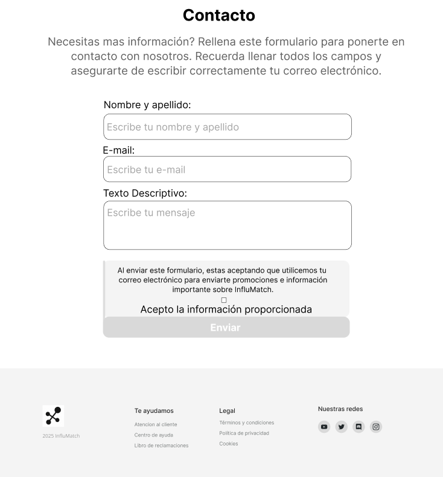

 <h1>Informe del TB1</h1>
    <h2>Universidad Peruana de Ciencias Aplicadas</h2>
    
     
<strong>Ingeniería de Software</strong>

    
<strong>Curso:</strong> Desarrollo de Aplicaciones Open Source

    
<strong>Docente:</strong> Angel Augusto Velasquez Nuñez

    
<strong>"Informe de TB1"</strong>

    
<strong>Startup:</strong> DevForge

    
<strong>Producto:</strong> InfluMatch

### Team members:

    <table style="width: 100%; border-collapse: collapse;">
        <thead >
            <tr>
                <th style="border: 1px solid ;">Integrantes</th>
                <th style="border: 1px solid ;">Código</th>
            </tr>
        </thead>
        <tbody>
            <tr>
                <td style="border: 1px solid ;">Luis Sebastián Rubio Ortiz</td>
                <td style="border: 1px solid ;">U202310349</td>
            </tr>
            <tr>
                <td style="border: 1px solid ;">Irving Washington Allcca Guerrero</td>
                <td style="border: 1px solid ;">U202213241</td>
            </tr>
            <tr>
                <td style="border: 1px solid ;">Daniel Eduardo Rodriguez Aguilar</td>
                <td style="border: 1px solid ;">u202311691</td>
            </tr>
            <tr>
                <td style="border: 1px solid ;">Nelson Fabrizzio Pereira Vasquez</td>
                <td style="border: 1px solid ;">u202417468</td>
            </tr>
            <tr>
                <td style="border: 1px solid ;">Sebastian Matias Escobar Palomino</td>
                <td style="border: 1px solid ;">u202125968</td>
            </tr>
        </tbody>
    </table>

### Registro de versiones del informe

| Versión |   Fecha    | Autor                                                                                                                                 | Descripción de modificación                                                                                                                                                                                                          |
| :-----: | :--------: | :------------------------------------------------------------------------------------------------------------------------------------ | :----------------------------------------------------------------------------------------------------------------------------------------------------------------------------------------------------------------------------------- |
| **1.0** | 15/08/2023 | Irving W. Allcca Guerrero, Sebastián M. Escobar Palomino, Nelson F. Pereira Vásquez, Daniel E. Rodríguez Aguilar, Luis S. Rubio Ortiz | Creación del documento en formato Markdown, definición de estructura y portada; completado **Capítulo I: Introducción** y subcapítulos 1.1 Startup Profile y 1.1.1 Descripción de la Startup.                                        |
| **1.1** | 20/08/2023 | Irving W. Allcca Guerrero, Sebastián M. Escobar Palomino                                                                              | Redacción de **1.1.2 Perfiles de integrantes del equipo** y sección **1.2 Solution Profile** (1.2.1 Antecedentes y problemática). Iniciada la sección **1.2.2 Lean UX Process**, con los **Problem Statements** (1.2.2.1) completos. |
| **1.2** | 23/08/2023 | Sebastián M. Escobar Palomino, Nelson F. Pereira Vásquez                                                                              | Finalización de **1.2.2.2 Lean UX Assumptions**, **1.2.2.3 Hypothesis Statements** y **1.2.2.4 Lean UX Canvas**; redacción de **1.3 Segmentos objetivo** con datos demográficos y estadísticos reales.                               |
| **1.3** | 25/08/2023 | Irving W. Allcca Guerrero, Daniel E. Rodríguez Aguilar                                                                                | Desarrollo de **Capítulo II: Requirements Elicitation & Analysis**: completados 2.1.1 Análisis competitivo (tabla comparativa) y 2.1.2 Estrategias y tácticas frente a competidores.                                                 |
| **1.4** | 28/08/2023 | Nelson F. Pereira Vásquez, Luis S. Rubio Ortiz                                                                                        | Diseño y ejecución de **2.2 Entrevistas**: creación de guías de entrevista (2.2.1), registro de evidencias (2.2.2) y análisis inicial de hallazgos (2.2.3).                                                                          |
| **1.5** | 31/08/2023 | Daniel E. Rodríguez Aguilar, Sebastián M. Escobar Palomino                                                                            | Elaboración de **2.3 Needfinding**: user personas (2.3.1), user task matrix (2.3.2), journey mapping (2.3.3) y empathy mapping (2.3.4); definición de ubiquitous language (2.4).                                                     |
| **1.6** | 03/09/2023 | Irving W. Allcca Guerrero, Nelson F. Pereira Vásquez                                                                                  | Avance en **Capítulo III: Requirements Specification**: To-Be Scenario Mapping (3.1), redacción de primeras **User Stories** (3.2) y creación del **Impact Mapping** (3.3).                                                          |
| **1.7** | 05/09/2023 | Sebastián M. Escobar Palomino, Luis S. Rubio Ortiz                                                                                    | Desarrollo de **4.1 Style Guidelines** (4.1.1 y 4.1.2) y **4.2 Information Architecture** (4.2.1 a 4.2.5); se establecen convenciones de naming y estructura de navegación.                                                          |
| **1.8** | 08/09/2023 | Daniel E. Rodríguez Aguilar, Irving W. Allcca Guerrero                                                                                | Prototipos de **4.3 Landing Page UI Design**: wireframes (4.3.1) y mock-ups (4.3.2); se inicia sección **4.4 Web Applications UX/UI Design** con wireframes (4.4.1).                                                                 |
| **1.9** | 12/09/2023 | Nelson F. Pereira Vásquez, Sebastián M. Escobar Palomino                                                                              | Completados wireflow diagrams (4.4.2), mock-ups (4.4.2bis) y user flows (4.4.3); redacción de **4.5 Web Applications Prototyping**.                                                                                                  |
| **2.0** | 15/09/2023 | Irving W. Allcca Guerrero, Daniel E. Rodríguez Aguilar                                                                                | Diseño de **4.6 Domain-Driven Software Architecture**: context diagram (4.6.1), container diagrams (4.6.2) y components diagrams (4.6.3).                                                                                            |
| **2.1** | 18/09/2023 | Sebastián M. Escobar Palomino, Luis S. Rubio Ortiz                                                                                    | Avance en **4.7 Software OO Design**: Class Diagrams (4.7.1) y Class Dictionary (4.7.2); se inicia **4.8 Database Design** con esquema entidad-relación (4.8.1).                                                                     |
| **2.2** | 22/09/2023 | Nelson F. Pereira Vásquez, Daniel E. Rodríguez Aguilar                                                                                | Finalización de **Capítulo IV**: fully documented mock-ups y diagramas de flujos; revisión de estilo y estructura.                                                                                                                   |
| **2.3** | 25/09/2023 | Irving W. Allcca Guerrero, Sebastián M. Escobar Palomino                                                                              | Incorporación de feedback, ajustes en diagramas UML y UI; se pone en marcha **Capítulo V: Product Implementation**, configurando entorno de desarrollo y SCM (5.1.1 a 5.1.3).                                                        |

# Project Report Collaboration Insights

URL del repositorio para el reporte del proyecto: (Github): [InfluMatch](https://github.com/1ASI0729-2510-4307-G2-InfluMatch)

**TB1**

Para el desarrollo del informe perteneciente a la entrega TB1, se dividió la implementación de secciones de la siguiente forma
para cada integrante del equipo:

# Contenido
## Tabla de contenidos
- [Project Report Collaboration Insights](#project-report-collaboration-insights)
- [Contenido](#contenido)
  - [Tabla de contenidos](#tabla-de-contenidos)
- [Student Outcome](#student-outcome)
- [**Capítulo I: Introducción**](#capítulo-i-introducción)
  - [1.1. Startup Profile](#11-startup-profile)
    - [1.1.1. Descripción de la Startup](#111-descripción-de-la-startup)
    - [1.1.2. Perfiles de integrantes del equipo](#112-perfiles-de-integrantes-del-equipo)
  - [1.2. Solution Profile](#12-solution-profile)
    - [1.2.1. Antecedentes y problemática](#121-antecedentes-y-problemática)
  - [1.2.2. Lean UX Process](#122-lean-ux-process)
    - [1.2.2.1. Lean UX Problem Statements](#1221-lean-ux-problem-statements)
    - [1.2.2.2. Lean UX Assumptions](#1222-lean-ux-assumptions)
    - [1.2.2.3. Lean UX Hypothesis Statements](#1223-lean-ux-hypothesis-statements)
      - [Hypothesis Statement 01](#hypothesis-statement-01)
      - [Hypothesis Statement 02](#hypothesis-statement-02)
      - [Hypothesis Statement 03](#hypothesis-statement-03)
      - [Hypothesis Statement 04](#hypothesis-statement-04)
      - [1.2.2.4. Lean UX Canvas](#1224-lean-ux-canvas)
  - [1.3. Segmentos objetivos.](#13-segmentos-objetivos)
- [Capítulo II: Requirements Elicitation \& Analysis](#capítulo-ii-requirements-elicitation--analysis)
  - [2.1. Competidores](#21-competidores)
  - [2.1.2. Estrategias y tácticas frente a competidores](#212-estrategias-y-tácticas-frente-a-competidores)
  - [2.2. Entrevistas](#22-entrevistas)
    - [2.2.1. Diseño de entrevistas](#221-diseño-de-entrevistas)
  - [Diseño de entrevista – Primer segmento objetivo: Empresas](#diseño-de-entrevista--primer-segmento-objetivo-empresas)
  - [Diseño de entrevista – Segundo segmento objetivo: Influencers](#diseño-de-entrevista--segundo-segmento-objetivo-influencers)
    - [2.2.2. Registro de entrevistas](#222-registro-de-entrevistas)
  - [Entrevista para el Segmento Objetivo 1 - Empresas :](#entrevista-para-el-segmento-objetivo-1---empresas-)
  - [Entrevista para el Segmento Objetivo 2 - Influencer:](#entrevista-para-el-segmento-objetivo-2---influencer)
    - [2.2.3. Análisis de entrevistas](#223-análisis-de-entrevistas)
  - [2.3. Needfinding](#23-needfinding)
    - [2.3.1. User Personas](#231-user-personas)
    - [2.3.2. User Task Matrix](#232-user-task-matrix)
  - [Perfil 1: Trabaja en una startup o agencia](#perfil-1-trabaja-en-una-startup-o-agencia)
  - [Perfil 2: Creador de contenido independiente](#perfil-2-creador-de-contenido-independiente)
    - [2.3.3. User Journey Mapping](#233-user-journey-mapping)
    - [2.3.4. Empathy Mapping](#234-empathy-mapping)
    - [2.3.5. As-is Scenario Mapping](#235-as-is-scenario-mapping)
  - [2.4. Ubiquitous Language](#24-ubiquitous-language)
- [Capítulo III: Requirements Specification](#capítulo-iii-requirements-specification)
  - [3.1. To-Be Scenario Mapping](#31-to-be-scenario-mapping)
  - [3.2. User Stories](#32-user-stories)
    - [Epic 1: Landing page](#epic-1-landing-page)
    - [Epic 2: Autenticación](#epic-2-autenticación)
    - [Epic 3: Búsqueda y Selección de Influencers](#epic-3-búsqueda-y-selección-de-influencers)
    - [Epic 4: Dashboard Personalizado y Reputación](#epic-4-dashboard-personalizado-y-reputación)
    - [Epic 5: Visualización de Perfiles de Usuario](#epic-5-visualización-de-perfiles-de-usuario)
  - [3.3. Impact Mapping](#33-impact-mapping)
  - [3.4. Product Backlog](#34-product-backlog)
- [Capítulo IV: Product Design](#capítulo-iv-product-design)
  - [4.1. Style Guidelines](#41-style-guidelines)
    - [4.1.1. General Style Guidelines](#411-general-style-guidelines)
    - [4.1.2. Web Style Guidelines](#412-web-style-guidelines)
      - [Imágenes](#imágenes)
      - [Botones](#botones)
  - [4.2. Information Architecture](#42-information-architecture)
    - [4.2.1. Organization Systems](#421-organization-systems)
    - [4.2.2. Labeling Systems](#422-labeling-systems)
    - [4.2.3. SEO Tags and Meta Tags](#423-seo-tags-and-meta-tags)
    - [4.2.4. Searching Systems](#424-searching-systems)
    - [4.2.5. Navigation Systems](#425-navigation-systems)
  - [4.3. Landing Page UI Design](#43-landing-page-ui-design)
    - [4.3.1. Landing Page Wireframe](#431-landing-page-wireframe)
    - [4.3.2. Landing Page Mock-up](#432-landing-page-mock-up)
  - [4.4. Diseño UX/UI de Aplicaciones Web](#44-diseño-uxui-de-aplicaciones-web)
    - [4.4.1. Wireframes de Aplicaciones Web](#441-wireframes-de-aplicaciones-web)
    - [4.4.2. Web Applications Wireflow Diagrams](#442-web-applications-wireflow-diagrams)
  - [4.4. Diseño UX/UI de Aplicaciones Web](#44-diseño-uxui-de-aplicaciones-web-1)
    - [4.4.1. Mockups de Aplicaciones Web](#441-mockups-de-aplicaciones-web)
    - [4.4.4. Web Applications User Flow Diagrams](#444-web-applications-user-flow-diagrams)
  - [4.5. Web Applications Prototyping](#45-web-applications-prototyping)
  - [4.6. Domain-Driven Software Architecture](#46-domain-driven-software-architecture)
    - [4.6.1. Software Architecture Context Diagram](#461-software-architecture-context-diagram)
    - [4.6.2. Software Architecture Container Diagrams](#462-software-architecture-container-diagrams)
    - [4.6.3. Software Architecture Components Diagrams](#463-software-architecture-components-diagrams)
  - [4.7. Software Object-Oriented Design](#47-software-object-oriented-design)
    - [4.7.1. Class Diagrams](#471-class-diagrams)
    - [4.7.2. Class Dictionary](#472-class-dictionary)
      - [Class InfluencerProfile](#class-influencerprofile)
      - [Class Brand](#class-brand)
      - [Class Campaign](#class-campaign)
      - [Class Application](#class-application)
      - [Class Contract](#class-contract)
      - [Class ChatThread](#class-chatthread)
      - [Class Message](#class-message)
      - [Class Notification](#class-notification)
      - [Class Evaluation](#class-evaluation)
      - [Class CalendarEvent](#class-calendarevent)
      - [Class MediaAsset](#class-mediaasset)
      - [Class Category](#class-category)
  - [4.8. Database Design](#48-database-design)
    - [4.8.1. Database Diagram](#481-database-diagram)
- [**Capítulo V: Product Implementation, Validation \& Deployment**](#capítulo-v-product-implementation-validation--deployment)
  - [**5.1. Software Configuration Management**](#51-software-configuration-management)
    - [**5.1.1. Software Development Environment Configuration**](#511-software-development-environment-configuration)
    - [**5.1.2. Source Code Management**](#512-source-code-management)
    - [**5.1.3. Source Code Style Guide \& Conventions**](#513-source-code-style-guide--conventions)
    - [**5.1.4. Software Deployment Configuration**](#514-software-deployment-configuration)
  - [**5.2. Landing Page, Services \& Applications Implementation**](#52-landing-page-services--applications-implementation)
    - [**5.2.1. Sprint 1**](#521-sprint-1)
      - [**5.2.1.1. Sprint Planning 1**](#5211-sprint-planning-1)
      - [**5.2.1.2. Aspect Leaders and Collaborators.**](#5212-aspect-leaders-and-collaborators)
      - [**5.2.1.3. Sprint Backlog 1**](#5213-sprint-backlog-1)
      - [**5.2.1.4. Development Evidence for Sprint Review**](#5214-development-evidence-for-sprint-review)
      - [**5.2.1.5. Execution Evidence for Sprint Review**](#5215-execution-evidence-for-sprint-review)
      - [**5.2.1.6. Services Documentation Evidence for Sprint Review**](#5216-services-documentation-evidence-for-sprint-review)
      - [**5.2.1.7. Software Deployment Evidence for Sprint Review**](#5217-software-deployment-evidence-for-sprint-review)
      - [**5.2.1.8. Team Collaboration Insights during Sprint**](#5218-team-collaboration-insights-during-sprint)
      - [**Avance de Conclusiones**](#avance-de-conclusiones)
      - [**Bibliografia**](#bibliografia)
      - [**Anexo**](#anexo)

# Student Outcome

El curso contribuye al cumplimiento del Student Outcome ABET:
**ABET – EAC – Student Outcome 3**

**Criterio:** Capacidad de comunicarse efectivamente con un rango de audiencias.
En el siguiente cuadro se describe las acciones realizadas y enunciados de
conclusiones por parte del grupo, que permiten sustentar el haber alcanzado el logro
del ABET – EAC - Student Outcome 3.
El curso contribuye al cumplimiento del Student Outcome ABET:  
**ABET – EAC – Student Outcome 3**

| **Criterio específico**                                                   | **Acciones realizadas (TB1)**                                                                                                                                                                                                                                                                                                                                                                                                                                                                                                                                                                                                                                                                                                                                                                                                                                                                                                                                                                                                                                                                                                             | **Conclusiones**                                                                                                                                                                                                              |
| ------------------------------------------------------------------------- | ----------------------------------------------------------------------------------------------------------------------------------------------------------------------------------------------------------------------------------------------------------------------------------------------------------------------------------------------------------------------------------------------------------------------------------------------------------------------------------------------------------------------------------------------------------------------------------------------------------------------------------------------------------------------------------------------------------------------------------------------------------------------------------------------------------------------------------------------------------------------------------------------------------------------------------------------------------------------------------------------------------------------------------------------------------------------------------------------------------------------------------------- | ----------------------------------------------------------------------------------------------------------------------------------------------------------------------------------------------------------------------------- |
| **Comunica oralmente con efectividad a diferentes rangos de audiencia**   | **Irving Allcca Guerrero**   TB1: Preparó una presentación en PowerPoint de 10 diapositivas sobre el “Startup Profile”, diseñando gráficas comparativas y hablando ante el equipo y el docente; adaptó el discurso para audiencias técnicas (ingenieros) y de negocio (docente).   **Sebastián Escobar Palomino**   TB1: Explicó con detalle el “Solution Profile” y los “Lean UX Problem Statements” en un pitch de 5 minutos, gestionando preguntas de sus compañeros y demostrando dominio de conceptos UX.   **Nelson Pereira Vásquez**   TB1: Moderó la sesión de preguntas y respuestas, reforzó las intervenciones de sus compañeros con datos estadísticos, y empleó un tono claro frente a audiencias no técnicas.   **Daniel Rodríguez Aguilar**   TB1: Coordinó el orden de exposiciones, marcó tiempos con cronómetro y dio feedback en vivo para mejorar la claridad de cada orador.   **Luis Rubio Ortiz**   TB1: Capturó en notas las dudas planteadas por la audiencia, sintetizó los puntos clave de cada intervención y propuso ajustes de lenguaje para futuras presentaciones. | En TB1 practicamos la adaptación oral a distintos públicos, modulamos el nivel de detalle, respondimos preguntas en vivo y mejoramos la coordinación del equipo, lo que consolidó nuestra confianza y efectividad al exponer. |
| **Comunica por escrito con efectividad a diferentes rangos de audiencia** | **Irving Allcca Guerrero**   TB1: Redactó en Markdown las secciones **1.1** y **1.1.1**, aplicando encabezados semánticos, listas numeradas y tablas para facilitar la lectura académica y ejecutiva.   **Sebastián Escobar Palomino**   TB1: Diseñó la tabla de contenidos y definió los estilos de título, incorporó enlaces internos y externos para que lectores técnicos pudieran profundizar en documentos de referencia.   **Nelson Pereira Vásquez**   TB1: Documentó íntegro el “Lean UX Process” (1.2.2.1–1.2.2.4) incluyendo subtítulos, descripciones detalladas y gráficos exportados como imágenes Markdown.   - **Daniel Rodríguez Aguilar**   TB1: Elaboró la tabla del **2.1.1 Análisis competitivo**, integrando logos con etiquetas alt y ajustando el ancho de columnas para asegurar compatibilidad responsive.   **Luis Rubio Ortiz**   TB1: Verificó la consistencia de estilo (uso de negrillas, cursivas y bloques de código), corrigió errores de sintaxis Markdown y escribió mensajes de commit claros que describen cada cambio.                                      | La TB1 demostró nuestra capacidad de estructurar documentación técnica de forma clara, usar herramientas de Markdown para distintos públicos y mantener un estilo coherente en todo el informe.                               |
# **Capítulo I: Introducción**

## 1.1. Startup Profile
 En esta sección se presenta la descripción del startup y los perfiles de los miembros del equipo.

### 1.1.1. Descripción de la Startup
InfluMatch es una plataforma web innovadora que redefine la forma en que las marcas y los influencers colaboran. A través de un ecosistema digital basado en inteligencia artificial, Internet de las Cosas (IoT) y análisis en tiempo real, InfluMatch optimiza las estrategias de marketing de influencia para hacerlas más eficientes, transparentes y medibles.

Dirigida tanto a marcas de todos los tamaños (desde startups hasta grandes corporaciones) como a influencers de diversos niveles (micro, medianos, macro y celebridades), la plataforma permite gestionar colaboraciones desde un solo lugar, con herramientas inteligentes que automatizan la validación, contratación, monitoreo y evaluación del impacto de cada campaña.

Lo que hace única a InfluMatch es su capacidad de cerrar la brecha entre el mundo digital y el físico: mediante dispositivos IoT como sensores de tráfico en tiendas, cámaras o smart tags, se puede rastrear el impacto real de una campaña digital en el entorno offline. Esto permite a las marcas tomar decisiones basadas en datos concretos y evaluar el retorno de inversión de manera más precisa.

Además, la plataforma cuenta con funcionalidades diferenciales como búsqueda avanzada de perfiles, contratos digitales con firma electrónica, sistema de mensajería interna, reputación gamificada, y mecanismos de seguridad avanzados que previenen el fraude y fomentan relaciones confiables.

- **Misión:** Empoderar a marcas e influencers mediante una plataforma inteligente que fomente colaboraciones auténticas, éticas y sostenibles. Buscamos facilitar conexiones basadas en datos reales, donde ambas partes puedan crecer de forma transparente, midiendo resultados tangibles y generando valor mutuo a largo plazo.

- **Visión:** Ser la plataforma líder en la evolución del marketing de influencia, integrando lo digital con lo físico a través de tecnologías emergentes. Aspiramos a transformar la manera en que se construyen las campañas de marketing, convirtiéndonos en el estándar global para colaboraciones estratégicas entre marcas e influencers, impulsadas por datos, tecnología y confianza.

**Logotipo del servicio**

### 1.1.2. Perfiles de integrantes del equipo

|                                                       **Integrantes**                                                       |                                                                                                                                                                                            **Descripción del Perfil**                                                                                                                                                                                            |
| :-------------------------------------------------------------------------------------------------------------------------: | :--------------------------------------------------------------------------------------------------------------------------------------------------------------------------------------------------------------------------------------------------------------------------------------------------------------------------------------------------------------------------------------------------------------: |
|          **Fabrizzio Pereira Vásquez(U202417468)**            | 
Me llamo Fabrizzio Pereira Vásquez, soy estudiante de Ingeniería de Software y actualmente curso el sexto ciclo. Me apasiona el desarrollo web, especialmente con tecnologías como React y disfruto  aprender creando proyectos prácticos. Me considero una persona dedicada, con muchas ganas de seguir mejorando y siempre dispuesto a ayudar a mis compañeros cuando lo necesiten.
 |
| **Sebastian Matias Escobar Palomino (U202125968)**  |                           
Me llamo Sebastian Matias Escobar Palomino  , soy estudiante de Ingeniería de Software, me propongo aportar activamente al trabajo en equipo, respetar los plazos de entrega y mantener una comunicación constante y clara con mis compañeros, utilizando mis conocimientos para cumplir con las responsabilidades del proyecto.
                            |
|    **Luis Sebastián Rubio Ortiz (U202310349)**      |                                               
Me llamo Luis Sebastián Rubio ortiz, soy estudiante de Ingeniería de Software y actualmente estoy cursando el quinto ciclo. Considero que soy una persona responsable, me gusta aprender cosas nuevas constantemente y me gusta apoyar a mis compañeros con cualquier cosa que necesiten.
                                               |
|            **Irving Allcca Guerrero 4 (U202213241)**             |          
Me llamo Irving Allcca Guerrero, soy estudiante de Ingeniería de Software y actualmente estoy cursando el quinto ciclo. Considero que soy una persona responsable, me gusta aprender cosas nuevas constantemente y me gusta apoyar y cooperar con mis compañeros, tambien suelo empatizar y me gusta participar activamente con las responsabilidades del proyecto.
          |
|                       **Daniel Eduardo Rodriguez Aguilar (u202311691)**                        |                      Me llamo Daniel Eduardo Rodriguez, soy estudiante de Ingeniería de Software y actualmente estoy cursando el cuarto ciclo. Considero que soy una persona responsable, me gusta aprender cosas nuevas constantemente y me gusta apoyar y cooperar con mis compañeros, tambien suelo empatizar y me gusta participar activamente con las responsabilidades del proyecto.                       |

## 1.2. Solution Profile

### 1.2.1. Antecedentes y problemática

En los últimos años, el marketing de influencers se ha consolidado como una de las estrategias más poderosas para alcanzar audiencias específicas en redes sociales. Sin embargo, a pesar de su crecimiento, muchas marcas enfrentan dificultades para medir el verdadero impacto de sus colaboraciones, identificar perfiles auténticos y asegurar relaciones que generen valor real y sostenible. Al mismo tiempo, influencers con contenido genuino y comunidades activas encuentran limitaciones para acceder a oportunidades transparentes y relevantes. Esto ha generado un entorno donde abundan las campañas poco efectivas, con métricas superficiales y escasa trazabilidad.

En este contexto, se hace necesario repensar la forma en que se gestionan las relaciones entre marcas e influencers, integrando herramientas tecnológicas que permitan validar datos, automatizar procesos y conectar el marketing digital con el mundo físico. Aquí es donde surge la oportunidad de crear una solución que no solo intermedie, sino que también aporte inteligencia, seguridad y medición objetiva a cada colaboración.

**What** 
**¿Cuál es el problema?**
El problema central es la falta de transparencia, autenticidad y medición real en el marketing de influencia. Muchas marcas invierten sin saber si su colaboración realmente tuvo un efecto concreto en las ventas o en la interacción física con su marca. Por otro lado, también hay fraude en métricas, como seguidores falsos o engagement inflado, lo que afecta la confianza en este tipo de campañas.

**When** 
**¿Cuándo sucede el problema?**
El problema sucede durante todas las etapas de una campaña: desde la búsqueda de influencers, validación de su alcance, ejecución de la campaña, hasta la medición de resultados. Especialmente se manifiesta cuando se requiere evaluar resultados tangibles fuera del entorno digital, como visitas a tiendas o escaneo de productos físicos.

**Where** 
**¿Dónde surge el problema?** 
Este problema es global, pero se acentúa en mercados emergentes donde aún no existen plataformas maduras que integren tecnologías de validación avanzada. Las campañas pueden ejecutarse digitalmente en redes sociales, pero el impacto esperado muchas veces debe reflejarse en puntos físicos de venta o interacción con el producto.

**Who** 
**¿Quiénes están involucrados? ¿Quién lo utilizará?** 
Los principales involucrados son las empresas o marcas (especialmente PYMEs, startups y agencias de marketing) que buscan impulsar sus productos mediante colaboraciones auténticas, y los influencers (desde micro hasta celebridades) que desean monetizar su contenido de forma profesional. Además, equipos de marketing digital y analistas de datos también utilizarán esta plataforma para gestionar y optimizar campañas.

**Why (Por qué)** 
**¿Cuál es la causa del problema?** 
La raíz del problema está en la desconexión entre el entorno digital y físico, la falta de herramientas que permitan medir el impacto real de una campaña, y la ausencia de filtros automáticos que validen datos antes de cerrar un acuerdo. Esto genera inversiones riesgosas y desconfianza en el ecosistema.

**¿Cuáles son las 2H?** 

**How (Cómo)** 
**¿Cómo se utilizará el producto?** 
**InfluMatch** se utilizará como una plataforma web con módulos que integran APIs de redes sociales para la validación automática de perfiles, herramientas de contratación y comunicación, y un sistema IoT que conecta campañas online con medición offline. El desarrollo se realizará combinando tecnologías web, machine learning, procesamiento de datos en tiempo real y hardware de sensores IoT para tiendas físicas o eventos.

**How much (Cuánto)** 
**¿Cuál es la magnitud del problema?** 
El impacto económico puede medirse en términos de eficiencia y retorno de inversión. Para las marcas, se traduce en campañas más rentables, segmentadas y basadas en resultados medibles. Para los influencers, en acceso a oportunidades legítimas y remuneradas. El modelo de negocio basado en comisiones, suscripciones y servicios avanzados garantiza la sostenibilidad y escalabilidad de la plataforma.

## 1.2.2. Lean UX Process

### 1.2.2.1. Lean UX Problem Statements

**Problem Statement**

Hoy en día, muchas marcas, startups y agencias utilizan el marketing de influencers para promocionar sus productos o servicios. Sin embargo, en la práctica, estas campañas no siempre logran el impacto esperado.

Uno de los principales problemas es que no existen herramientas adecuadas que permitan conectar de forma confiable a las marcas con los influencers correctos, verificar si los perfiles son auténticos, ni medir con claridad los resultados que generan las colaboraciones. Esto genera incertidumbre sobre si realmente la inversión funcionará o no.

A menudo, las marcas se basan en datos poco confiables, como la cantidad de seguidores o los "likes", sin poder comprobar si una campaña ayudó a aumentar las visitas, las ventas o el interés real por su producto, especialmente en espacios físicos como tiendas o eventos.

Al mismo tiempo, muchos influencers, sobre todo los que están creciendo, no tienen cómo demostrar el valor real de su comunidad ni acceder fácilmente a colaboraciones serias y transparentes. Esto los limita y los deja fuera de oportunidades importantes.

Como resultado, existe una gran brecha entre lo que se hace actualmente y lo que se espera lograr. Por un lado, el proceso de encontrar y contratar influencers es lento, poco seguro y muchas veces ineficiente. Por otro lado, las campañas no siempre tienen seguimiento ni herramientas que ayuden a entender su verdadero impacto. Esta situación afecta directamente a las marcas, que pierden dinero en campañas poco efectivas, y a los influencers, que no consiguen crecer profesionalmente.

Además, si este problema continúa sin resolverse, el marketing de influencers se volverá menos confiable, menos rentable y más riesgoso para todos los involucrados.

Resolver este problema es clave para mejorar la forma en que marcas e influencers trabajan juntos. Si se logra contar con una plataforma que conecte a ambos de manera segura, transparente y basada en datos reales, se podrá crear un ecosistema más justo, eficiente y con mejores resultados para todos.

### 1.2.2.2. Lean UX Assumptions

**Business Assumptions**

- Creemos que nuestros usuarios necesitan una forma más confiable, rápida y basada en datos para conectar marcas con influencers que realmente generen impacto en sus campañas.
- Estas necesidades pueden satisfacerse con el desarrollo de una plataforma web que automatice la búsqueda, validación, gestión y medición de resultados en las colaboraciones de marketing de influencia.
- Nuestros primeros clientes serán pequeñas y medianas empresas, startups en crecimiento y agencias de marketing digital que desean lanzar campañas efectivas con creadores de contenido con audiencias reales.
- El valor más importante que un cliente quiere de nuestra solución es poder identificar influencers legítimos, automatizar los acuerdos y comprobar con datos concretos el impacto real de sus campañas, tanto en el entorno digital como en el físico.
- Los clientes también obtendrán beneficios adicionales como informes detallados de engagement, reputación de los influencers, trazabilidad en campañas y análisis de datos recogidos por dispositivos IoT.
- Vamos a adquirir la mayoría de nuestros clientes mediante publicidad digital, alianzas con agencias de marketing, estrategias inbound y participación en ferias o eventos de tecnología publicitaria y startups.
- Obtendremos ingresos principalmente mediante un modelo de comisión por campaña, complementado por suscripciones premium que otorguen acceso a funciones avanzadas y visibilidad destacada dentro de la plataforma.
- Nuestra competencia directa incluye plataformas como Heepsy, CreatorIQ y otras soluciones parciales enfocadas en la gestión de influencers, pero sin conexión real con el impacto físico ni validación a través de IoT.
- Nuestra ventaja competitiva es que **InfluMatch** no solo automatiza las colaboraciones, sino que las conecta con el mundo físico mediante tecnologías IoT, permitiendo una medición real del impacto de una campaña, algo que actualmente no ofrecen otras plataformas.

- El mayor riesgo es que las marcas no estén dispuestas a adoptar nuevas herramientas tecnológicas si ya tienen métodos tradicionales o relaciones informales con influencers.
- También existe el riesgo de baja adopción por parte de influencers que desconfíen de nuevos sistemas de validación.
- Este riesgo se abordará diseñando una plataforma con una interfaz amigable, procesos claros, confianza en la privacidad de los datos y mostrando casos de éxito que evidencien el valor generado para ambas partes.

**User Assumptions**

**¿Quién es el usuario?**

Nuestros usuarios son responsables de marketing y comunicación en empresas, startups y agencias que desean lanzar campañas con creadores de contenido. También lo son los influencers (micro, medianos y macro) que buscan oportunidades legítimas para colaborar con marcas alineadas a su estilo y comunidad.

**¿Qué problemas tiene nuestro usuario que el producto debe resolver?**

Las marcas enfrentan dificultad para encontrar perfiles confiables, validar métricas reales y medir el impacto fuera de las redes. Los influencers, por su parte, no siempre acceden a colaboraciones justas ni tienen herramientas para demostrar el valor de su comunidad.

**¿Qué características son importantes?**

Los usuarios valoran funcionalidades como:

- Búsqueda avanzada de influencers
- Verificación automática de perfiles mediante APIs
- Gestión de contratos digitales
- Comunicación directa
- Reportes de rendimiento
- Métricas reales generadas por tecnologías IoT

**¿Dónde encaja el producto en su trabajo o vida diaria?**

La plataforma será una herramienta esencial en el flujo de trabajo de campañas digitales. Permitirá planificar, ejecutar y medir colaboraciones sin salir del entorno digital, agilizando tareas que antes se hacían de forma separada o manual.

**¿Cuándo y cómo se usará el producto?**

Se usará al momento de planificar campañas, seleccionar perfiles, enviar propuestas, firmar contratos, lanzar publicaciones, hacer seguimiento de resultados y obtener métricas de rendimiento en tiempo real.

**¿Cómo debe verse y comportarse el producto?**

Debe tener una interfaz moderna, intuitiva y profesional. La experiencia debe transmitir confianza, facilidad de uso y eficiencia. El sistema debe ser seguro, proteger la información de ambas partes y permitir personalización según el tipo de usuario (marca o influencer).

**Future Assumptions** 

- **Creemos que** la plataforma debe contar con una búsqueda avanzada y filtros inteligentes.
- **Creemos que** debe ofrecer verificación automática de perfiles con APIs de redes sociales.
- **Creemos que** debe incluir herramientas para redactar, firmar y rastrear acuerdos digitales.
- **Creemos que** debe integrar sensores IoT para medición del impacto físico y reportes visuales.
- **Creemos que** debe tener un sistema de reputación y badges basado en desempeño.
- **Creemos que** debe incorporar paneles visuales para seguimiento de KPIs y métricas clave.

---

### 1.2.2.3. Lean UX Hypothesis Statements

#### Hypothesis Statement 01

Creemos que los responsables de marketing en startups, PYMEs y agencias estarán dispuestos a adoptar la plataforma InfluMatch para encontrar y validar influencers de forma automatizada y basada en datos reales.

Sabremos que hemos tenido éxito

Cuando al menos el 70% de los usuarios registrados completen el proceso de búsqueda y selección de influencers utilizando los filtros y validaciones automáticas durante el primer mes de uso.

#### Hypothesis Statement 02

Creemos que los influencers (especialmente micro y medianos) estarán interesados en registrarse y verificar sus perfiles dentro de InfluMatch para acceder a oportunidades legítimas de colaboración con marcas.

Sabremos que hemos tenido éxito

Cuando al menos el 60% de los influencers registrados conecten sus redes sociales para validación automática y completen su perfil en los primeros 15 días tras el registro.

#### Hypothesis Statement 03

Creemos que la conexión entre el entorno digital y físico mediante tecnologías como sensores IoT o códigos QR permitirá a las marcas medir el impacto real de sus campañas y justificar mejor su inversión.

Sabremos que hemos tenido éxito

Cuando al menos el 30% de las campañas activas integren alguna forma de medición física y el 40% de esas campañas generen reportes consultados por los responsables de marketing.

#### Hypothesis Statement 04

Creemos que la automatización de acuerdos y propuestas mediante contratos digitales con seguimiento reducirá los tiempos y errores en la gestión de colaboraciones entre marcas e influencers.

Sabremos que hemos tenido éxito

Cuando al menos el 80% de las campañas gestionadas en la plataforma utilicen contratos digitales automatizados y se observe una reducción del 40% en el tiempo promedio de cierre de acuerdos en comparación con métodos tradicionales.

#### 1.2.2.4. Lean UX Canvas

  

Este Lean UX Canvas de **InfluMatch** ilustra de forma concisa nuestras hipótesis, las necesidades clave de marcas e influencers, las soluciones propuestas y las métricas esenciales para iterar rápidamente y validar la plataforma de manera colaborativa.

**Enlace para acceder al Canvas:**  
https://miro.com/welcomeonboard/WTJ1T2EwOVdxYndLMGhZb2tIU2I0ckNReWJ5WS8yRlU2ZjBWMDQyQWlHK085MVpuTjl0UmpJZXJkcXp5azNzOWZpRzQ3UXRFdjFSSU9zcUxObjF3R21LNXRvSTA0dU1mZktwcFNxbWdXcFF0TU8vWUhCZ2xuWWc5ODBPYzVscHBQdGo1ZEV3bUdPQWRZUHQzSGl6V2NBPT0hdjE=?share_link_id=286206219531  

## 1.3. Segmentos objetivos.
**Marcas y agencias de marketing digital**   
Este segmento incluye startups, PYMEs, agencias de marketing y grandes corporaciones que destinan presupuestos específicos a colaboraciones con influencers. En 2023, el valor global del mercado de marketing de influencers alcanzó los USD 21,1 mil millones, más del triple que en 2019 (Statista Research Department, 2024). En América Latina, el gasto en publicidad de influencers superó los USD 1,12 mil millones en 2024, con un crecimiento del 12,6 % respecto al año anterior (Statista, 2024). El 86 % de los mercadólogos estadounidenses planea asociarse con influencers en 2025, reflejando la prioridad de este canal en la estrategia digital (Sprout Social, 2024). Además, el 80 % de las empresas de EE. UU. ya utiliza influencers en sus campañas, con un ROI medio del 160 %, lo que demuestra la madurez de estas tácticas entre marcas establecidas (Financial Times, 2024). Se espera que el gasto en EE. UU. alcance los USD 9,29 mil millones en 2025, con un crecimiento interanual del 14,2 % (eMarketer, 2024). Por su parte, el 72 % de las agencias de marketing en Latinoamérica ya emplea al menos dos plataformas dedicadas a la gestión de influencers (eMarketer, 2024).

**Influencers**  
Este segmento agrupa a los creadores de contenido en redes sociales según su tamaño de audiencia y capacidad de engagement. En 2023, los “nano‑influencers” (1 000–10 000 seguidores) obtuvieron la tasa de interacción más alta en Instagram, con un 2,19 % de engagement (Statista Research Department, 2024). En contraste, los influencers de rango medio (50 000–500 000 seguidores) registraron la tasa más baja, destacando la importancia de segmentar adecuadamente las campañas (Statista Research Department, 2024). Una buena tasa de engagement en Instagram se sitúa entre el 2 % y el 3 %, por lo que todo valor superior al 3 % se considera alto (HypeAuditor, 2025). Solo el 0,2 % de los influencers en América Latina supera el millón de seguidores, lo que subraya el nicho y la relevancia de los micro‑ y nano‑influencers en la región (Statista Research Department, 2023).
# Capítulo II: Requirements Elicitation & Analysis

## 2.1. Competidores

<table style="width: 100%; border-collapse: collapse; font-family: Arial, sans-serif;">
        <tr>
            <td colspan="6" style="border: 1px solid black; padding: 8px; vertical-align: top; "><strong>Competitive Analysis Landscape</strong></td>
        </tr>
        <tr>
            <td style="border: 1px solid black; padding: 8px; vertical-align: top;"><strong>¿Por qué llevar a cabo este análisis?</strong></td>
            <td colspan="5" style="border: 1px solid black; padding: 8px; vertical-align: top;">
                Comprender cómo se diferencia InfluMatch de sus principales competidores, identificar oportunidades de mejora y validar nuestra ventaja competitiva para optimizar la estrategia de producto y comercialización.
            </td>
        </tr>
        <tr>
            <td colspan="2" style="border: 1px solid black; padding: 8px; vertical-align: top;">Marca y Logo</td>
            <td style="border: 1px solid black; padding: 8px; vertical-align: top;"><strong>InfluMatch</strong> </td>
            <td style="border: 1px solid black; padding: 8px; vertical-align: top;"><strong>Heepsy</strong> </td>
            <td style="border: 1px solid black; padding: 8px; vertical-align: top;"><strong>CreatorIQ</strong> </td>
            <td style="border: 1px solid black; padding: 8px; vertical-align: top;"><strong>Upfluence</strong> </td>
        </tr>
        <tr>
            <td rowspan="2" style="border: 1px solid black; padding: 8px; vertical-align: top; width: 15%;"><strong>Perfil</strong></td>
            <td style="border: 1px solid black; padding: 8px; vertical-align: top;"><strong>Overview</strong></td>
            <td style="border: 1px solid black; padding: 8px; vertical-align: top;">
                InfluMatch se destaca por conectar influencers y marcas de manera accesible y sencilla, automatizando la validación de perfiles, la gestión de contratos digitales, la comunicación interna y el análisis de resultados en tiempo real.
            </td>
            <td style="border: 1px solid black; padding: 8px; vertical-align: top;">
                Directorio global de más de 11 M de influencers con filtros por engagement, ubicación y nicho.
            </td>
            <td style="border: 1px solid black; padding: 8px; vertical-align: top;">
                Solución enterprise para grandes marcas y agencias, con gestión completa de campañas y reporting avanzado.
            </td>
            <td style="border: 1px solid black; padding: 8px; vertical-align: top;">
                Suite orientada a e‑commerce y DTC que vincula actividad de influencers con ventas online y social commerce.
            </td>
        </tr>
        <tr>
            <td style="border: 1px solid black; padding: 8px; vertical-align: top;"><strong>Ventaja competitiva</strong> ¿Qué valor ofrece a los clientes?</td>
            <td style="border: 1px solid black; padding: 8px; vertical-align: top;">
                <ul style="margin:0 0 0 16px; padding:0;">
                    <li>Validación automática de perfiles y engagement vía APIs sociales.</li>
                    <li>Matching predictivo con IA.</li>
                    <li>Contratos 100 % digitales.</li>
                    <li>Gamificación y feedback post‑campaña.</li>
                    <li>Seguridad antifraude.</li>
                </ul>
            </td>
            <td style="border: 1px solid black; padding: 8px; vertical-align: top;">
                <ul style="margin:0 0 0 16px; padding:0;">
                    <li>Búsqueda rápida y freemium de micro‑influencers.</li>
                    <li>API para integración de datos.</li>
                    <li>Base de datos actualizada en tiempo real.</li>
                </ul>
            </td>
            <td style="border: 1px solid black; padding: 8px; vertical-align: top;">
                <ul style="margin:0 0 0 16px; padding:0;">
                    <li>Atribución multi‑touch y paneles configurables.</li>
                    <li>Integraciones nativas con Salesforce, Adobe y BI.</li>
                    <li>Soporte SLA 24/7.</li>
                </ul>
            </td>
            <td style="border: 1px solid black; padding: 8px; vertical-align: top;">
                <ul style="margin:0 0 0 16px; padding:0;">
                    <li>Plugins para Shopify, Magento y WooCommerce.</li>
                    <li>Automatización de remarketing en social commerce.</li>
                    <li>Marketplace interno de creadores.</li>
                </ul>
            </td>
        </tr>
        <tr>
            <td rowspan="2" style="border: 1px solid black; padding: 8px; vertical-align: top; width: 15%;"><strong>Perfil de Marketing</strong></td>
            <td style="border: 1px solid black; padding: 8px; vertical-align: top;"><strong>Mercado objetivo</strong></td>
            <td style="border: 1px solid black; padding: 8px; vertical-align: top;">
                <ul style="margin:0 0 0 16px; padding:0;">
                    <li>PYMEs, startups y grandes corporaciones que buscan colaboraciones auténticas y medibles.</li>
                    <li>Influencers (micro, medianos, macro y celebridades) con comunidades activas.</li>
                </ul>
            </td>
            <td style="border: 1px solid black; padding: 8px; vertical-align: top;">
                PYMEs, startups y agencias emergentes en busca de un buscador asequible y freemium.
            </td>
            <td style="border: 1px solid black; padding: 8px; vertical-align: top;">
                Grandes corporativos y agencias globales con altos volúmenes de campañas e integraciones B2B.
            </td>
            <td style="border: 1px solid black; padding: 8px; vertical-align: top;">
                Marcas DTC y tiendas online que vinculan influencers con ventas y remarketing.
            </td>
        </tr>
        <tr>
            <td style="border: 1px solid black; padding: 8px; vertical-align: top;"><strong>Estrategias de marketing</strong></td>
            <td style="border: 1px solid black; padding: 8px; vertical-align: top;">
                <ul style="margin:0 0 0 16px; padding:0;">
                    <li>Webinars y tutoriales.</li>
                    <li>Casos de éxito en LinkedIn y YouTube.</li>
                    <li>Alianzas con comunidades de creadores.</li>
                    <li>Programa “InfluMatch Certified”.</li>
                </ul>
            </td>
            <td style="border: 1px solid black; padding: 8px; vertical-align: top;">
                <ul style="margin:0 0 0 16px; padding:0;">
                    <li>SEO y blog educativo.</li>
                    <li>Plan de referidos freemium.</li>
                    <li>Tutoriales en YouTube.</li>
                </ul>
            </td>
            <td style="border: 1px solid black; padding: 8px; vertical-align: top;">
                <ul style="margin:0 0 0 16px; padding:0;">
                    <li>Conferencias globales (CES, Cannes Lions).</li>
                    <li>ABM y co‑marketing con partners tecnológicos.</li>
                </ul>
            </td>
            <td style="border: 1px solid black; padding: 8px; vertical-align: top;">
                <ul style="margin:0 0 0 16px; padding:0;">
                    <li>Casos de estudio de social commerce.</li>
                    <li>Email automation.</li>
                    <li>Alianzas con marketplaces regionales.</li>
                    <li>Webinars de e‑commerce.</li>
                </ul>
            </td>
        </tr>
        <tr>
            <td rowspan="3" style="border: 1px solid black; padding: 8px; vertical-align: top; width: 15%;"><strong>Perfil de Producto</strong></td>
            <td style="border: 1px solid black; padding: 8px; vertical-align: top;"><strong>Productos & Servicios</strong></td>
            <td style="border: 1px solid black; padding: 8px; vertical-align: top;">
                <ul style="margin:0 0 0 16px; padding:0;">
                    <li>Matching IA.</li>
                    <li>Validación automática (APIs).</li>
                    <li>Contratos digitales.</li>
                    <li>Mensajería interna.</li>
                    <li>Dashboard de reputación y badges.</li>
                    <li>Feedback y reseñas.</li>
                    <li>Seguridad antifraude.</li>
                </ul>
            </td>
            <td style="border: 1px solid black; padding: 8px; vertical-align: top;">
                Búsqueda con filtros avanzados, rankings de engagement, exportación CSV/Excel y alertas de métricas.
            </td>
            <td style="border: 1px solid black; padding: 8px; vertical-align: top;">
                Gestión end‑to‑end de campañas, propuestas, firma digital, pagos integrados y reporting.
            </td>
            <td style="border: 1px solid black; padding: 8px; vertical-align: top;">
                Segmentación automática, plugins de e‑commerce, análisis de ventas post‑campaña y remarketing social.
            </td>
        </tr>
        <tr>
            <td style="border: 1px solid black; padding: 8px; vertical-align: top;"><strong>Precios & Costos</strong></td>
            <td style="border: 1px solid black; padding: 8px; vertical-align: top;">Suscripción Premium + 5 % de comisión por campaña.</td>
            <td style="border: 1px solid black; padding: 8px; vertical-align: top;">Freemium (hasta 1 000 búsquedas/mes), Pro desde USD 49/mes, Enterprise a medida.</td>
            <td style="border: 1px solid black; padding: 8px; vertical-align: top;">Enterprise desde USD 5 000/mes (volumen y SLA).</td>
            <td style="border: 1px solid black; padding: 8px; vertical-align: top;">USD 99/mes por usuario + 2 % de ventas generadas.</td>
        </tr>
        <tr>
            <td style="border: 1px solid black; padding: 8px; vertical-align: top;"><strong>Canales de distribución</strong> (Web y/o Móvil)</td>
            <td style="border: 1px solid black; padding: 8px; vertical-align: top;">Web responsive; apps iOS/Android para campo.</td>
            <td style="border: 1px solid black; padding: 8px; vertical-align: top;">Solo plataforma web.</td>
            <td style="border: 1px solid black; padding: 8px; vertical-align: top;">Plataforma web + app móvil para alertas.</td>
            <td style="border: 1px solid black; padding: 8px; vertical-align: top;">Web responsive + plugins para Shopify, Magento y WooCommerce.</td>
        </tr>
        <tr>
            <td rowspan="4" style="border: 1px solid black; padding: 8px; vertical-align: top; width: 15%;"><strong>Análisis SWOT</strong></td>
            <td style="border: 1px solid black; padding: 8px; vertical-align: top;"><strong>Fortalezas</strong></td>
            <td style="border: 1px solid black; padding: 8px; vertical-align: top;">
                <ul style="margin:0 0 0 16px; padding:0;">
                    <li>Matching y validación automáticos.</li>
                    <li>Contratos digitales.</li>
                    <li>Reputación gamificada.</li>
                    <li>UX intuitiva.</li>
                </ul>
            </td>
            <td style="border: 1px solid black; padding: 8px; vertical-align: top;">Base de datos masiva; plan freemium; API abierta.</td>
            <td style="border: 1px solid black; padding: 8px; vertical-align: top;">Funcionalidades enterprise completas; reporting detallado; soporte SLA.</td>
            <td style="border: 1px solid black; padding: 8px; vertical-align: top;">Integración e‑commerce; social commerce automatizado; marketplace.</td>
        </tr>
        <tr>
            <td style="border: 1px solid black; padding: 8px; vertical-align: top;"><strong>Debilidades</strong></td>
            <td style="border: 1px solid black; padding: 8px; vertical-align: top;">
                <ul style="margin:0 0 0 16px; padding:0;">
                    <li>Comunidad incipiente.</li>
                    <li>Dependencia de APIs externas.</li>
                    <li>Gamificación en adopción.</li>
                </ul>
            </td>
            <td style="border: 1px solid black; padding: 8px; vertical-align: top;">Analítica limitada; sin medición offline.</td>
            <td style="border: 1px solid black; padding: 8px; vertical-align: top;">Costes elevados; curva de aprendizaje alta.</td>
            <td style="border: 1px solid black; padding: 8px; vertical-align: top;">Enfoque muy centrado en e‑commerce; sin tracking offline.</td>
        </tr>
        <tr>
            <td style="border: 1px solid black; padding: 8px; vertical-align: top;"><strong>Oportunidades</strong></td>
            <td style="border: 1px solid black; padding: 8px; vertical-align: top;">
                <ul style="margin:0 0 0 16px; padding:0;">
                    <li>Demanda creciente de ROI medible.</li>
                    <li>Alianzas con comunidades de creadores.</li>
                    <li>Profesionalización del sector.</li>
                </ul>
            </td>
            <td style="border: 1px solid black; padding: 8px; vertical-align: top;">Crecimiento de nano‑influencers; adopción de freemium en mercados emergentes.</td>
            <td style="border: 1px solid black; padding: 8px; vertical-align: top;">Consolidación de soluciones enterprise; interés en atribución multi‑touch.</td>
            <td style="border: 1px solid black; padding: 8px; vertical-align: top;">Auge del livestream shopping; integración con marketplaces regionales.</td>
        </tr>
        <tr>
            <td style="border: 1px solid black; padding: 8px; vertical-align: top;"><strong>Amenazas</strong></td>
            <td style="border: 1px solid black; padding: 8px; vertical-align: top;">
                <ul style="margin:0 0 0 16px; padding:0;">
                    <li>Competidores incorporando funciones similares.</li>
                    <li>Cambios en políticas de APIs sociales.</li>
                    <li>Nuevas startups con IA especializada.</li>
                </ul>
            </td>
            <td style="border: 1px solid black; padding: 8px; vertical-align: top;">Saturación del modelo freemium; nuevas herramientas con IA avanzada.</td>
            <td style="border: 1px solid black; padding: 8px; vertical-align: top;">Fusiones en el sector B2B; normativas de privacidad (GDPR, CCPA).</td>
            <td style="border: 1px solid black; padding: 8px; vertical-align: top;">Herramientas low‑cost para PYMEs; cambios en APIs de plataformas sociales.</td>
        </tr>
</table>

## 2.1.2. Estrategias y tácticas frente a competidores

En base al análisis competitivo y al SWOT previo, definimos un conjunto de estrategias y tácticas para que **InfluMatch** aproveche nuestras fortalezas, subsane nuestras debilidades, explote las oportunidades de mercado y mitigue las amenazas derivadas de la competencia.

**Afrontando las fortalezas de nuestros competidores**  
**Fortalezas de Heepsy, CreatorIQ y Upfluence**  
- Heepsy: base de datos masiva y modelo freemium que atrae a pymes y micro‑influencers.  
- CreatorIQ: integraciones enterprise (Salesforce, BI) y reporting avanzado para grandes agencias.  
- Upfluence: plugins nativos para e‑commerce y remarketing social.

**Nuestras fortalezas**  
- Matching y validación automática de perfiles y engagement con IA.  
- Contratos 100 % digitales y firma integrada.  
- Gamificación de reputación y feedback estructurado.  
- Dashboard en tiempo real y mensajería interna.

**Estrategias**  
1. **Freemium inteligente**  
   - Ofrecer un plan gratuito con matching IA limitado (500 búsquedas/mes) para captar micro‑influencers y pymes.  
2. **Integraciones modulares**  
   - Desplegar conectores “pay‑as‑you‑go” con CRMs y herramientas BI en lugar de un paquete enterprise único.  
3. **Gamificación y comunidad**  
   - Lanzar “InfluMatch Leaderboard” público para destacar creadores y marcas más activos.

**Tácticas**  
- Desarrollar cupones de referidos que amplíen el acceso al plan freemium.  
- Crear un SDK ligero para integrar métricas de InfluMatch en plataformas como Tableau o Power BI.  
- Programar eventos virtuales mensuales donde los top scorers de badges compartan casos de éxito.

---

**Afrontando las debilidades de nuestros competidores**  
**Debilidades de los competidores**  
- Heepsy: analítica limitada, sin medición offline.  
- CreatorIQ: costes elevados y curva de aprendizaje alta.  
- Upfluence: enfoque muy centrado en e‑commerce, sin tracking de campañas offline.

**Nuestras debilidades**  
- Comunidad inicial y visibilidad reducida en el mercado.  
- Dependencia de APIs externas que pueden cambiar políticas.  
- Módulos de gamificación y reputación aún en adopción.

**Estrategias**  
1. **Soporte y educación intensiva**  
   - Implementar un knowledge‑base público y chat en vivo 24/7.  
2. **Diversificación de fuentes de datos**  
   - Añadir scraping autorizado y partnerships con otras plataformas para reducir dependencia de una sola API.  

**Tácticas**  
- Integrar un widget de feedback instantáneo (“¿Esta información fue útil?”) en cada módulo de la plataforma.  
- Desarrollar conexiones con alternativas (p. ej. TikTok API + YouTube Data API) y con servicios de terceros (p. ej. SocialBlade).  
- Lanzar webinars quincenales centrados en “cómo aprovechar al máximo InfluMatch” para acelerar la curva de adopción.

---

**Aprovechando las oportunidades del mercado**  
**Oportunidades detectadas**  
- Crecimiento de los nano‑influencers y demanda de ROI medible.  
- Baja penetración de soluciones con medición offline en Latinoamérica.  
- Auge del social commerce y livestream shopping.

**Nuestras oportunidades**  
- Posicionarnos como la única plataforma con medición real—online y offline—gracias a QR y sensores ligeros.  
- Expandirnos a nichos emergentes (gaming, fitness) donde florecen micro‑comunidades.  

**Estrategias**  
1. **Piloto de medición offline**  
   - Asociarnos con 10 tiendas físicas para probar escaneo QR en campañas.  
2. **Verticalización ágil**  
   - Crear “packs” de matching por industria: fitness, gaming, beauty.  
3. **Social commerce integrado**  
   - Desarrollar widget de checkout directo en Instagram y TikTok.

**Tácticas**  
- Instalar códigos QR dinámicos en eventos locales, con tracking en dashboard.  
- Elaborar “Industry Playbooks” descargables (PDF) con benchmarks por vertical.  
- Integrar con Shopify y WooCommerce para medir ventas atribuibles a influencers.

---

**Mitigando las amenazas del entorno**  
**Amenazas principales**  
- Cambios en políticas de APIs (Instagram, YouTube).  
- Regulaciones de datos (GDPR, LOPD).  
- Competidores low‑cost emergentes con IA especializada.

**Nuestras amenazas**  
- Riesgo de baja adopción inicial ante nuevas plataformas.  
- Inestabilidad de acceso a datos de redes sociales.

**Estrategias**  
1. **Cumplimiento y resiliencia**  
   - Certificar nuestra plataforma en ISO 27001 y adaptar rápidamente la arquitectura ante cambios de API.  
2. **Diferenciación continuada**  
   - Invertir en I+D para incorporar machine learning explainable (XAI) y ofrecer insights únicos.  

**Tácticas**  
- Implementar un proxy local que cachee datos clave y notifique proactivamente cambios de endpoints.  
- Publicar un “Security & Privacy Report” trimestral que refuerce la confianza de clientes corporativos.  
- Calendario de lanzamientos bimestrales con mejoras de IA explicable y visualizaciones avanzadas.

## 2.2. Entrevistas
La sección cubre el proceso de exploración de nuestros segmentos objetivos a través de la recopilación de datos obtenidos mediante entrevistas.
### 2.2.1. Diseño de entrevistas
## Diseño de entrevista – Primer segmento objetivo: Empresas

1. ¿Cuál es su nombre?
2. ¿Qué edad tiene?
3. ¿A qué se dedica?
4. ¿Cómo das a conocer a tu negocio, emprendimiento o tu producto?
5. ¿Suelen trabajar con creadores de contenido o influencers en alguna etapa del marketing?
6. ¿Cómo identifican a las personas con las que colaboran?
7. ¿Qué factores consideras al momento de decidir si una persona es adecuada para representar tu marca?
8. ¿Qué herramientas o métodos utilizan para organizar o dar seguimiento a esas colaboraciones?
9. ¿Cómo definen si una campaña fue exitosa o no?
10. ¿Hay algo en este proceso que te resulte difícil o te quite demasiado tiempo?
11. ¿Qué valoras más en una colaboración: la visibilidad, la conversión, la experiencia?
12. Si pudieras cambiar algo en la forma en que gestionas este tipo de campañas, ¿qué sería?

---

## Diseño de entrevista – Segundo segmento objetivo: Influencers

1. ¿Cuál es su nombre?
2. ¿Qué edad tiene?
3. ¿A qué se dedica?
4. ¿Desde hace cuánto tiempo creas contenido en redes sociales?
5. ¿En qué plataformas estás más activo/a actualmente?
6. ¿Sueles colaborar con marcas? ¿Con qué frecuencia lo haces?
7. ¿Cómo sueles conseguir las oportunidades de colaboración? ¿Te buscan o tú los contactas?
8. ¿Qué suele incluir una propuesta que recibes de una marca? ¿Hay contratos?
9. ¿Te ha pasado que una marca no cumpliera con lo pactado o el pago fuera tardío?
10. ¿Alguna vez has tenido dudas sobre si una propuesta era legítima?
11. ¿Tienes forma de hacer seguimiento o mostrar resultados después de una campaña?
12. ¿Qué información crees que te ayudaría a mostrar mejor el valor de tu trabajo?
13. ¿Qué cosas hacen que una marca te genere confianza desde el primer contacto?

### 2.2.2. Registro de entrevistas

## Entrevista para el Segmento Objetivo 1 - Empresas :

**Entrevista N°1:**

**Entrevistado:** Ana Lucia Basurco

**Sexo:** Femenino

**Edad:** 19 años

**Inicio de la Entrevista:** 0:00

**Duración de la Entrevista:** 3:50

  

**Resumen de la Entrevista:** Ana Lucia Basurco, estudiante de Ingeniería Ambiental de 19 años, tiene un emprendimiento llamado Visebaking, enfocado en postres y catering para eventos. Aunque aún no ha colaborado con influencers, cree que sería positivo para su marca.
Al elegir un representante, priorizaría que su imagen esté alineada con el rubro gastronómico. Usaría redes sociales como Instagram o WhatsApp para coordinar colaboraciones y evaluaría el éxito por la visibilidad del contenido y el impacto en las ventas.
Destaca que la creación de contenido puede ser difícil por el nivel de creatividad y análisis que requiere. Para ella, lo más valioso de una colaboración es aumentar el alcance y hacer crecer su emprendimiento.

**Enlace:** https://upcedupe-my.sharepoint.com/:v:/g/personal/u202125968_upc_edu_pe/ES3VcTfkvTFKuIYprU-TrjwBE1_lD6ZHoP90A3VREniFCw?nav=eyJyZWZlcnJhbEluZm8iOnsicmVmZXJyYWxBcHAiOiJTdHJlYW1XZWJBcHAiLCJyZWZlcnJhbFZpZXciOiJTaGFyZURpYWxvZy1MaW5rIiwicmVmZXJyYWxBcHBQbGF0Zm9ybSI6IldlYiIsInJlZmVycmFsTW9kZSI6InZpZXcifX0%3D&e=gmrMb2 

**Entrevista N°2:**

**Entrevistado:** Camila Sánchez

**Sexo:** Femenino

**Edad:** 23 años

**Inicio de la Entrevista:** 0:00

**Duración de la Entrevista:** 4:49

  

**Resumen de la Entrevista:** Camila Sánchez, cofundadora de P Care Solutions, una empresa  enfocada en la salud de mascotas, comentó que promocionan sus productos mediante redes sociales, colaboraciones con clínicas veterinarias e influencers en TikTok e Instagram. Seleccionan a sus colaboradores por afinidad con el mundo de las mascotas, autenticidad y alineación con los valores de la empresa.
Utilizan hojas de cálculo y plataformas especializadas para organizar las campañas, evaluando el éxito por visualizaciones, alcance y objetivos cumplidos. Lo más difícil para ella es coordinar tiempos y encontrar perfiles adecuados. Valora especialmente la conexión con el público, la experiencia y las relaciones a largo plazo. Sugiere automatizar procesos para mejorar la gestión.

**Enlace:** https://upcedupe-my.sharepoint.com/:v:/g/personal/u202125968_upc_edu_pe/EXfVLrHn5MxOkEnCbTHmr60Bz_0zwXxMyT75-blh9Yx4IQ?nav=eyJyZWZlcnJhbEluZm8iOnsicmVmZXJyYWxBcHAiOiJTdHJlYW1XZWJBcHAiLCJyZWZlcnJhbFZpZXciOiJTaGFyZURpYWxvZy1MaW5rIiwicmVmZXJyYWxBcHBQbGF0Zm9ybSI6IldlYiIsInJlZmVycmFsTW9kZSI6InZpZXcifX0%3D&e=l1ae0n

**Entrevista N°3:**

**Entrevistado:** Gianella Cardenas

**Sexo:** Femenino

**Edad:** 23 años

**Inicio de la Entrevista:** 0:00

**Duración de la Entrevista:** 6:15

  

**Resumen de la Entrevista:** Gianella Cárdenas, de 23 años, es fundadora de “Patitas Heladitas”, un emprendimiento de snacks helados para perros. Promociona su marca en Instagram y Facebook, aunque aún no ha trabajado con influencers. Planea hacerlo en el futuro, priorizando perfiles con experiencia en productos similares y afinidad con el cuidado de mascotas.
Considera que una campaña es exitosa si genera más consultas y ventas. Destaca como reto el contacto con influencers, ya que los mensajes pueden perderse. Valora la experiencia del colaborador y propone una app que facilite la gestión de campañas.

**Enlace:** https://upcedupe-my.sharepoint.com/:v:/g/personal/u202125968_upc_edu_pe/ERrPmT52IVtNoyYC-3h3kZkBYWyYRf_IByrh4XJ1wqrjbw?nav=eyJyZWZlcnJhbEluZm8iOnsicmVmZXJyYWxBcHAiOiJTdHJlYW1XZWJBcHAiLCJyZWZlcnJhbFZpZXciOiJTaGFyZURpYWxvZy1MaW5rIiwicmVmZXJyYWxBcHBQbGF0Zm9ybSI6IldlYiIsInJlZmVycmFsTW9kZSI6InZpZXcifX0%3D&e=8nTBbh

## Entrevista para el Segmento Objetivo 2 - Influencer:

**Entrevista N°1:**

**Entrevistado:** Diego Bastidas

**Sexo:** Masculino

**Edad:** 23 años

**Inicio de la Entrevista:** 0:00

**Duración de la Entrevista:** 11:58

  

**Resumen de la Entrevista:** Diego Bastidas, estudiante de Ingeniería de Software y groomer canino, crea contenido en Instagram sobre peluquería de mascotas desde hace 1 año y medio. Ha colaborado con marcas como Mister CAM y Altu Perú, generalmente a cambio de productos. Aunque no ha firmado contratos formales, ha recibido beneficios como descuentos y productos para competencias.
Destaca que su única mala experiencia fue con otro influencer que no cumplió con el canje acordado. Le gustaría una plataforma como Influmatch que conecte marcas con influencers de forma segura, donde se pueda verificar la legitimidad de las propuestas y evitar estafas o pagos tardíos. Valora especialmente la idea de tener un espacio tipo “LinkedIn para influencers” con perfiles, portafolios y soporte ante inconvenientes.

**Enlace:** https://upcedupe-my.sharepoint.com/:v:/g/personal/u202125968_upc_edu_pe/Efds0pTj839OtqKxrhaCPRwBzs0Iu2iJBxkA8PaxzCiLmA?nav=eyJyZWZlcnJhbEluZm8iOnsicmVmZXJyYWxBcHAiOiJTdHJlYW1XZWJBcHAiLCJyZWZlcnJhbFZpZXciOiJTaGFyZURpYWxvZy1MaW5rIiwicmVmZXJyYWxBcHBQbGF0Zm9ybSI6IldlYiIsInJlZmVycmFsTW9kZSI6InZpZXcifX0%3D&e=121CYg

**Entrevista N°2:**

**Entrevistado:** Sebastian Silva

**Sexo:** Masculino

**Edad:** 21 años

**Inicio de la Entrevista:** 0:00

**Duración de la Entrevista:** 7:03

  

**Resumen de la Entrevista:** Sebastian Silva es estudiante de Ingeniería de Software y creador de contenido desde hace 5 años, centrado en videos de videojuegos y tutoriales. Principalmente usa YouTube y Twitter. Ha colaborado ocasionalmente con marcas pequeñas, generalmente contactándolas él mismo. Las propuestas suelen incluir contratos con pagos acordados, aunque ha experimentado leves retrasos.
Verifica cuidadosamente la autenticidad de las propuestas y algunas marcas le proporcionan métricas para evaluar resultados (clics, alcance). Considera útil recibir más información detallada sobre el rendimiento de cada contenido.
Apoya la idea de una plataforma tipo “LinkedIn para influencers”, que permita conectar con marcas de forma segura y segmentada, evitando estafas y facilitando colaboraciones más profesionales.

**Enlace:** https://upcedupe-my.sharepoint.com/:v:/g/personal/u202125968_upc_edu_pe/EUecjjoGNbFNq2LHVtX2BmYB8kVk9yy6PwFZhbGsJDuy7w?nav=eyJyZWZlcnJhbEluZm8iOnsicmVmZXJyYWxBcHAiOiJTdHJlYW1XZWJBcHAiLCJyZWZlcnJhbFZpZXciOiJTaGFyZURpYWxvZy1MaW5rIiwicmVmZXJyYWxBcHBQbGF0Zm9ybSI6IldlYiIsInJlZmVycmFsTW9kZSI6InZpZXcifX0%3D&e=hY7dSf

**Entrevista N°3:**

**Entrevistado:** Sayuri Cardenas

**Sexo:** Femenino

**Edad:** 20 años

**Inicio de la Entrevista:** 0:00

**Duración de la Entrevista:** 4:27

  

**Resumen de la Entrevista:** Sayuri Cárdenas , influencer de 20 años, crea contenido en Instagram y TikTok desde hace cinco años. Ha colaborado con marcas entre 2 y 4 veces, usualmente contactada por correo. Las propuestas incluyen objetivos, tipo de contenido y suelen ir acompañadas de contrato.
Ha tenido experiencias con pagos tardíos y propuestas sospechosas. Para medir resultados usa métricas como alcance e interacciones. Valora la transparencia de las marcas. Le parece útil una app que conecte influencers con empresas, ya que facilitaría colaboraciones seguras y rápidas.

**Enlace:** https://upcedupe-my.sharepoint.com/:v:/g/personal/u202125968_upc_edu_pe/EcFNHUUxYFNNhL1px9U3J7EBS0c6KAVsKErv-yjpgEM2sw?nav=eyJyZWZlcnJhbEluZm8iOnsicmVmZXJyYWxBcHAiOiJTdHJlYW1XZWJBcHAiLCJyZWZlcnJhbFZpZXciOiJTaGFyZURpYWxvZy1MaW5rIiwicmVmZXJyYWxBcHBQbGF0Zm9ybSI6IldlYiIsInJlZmVycmFsTW9kZSI6InZpZXcifX0%3D&e=Uoj4yG 

### 2.2.3. Análisis de entrevistas

**Segmento 1: Empresas**

En los emprendimientos entrevistados, se identifican distintas aproximaciones y retos al momento de trabajar (o planear trabajar) con influencers para promocionar sus marcas. Aunque algunas no han tenido aún experiencias directas, todas coinciden en el potencial valor de estas colaboraciones para aumentar el alcance y las ventas.

El criterio más importante al seleccionar influencers es la afinidad temática: se busca que el perfil del colaborador esté alineado con el rubro del negocio (gastronomía o cuidado de mascotas) y que transmita autenticidad. Esta alineación refuerza la imagen de marca y mejora la conexión con el público objetivo.

Las redes sociales como Instagram, TikTok y Facebook son los principales canales de difusión, y herramientas como hojas de cálculo o plataformas especializadas ayudan en la organización de campañas. Se evalúa el éxito por métricas como alcance, visualizaciones, consultas y ventas, aunque también se destaca el valor de las relaciones a largo plazo.

Entre los retos mencionados se encuentran la falta de experiencia previa, la dificultad para contactar influencers y la coordinación de tiempos. Las entrevistadas sugieren soluciones como la automatización de procesos o el uso de aplicaciones especializadas para facilitar la gestión de campañas, mostrando una necesidad compartida por herramientas que profesionalicen y simplifiquen el vínculo entre marcas e influencers.

**Segmento 2: Influencers**

Entre los creadores de contenido entrevistados, se identifican experiencias diversas pero una preocupación común por la seguridad, formalidad y profesionalización del vínculo con marcas. Aunque la mayoría ha tenido colaboraciones, estas suelen ser informales y con poca estructura contractual.

Los principales canales utilizados son Instagram, TikTok, YouTube y Twitter, dependiendo del tipo de contenido (desde peluquería canina hasta videojuegos y tutoriales). Las colaboraciones se dan tanto por iniciativa de los influencers como por contacto directo de las marcas, siendo frecuente el canje por productos o descuentos en lugar de pagos económicos.

Las principales dificultades mencionadas incluyen pagos tardíos, propuestas poco claras o sospechosas, e incumplimientos en acuerdos, especialmente en colaboraciones entre influencers. Para evaluar el impacto de su trabajo, utilizan métricas como visualizaciones, clics, interacciones y alcance.

Todos coinciden en la necesidad de una plataforma especializada que conecte marcas con influencers de forma segura y profesional. Se valora la idea de un espacio similar a “LinkedIn para influencers”, donde se puedan mostrar portafolios, verificar perfiles, gestionar campañas, y contar con soporte ante inconvenientes. Esta herramienta permitiría reducir riesgos, facilitar colaboraciones y mejorar la eficiencia del trabajo digital.

## 2.3. Needfinding
En esta sección se presentarán los artefactos resultantes del proceso de análisis de la información recolectada de los segmentos objetivos

### 2.3.1. User Personas

User Persona del Priemer segmento objetivo:

User Persona del Segundo segmento objetivo:

### 2.3.2. User Task Matrix
## Perfil 1: Trabaja en una startup o agencia  
_Gestiona campañas con influencers manualmente o por redes sociales._

| User Task                                                                          | Frequency | Importance |
| ---------------------------------------------------------------------------------- | --------- | ---------- |
| Buscar perfiles de influencers en redes sociales (Instagram, TikTok, etc.)         | Often     | High       |
| Revisar manualmente los seguidores, likes y comentarios para validar el perfil     | Often     | High       |
| Contactar por DM o email a posibles influencers                                    | Sometimes | High       |
| Negociar condiciones de campaña por correo o mensaje                               | Sometimes | High       |
| Hacer seguimiento en Excel o Notion del estado de cada campaña                     | Sometimes | Medium     |
| Solicitar capturas o estadísticas post-publicación                                 | Sometimes | Medium     |
| Calificar internamente al influencer para futuras campañas (si es que lo hacen)    | Rarely    | Medium     |
| Comparar resultados entre campañas anteriores                                      | Rarely    | Medium     |
| Justificar inversión de la campaña al equipo interno o cliente sin métricas claras | Often     | High       |

---

## Perfil 2: Creador de contenido independiente  
_Busca activamente colaboraciones en redes o vía contactos personales._

| User Task                                                                             | Frequency | Importance |
| ------------------------------------------------------------------------------------- | --------- | ---------- |
| Revisar mensajes en DM o email con posibles propuestas                                | Often     | High       |
| Evaluar manualmente si una marca encaja con su contenido                              | Sometimes | High       |
| Negociar condiciones directamente sin intermediarios                                  | Sometimes | High       |
| Crear contenido según lo acordado con la marca                                        | Sometimes | High       |
| Recordar fechas de publicación acordadas sin herramientas específicas                 | Often     | Medium     |
| Pedir retroalimentación o confirmar si el contenido funcionó bien                     | Rarely    | Medium     |
| Guardar capturas o métricas en carpetas para enviarlas a futuro                       | Sometimes | Medium     |
| Contar con un portafolio profesional que resuma su experiencia y resultados pasados   | Rarely    | High       |
| Preguntar a otros influencers si han trabajado con X marca para saber si es confiable | Sometimes | Medium     |

### 2.3.3. User Journey Mapping

User Journey Mapping del Priemer segmento objetivo:

User Journey Mapping Segundo segmento objetivo:

### 2.3.4. Empathy Mapping

Empathy Mapping del Priemer segmento objetivo:

Empathy Mapping del Segundo segmento objetivo:

### 2.3.5. As-is Scenario Mapping

En esta sección describimos el proceso que seguimos para construir los As-Is Scenario Mapping de cada segmento objetivo. Partimos de una lluvia de ideas individual, luego revisamos en equipo las acciones reales de los usuarios, identificamos las fases clave de sus procesos.

**As-Is Scenario Mapping – Marcas y Agencias de Marketing Digital**

**As-Is Scenario Mapping – Influencers**

As-Is Scenario Mapping: [As-Is Scenario Mapping InfluMAtch](https://miro.com/app/board/uXjVI-bOU84=/?share_link_id=691660768471)

## 2.4. Ubiquitous Language

Este documento define el Lenguaje Ubicuo (Ubiquitous Language) que se utilizará en el proyecto InfluMatch. Su propósito es garantizar una comunicación clara y consistente entre todos los miembros del equipo y stakeholders.

**Términos Clave**

1. **Influencer**: Persona que crea contenido en plataformas digitales y tiene la capacidad de influir en su audiencia. En InfluMatch, los influencers son usuarios que buscan oportunidades de colaboración con marcas para promocionar productos o servicios.

2. **Empresa**: Cliente o usuario en InfluMatch que busca promocionar sus productos o servicios a través del marketing de influencers. Las empresas pueden registrarse, buscar y conectar con influencers adecuados para sus campañas de marketing.

3. **Colaboración**: Acuerdo entre una empresa y un influencer para crear contenido que promueva un producto, servicio o marca. Las colaboraciones pueden ser pagadas o basadas en intercambio de productos.

4. **Plataforma InfluMatch**: Sistema digital donde empresas e influencers pueden interactuar, establecer conexiones y gestionar colaboraciones. InfluMatch proporciona herramientas para la búsqueda, selección y análisis de resultados de campañas de influencers.

5. **Campaña de Marketing de Influencers**: Estrategia de promoción que implica a influencers para aumentar la visibilidad de una marca, mejorar el reconocimiento del producto, y/o incrementar las ventas. En InfluMatch, las empresas crean campañas a las que los influencers pueden aplicar.

6. **Registro**: Proceso por el cual tanto influencers como empresas crean un perfil en InfluMatch para acceder a las funciones de la plataforma.

7. **Perfil de Influencer**: Página dentro de InfluMatch que contiene información sobre un influencer, como estadísticas de audiencia, contenido anterior, y detalles de contacto. Utilizado por las empresas para evaluar posibles colaboraciones.

8. **Brief de Campaña**: Documento proporcionado por la empresa que describe los objetivos, requisitos, y expectativas de una campaña específica. Incluye información clave como la audiencia objetivo, mensajes clave y métricas de éxito.

9. **Matching de Influencers**: Proceso por el cual InfluMatch recomienda influencers a las empresas basándose en criterios específicos como el nicho de audiencia, la relevancia del contenido y la tasa de compromiso.

10. **Dashboard de Métricas**: Herramienta en InfluMatch que proporciona estadísticas y datos sobre el rendimiento de campañas y colaboraciones. Las empresas e influencers pueden usar esta herramienta para evaluar el impacto de sus esfuerzos de marketing.

11. **ROI (Return on Investment)**: Métrica utilizada por las empresas para medir la efectividad de las campañas de marketing con influencers. En InfluMatch, el ROI puede evaluarse a través del dashboard de métricas.

12. **Onboarding**: Proceso de introducción para nuevos usuarios (tanto influencers como empresas) en InfluMatch. Incluye guías, tutoriales, y soporte inicial para garantizar que los usuarios comprendan cómo usar la plataforma.

13. **Comunicación Directa**: Herramienta dentro de InfluMatch que permite la comunicación fluida entre empresas e influencers para discutir detalles de las colaboraciones, resolver dudas y alinear expectativas.

14. **Programa de Recompensas**: Sistema de incentivos dentro de InfluMatch que motiva a los usuarios (especialmente influencers) a realizar acciones específicas, como invitar a otros usuarios a la plataforma o completar campañas exitosamente.

15. **Feedback de Campaña**: Opiniones y comentarios proporcionados por la empresa al influencer (y viceversa) después de la finalización de una colaboración. Este feedback es crucial para la mejora continua de las campañas futuras.
# Capítulo III: Requirements Specification

## 3.1. To-Be Scenario Mapping

En esta sección describimos el proceso que seguimos para construir los **To-Be Scenario Mapping** de cada segmento objetivo. A partir de los insights obtenidos en el As-Is, realizamos una lluvia de ideas individual, luego revisamos en equipo las fricciones y comportamientos reales observados, identificamos oportunidades de mejora y redefinimos las fases clave del proceso.

El enfoque principal fue eliminar pasos manuales, mejorar la eficiencia de la experiencia del usuario y aprovechar al máximo las funcionalidades diferenciales que ofrece **InfluMatch**, como el matching automático, los contratos digitales, la mensajería integrada y el análisis en tiempo real.

**To-Be Scenario Mapping – Marcas y Agencias de Marketing Digital**  

**To-Be Scenario Mapping – Influencers**  

To-be Scenario Mapping:[ To-Be Scenario Mapping en Miro](https://miro.com/app/board/uXjVI-bOU84=/?share_link_id=638641244611)

## 3.2. User Stories

###  Epic 1: Landing page  
**Como** visitante interesado en marketing de influencia (marca o creador de contenido)  
**Quiero** visualizar una landing page clara y atractiva  
**Para** entender cómo InfluMatch conecta marcas con influencers de forma transparente y basada en datos.

| Epic / Story ID | Título                              | Descripción                                                                                                                                                                   | Criterios de Aceptación                                                                                                                                                                                                                                                                                                                                                                                                                                                                                                                                                                                                                                                                                                                                                                                                                                                                                 | Relacionado con (Epic ID) |
| --------------- | ----------------------------------- | ----------------------------------------------------------------------------------------------------------------------------------------------------------------------------- | ------------------------------------------------------------------------------------------------------------------------------------------------------------------------------------------------------------------------------------------------------------------------------------------------------------------------------------------------------------------------------------------------------------------------------------------------------------------------------------------------------------------------------------------------------------------------------------------------------------------------------------------------------------------------------------------------------------------------------------------------------------------------------------------------------------------------------------------------------------------------------------------------------- | ------------------------- |
| E1-US1          | Barra de navegación en landing page | **Como** visitante    **Quiero** una barra de navegación visible en la landing page   **Para** acceder rápidamente a información clave sobre InfluMatch.                | **Escenario 1: Visualización de características principales** • Dado que el visitante está en la landing page • Y accede a la barra de navegación • Cuando selecciona la pestaña “Características” • Entonces es redirigido a la sección que describe las funcionalidades de InfluMatch.  **Escenario 2: Consulta de planes y precios** • Dado que el visitante se encuentra en la landing page • Y accede a la barra de navegación • Cuando selecciona la pestaña “Planes” • Entonces es redirigido a la sección con detalles sobre suscripciones, comisiones y beneficios premium.  **Escenario 3: Acceso a testimonios reales** • Dado que el visitante se encuentra en la landing page • Y accede a la barra de navegación • Cuando selecciona “Testimonios” • Entonces es redirigido a la sección con experiencias de marcas e influencers reales. | 1                         |
| E1-US2          | Sección Hero                        | **Como** visitante nuevo   **Quiero** visualizar una sección hero destacada   **Para** entender de forma rápida qué hace InfluMatch.                                    | **Escenario 1: Presentación del valor de InfluMatch** • Dado que el visitante está en la landing page • Cuando accede a la sección hero • Entonces visualiza una frase impactante, una breve descripción de la plataforma y un llamado a la acción.  **Escenario 2: Acceso rápido al registro** • Dado que el visitante está en la sección hero • Cuando selecciona el botón de “Registrarse” • Entonces es redirigido al formulario de registro de usuarios (marca o influencer).                                                                                                                                                                                                                                                                                                                                                                                              | 1                         |
| E1-US3          | Sección Product                     | **Como** visitante   **Quiero** ver un resumen visual de las funcionalidades clave   **Para** conocer lo que ofrece InfluMatch para marcas e influencers.               | **Escenario: Exploración de funcionalidades** • Dado que el visitante accede a la sección “Características” • Cuando revisa el contenido • Entonces visualiza elementos como verificación de perfiles, automatización de campañas, métricas reales, y conexión con el mundo físico.                                                                                                                                                                                                                                                                                                                                                                                                                                                                                                                                                                                                            | 1                         |
| E1-US4          | Sección Reviews                     | **Como** visitante interesado   **Quiero** leer opiniones de usuarios reales   **Para** tener mayor confianza sobre la utilidad de la plataforma.                       | **Escenario: Visualización de testimonios** • Dado que el visitante accede a la sección de testimonios • Cuando lee las experiencias compartidas • Entonces encuentra citas de marcas e influencers que ya han utilizado InfluMatch y los resultados que obtuvieron.                                                                                                                                                                                                                                                                                                                                                                                                                                                                                                                                                                                                                           | 1                         |
| E1-US5          | Sección Pricing                     | **Como** posible cliente (marca o influencer)   **Quiero** conocer los planes de uso y sus beneficios   **Para** evaluar si se ajustan a mis necesidades y presupuesto. | **Escenario: Consulta de precios y beneficios** • Dado que el visitante accede a la sección “Planes” • Cuando revisa los niveles de suscripción y comisiones por campaña • Entonces entiende qué incluye cada plan (básico, premium) y cómo puede escalar.                                                                                                                                                                                                                                                                                                                                                                                                                                                                                                                                                                                                                                     | 1                         |
| E1-US6          | Sección About Us                    | **Como** visitante curioso   **Quiero** saber quién está detrás de InfluMatch   **Para** confiar más en la misión y la visión del proyecto.                             | **Escenario: Presentación del equipo y propósito** • Dado que el visitante accede a la sección “Nosotros” • Cuando explora el contenido • Entonces visualiza la historia del equipo, la misión de InfluMatch y sus principios de transparencia y colaboración.                                                                                                                                                                                                                                                                                                                                                                                                                                                                                                                                                                                                                                 | 1                         |

### Epic 2: Autenticación  
**Como** usuario de InfluMatch (marca o influencer)  
**Quiero** tener mi propia cuenta de usuario  
**Para** acceder de manera personalizada y segura a las funcionalidades de la plataforma según mi rol.

| Epic / Story ID | Título                                             | Descripción                                                                                                                                                                  | Criterios de Aceptación                                                                                                                                                                                                                                                                                                                                                                                                                                                                                                                                                                                                                                                                                                                                                                                                               | Relacionado con (Epic ID) |
| --------------- | -------------------------------------------------- | ---------------------------------------------------------------------------------------------------------------------------------------------------------------------------- | ------------------------------------------------------------------------------------------------------------------------------------------------------------------------------------------------------------------------------------------------------------------------------------------------------------------------------------------------------------------------------------------------------------------------------------------------------------------------------------------------------------------------------------------------------------------------------------------------------------------------------------------------------------------------------------------------------------------------------------------------------------------------------------------------------------------------------------- | ------------------------- |
| E2-US1          | Iniciar sesión con cuenta registrada en InfluMatch | **Como** usuario    **Quiero** iniciar sesión con mis credenciales    **Para** acceder a mi cuenta y gestionar colaboraciones, campañas o propuestas.                  | **Escenario 1: Inicio de sesión exitoso** • Dado que el usuario se encuentra en la pantalla de inicio de sesión • Cuando ingresa su correo y contraseña correctamente • Entonces accede a su cuenta y es redirigido a su panel según su rol.  **Escenario 2: Credenciales incorrectas** • Dado que el usuario se encuentra en la pantalla de inicio de sesión • Cuando ingresa credenciales incorrectas • Entonces aparece un mensaje indicando que la cuenta o contraseña es incorrecta.                                                                                                                                                                                                                                                                                                                     | 1                         |
| E2-US2          | Iniciar sesión con cuenta de Google                | **Como** usuario    **Quiero** iniciar sesión con mi cuenta de Google    **Para** acceder fácilmente con mis datos personales ya verificados.                          | **Escenario 1: Inicio de sesión con cuenta de Google existente** • Dado que el usuario se encuentra en la pantalla de inicio de sesión • Cuando selecciona “Iniciar sesión con Google” • Y los datos son correctos según las validaciones • Entonces accede a su cuenta de InfluMatch vinculada a Google.  **Escenario 2: Cuenta de Google no registrada previamente** • Dado que el usuario selecciona “Iniciar sesión con Google” • Y el sistema detecta que no existe una cuenta vinculada • Entonces se crea automáticamente una cuenta con la información básica de Google • Y se le envía un correo confirmando la creación de la cuenta.                                                                                                                                                         | 1                         |
| E2-US3          | Iniciar sesión con cuenta de Facebook              | **Como** usuario    **Quiero** iniciar sesión con mi cuenta de Facebook    **Para** conectarme rápidamente y asociar mis datos existentes.                             | **Escenario 1: Inicio de sesión con cuenta de Facebook ya registrada** • Dado que el usuario se encuentra en la pantalla de inicio de sesión • Cuando selecciona “Iniciar sesión con Facebook” • Y las credenciales son válidas • Entonces accede a su cuenta en InfluMatch.  **Escenario 2: Inicio de sesión con Facebook sin cuenta previa** • Dado que el usuario intenta iniciar sesión con Facebook • Y no existe una cuenta previamente registrada • Entonces se crea una cuenta automáticamente con los datos de Facebook • Y se le envía un correo de confirmación de cuenta.                                                                                                                                                                                                                   | 1                         |
| E2-US4          | Registro con cuenta propia (correo y contraseña)   | **Como** nuevo usuario    **Quiero** registrar mi cuenta con correo y contraseña    **Para** personalizar mi experiencia según mi tipo de perfil (marca o influencer). | **Escenario 1: Registro exitoso** • Dado que el usuario está en la sección de registro • Cuando selecciona su tipo de usuario (marca o influencer) • E ingresa sus datos correctamente según validaciones • Entonces se crea la cuenta • Y se le envía un correo con código de activación.  **Escenario 2: Registro fallido por datos incorrectos** • Dado que el usuario está en la sección de registro • Cuando ingresa datos inválidos o incompletos • Entonces no se crea la cuenta • Y aparece un mensaje indicando que hay errores en el formulario.                                                                                                                                                                                                                                           | 1                         |
| E2-US5          | Restablecer contraseña                             | **Como** usuario    **Quiero** poder recuperar mi contraseña    **Para** establecerla en caso la haya olvidado.                                                        | **Escenario 1: Solicitud válida de recuperación** • Dado que el usuario está en la sección de recuperación de contraseña • Cuando ingresa un correo que está registrado en la plataforma • Entonces recibe un enlace para restablecer la contraseña.  **Escenario 2: Solicitud con correo no registrado** • Dado que el usuario ingresa un correo no existente en la base de datos • Entonces no se envía el correo de recuperación • Y se muestra un mensaje informando que no se encontró la cuenta.  **Escenario 3: Actualización exitosa de contraseña** • Dado que el usuario accede al enlace enviado por correo • Cuando establece una nueva contraseña válida • Entonces la contraseña se actualiza correctamente • Y se le informa mediante un correo que el cambio fue realizado. | 1                         |

###  Epic 3: Búsqueda y Selección de Influencers  
**Como** representante de una marca o agencia  
**Quiero** buscar, filtrar y visualizar perfiles de influencers  
**Para** encontrar al colaborador ideal según mis necesidades de campaña.

| Epic / Story ID | Título                                    | Descripción                                                                                                                                                                                                   | Criterios de Aceptación                                                                                                                                                                                                                                                                                                                                                                                                                                                                                                                                                                                                                 | Relacionado con (Epic ID) |
| --------------- | ----------------------------------------- | ------------------------------------------------------------------------------------------------------------------------------------------------------------------------------------------------------------- | --------------------------------------------------------------------------------------------------------------------------------------------------------------------------------------------------------------------------------------------------------------------------------------------------------------------------------------------------------------------------------------------------------------------------------------------------------------------------------------------------------------------------------------------------------------------------------------------------------------------------------------- | ------------------------- |
| E3-US1          | Buscar por nombre o usuario de red social | **Como** representante de marca    **Quiero** ingresar el nombre o usuario en un buscador    **Para** encontrar rápidamente el perfil de un influencer específico.                                      | **Escenario 1: Búsqueda con coincidencia exacta** • Dado que el usuario se encuentra en la sección de búsqueda de influencers • Cuando ingresa un nombre o usuario válido • Entonces el sistema muestra el perfil coincidente en los resultados.  **Escenario 2: Búsqueda sin coincidencia** • Dado que el usuario se encuentra en la sección de búsqueda de influencers • Cuando ingresa un nombre o usuario que no existe • Entonces el sistema muestra un mensaje indicando que no se encontraron resultados.                                                                                                | 2                         |
| E3-US2          | Filtrar por red social                    | **Como** representante de marca    **Quiero** filtrar por red social (Instagram, TikTok, YouTube, etc.)    **Para** visualizar únicamente influencers activos en la plataforma de interés.              | **Escenario 1: Filtrado por una red social específica** • Dado que el usuario se encuentra en la sección de búsqueda • Cuando selecciona una red social del menú de filtros • Entonces el sistema actualiza los resultados mostrando solo influencers de esa red.  **Escenario 2: Cambio de filtro de red social** • Dado que ya hay una red social seleccionada • Cuando el usuario selecciona una diferente • Entonces el sistema reemplaza el filtro anterior por el nuevo • Y actualiza los resultados correspondientes.                                                                                 | 1                         |
| E3-US3          | Filtrar por categoría o nicho             | **Como** representante de marca    **Quiero** aplicar un filtro por temática (moda, tecnología, viajes, etc.)    **Para** enfocar la búsqueda en creadores alineados a mi industria.                    | **Escenario 1: Filtrar por una categoría** • Dado que el usuario está en el panel de filtros • Cuando selecciona una categoría específica • Entonces los resultados se actualizan mostrando influencers relacionados a esa temática.  **Escenario 2: Cambiar la categoría seleccionada** • Dado que hay una categoría ya aplicada • Cuando se selecciona una nueva • Entonces el sistema sustituye la categoría anterior por la actual • Y actualiza los resultados en consecuencia.                                                                                                                         | 1                         |
| E3-US4          | Filtrar por puntuación o reputación       | **Como** representante de marca    **Quiero** filtrar los perfiles por reputación (ratings, badges, cumplimientos)    **Para** identificar influencers con alto desempeño en colaboraciones anteriores. | **Escenario 1: Filtrado por calificación mínima** • Dado que el usuario está en la sección de búsqueda • Cuando selecciona “3 estrellas” • Entonces se muestran los perfiles que cumplen como mínimo con ese criterio.                                                                                                                                                                                                                                                                                                                                                                                                         | 2                         |
| E3-US5          | Eliminar filtros aplicados                | **Como** representante de marca    **Quiero** eliminar uno o todos los filtros de búsqueda    **Para** visualizar nuevamente el catálogo completo sin restricciones.                                    | **Escenario 1: Eliminar todos los filtros activos** • Dado que el usuario aplicó filtros • Cuando presiona el botón “Quitar filtros” • Entonces todos los filtros se eliminan y los resultados vuelven a mostrarse sin restricciones.  **Escenario 2: Eliminar filtro individual** • Dado que hay filtros activos • Cuando presiona la “X” junto al nombre de un filtro • Entonces solo ese filtro se elimina y el resto permanece.  **Escenario 3: No hay filtros aplicados** • Dado que el usuario no ha aplicado ningún filtro • Entonces el sistema no muestra la opción para eliminar filtros. | 1                         |

###  Epic 4: Dashboard Personalizado y Reputación  
**Como** marca o influencer  
**Quiero** tener un panel donde pueda ver el historial de mis campañas, calificaciones y resultados  
**Para** evaluar mi rendimiento y optimizar futuras colaboraciones.

| Epic / Story ID | Título                             | Descripción                                                                                                                                                                                                                     | Criterios de Aceptación                                                                                                                                                                                                                                                                                                                                                                                                                                                                                                                                                                                                                                                       | Relacionado con (Epic ID) |
| --------------- | ---------------------------------- | ------------------------------------------------------------------------------------------------------------------------------------------------------------------------------------------------------------------------------- | ----------------------------------------------------------------------------------------------------------------------------------------------------------------------------------------------------------------------------------------------------------------------------------------------------------------------------------------------------------------------------------------------------------------------------------------------------------------------------------------------------------------------------------------------------------------------------------------------------------------------------------------------------------------------------- | ------------------------- |
| E4-US1          | Visualizar historial de campañas   | **Como** marca o influencer    **Quiero** ver un listado de todas mis campañas pasadas    **Para** revisar fechas, resultados, y decisiones tomadas en cada una.                                                          | **Escenario 1: Visualización exitosa del historial de campañas** • Dado que el usuario ha iniciado sesión correctamente • Y accede a su dashboard personal • Cuando selecciona la sección “Historial de campañas” • Entonces el sistema muestra una lista cronológica de campañas anteriores con detalles resumidos (nombre, estado, fechas, resultados clave).  **Escenario 2: No hay campañas anteriores** • Dado que el usuario ha iniciado sesión • Y aún no ha participado en ninguna campaña • Cuando accede a la sección “Historial de campañas” • Entonces el sistema muestra un mensaje indicando que aún no hay campañas registradas. | 2                         |
| E4-US2          | Ver calificaciones recibidas       | **Como** influencer o marca    **Quiero** consultar las calificaciones y comentarios que he recibido en campañas anteriores    **Para** entender cómo ha sido percibido mi desempeño y mejorar en futuras colaboraciones. | **Escenario 1: Ver lista de calificaciones por campaña** • Dado que el usuario accede a su dashboard • Cuando selecciona la pestaña “Reputación” o “Valoraciones” • Entonces se muestran las calificaciones recibidas organizadas por campaña, incluyendo puntuación y comentario textual.  **Escenario 2: Sin calificaciones disponibles** • Dado que el usuario accede a la sección de calificaciones • Y no ha recibido evaluaciones todavía • Entonces el sistema muestra un mensaje indicando que aún no ha sido calificado.                                                                                                                     | 2                         |
| E4-US3          | Visualizar métricas de rendimiento | **Como** marca    **Quiero** tener acceso a estadísticas como tasa de cumplimiento, engagement, alcance y reputación    **Para** monitorear mi rendimiento general en la plataforma.                                      | **Escenario 1: Visualizar panel de métricas** • Dado que el usuario accede a su dashboard • Cuando selecciona la sección “Rendimiento” • Entonces visualiza gráficas o tarjetas con datos acumulados: tasa de cumplimiento de entregables, promedio de engagement, calificación promedio, número de campañas finalizadas, entre otros.  **Escenario 2: Sin datos disponibles aún** • Dado que el usuario es nuevo y no tiene interacciones registradas • Cuando accede a la sección de rendimiento • Entonces el sistema muestra un mensaje de bienvenida indicando que las métricas aparecerán tras participar en campañas.                          | 2                         |

###  Epic 5: Visualización de Perfiles de Usuario  
**Como** usuario de InfluMatch (marca o influencer)  
**Quiero** poder visualizar el perfil de otras cuentas y el mío propio  
**Para** conocer mejor con quién podría colaborar y mostrar mi trayectoria profesional de forma clara y confiable.

| Epic / Story ID | Título                                             | Descripción                                                                                                                                                                                                              | Criterios de Aceptación                                                                                                                                                                                                                                                                                                                                                                                                                                                                                                                 | Relacionado con (Epic ID) |
| --------------- | -------------------------------------------------- | ------------------------------------------------------------------------------------------------------------------------------------------------------------------------------------------------------------------------ | --------------------------------------------------------------------------------------------------------------------------------------------------------------------------------------------------------------------------------------------------------------------------------------------------------------------------------------------------------------------------------------------------------------------------------------------------------------------------------------------------------------------------------------- | ------------------------- |
| E5-US1          | Visualizar perfil público de un influencer o marca | **Como** usuario de InfluMatch    **Quiero** poder visualizar el perfil público de otra cuenta (marca o influencer)    **Para** conocer su experiencia, desempeño y reputación antes de iniciar una colaboración.  | **Escenario 1: Visualización de perfil completo** • Dado que el usuario ha iniciado sesión • Cuando accede al perfil de otro usuario desde una búsqueda o desde una campaña • Entonces el sistema muestra la biografía, estadísticas, historial de campañas públicas, reputación y redes sociales verificadas.                                                                                                                                                                                                                 | 2                         |
| E5-US2          | Ver cómo se muestra mi perfil                      | **Como** influencer o marca    **Quiero** ver cómo se muestra mi perfil a otros usuarios    **Para** verificar la información pública que se está compartiendo sobre mí y mejorar mi presentación si es necesario. | **Escenario 1: Acceso a vista pública del perfil propio** • Dado que el usuario ha iniciado sesión • Cuando accede a la opción “Ver mi perfil público” • Entonces el sistema muestra cómo verán su perfil otros usuarios, incluyendo biografía, métricas y reputación.  **Escenario 2: Perfil sin métricas suficientes** • Dado que el usuario es nuevo o no ha participado aún en campañas • Cuando accede a su perfil • Entonces el sistema muestra la información incompleta en los campos correspondientes. | 1                         |
| E5-US3          | Visualizar reputación y calificaciones del usuario | **Como** marca o influencer    **Quiero** ver la calificación promedio, comentarios y badges recibidos    **Para** evaluar el nivel de confianza y desempeño de una cuenta.                                        | **Escenario 1: Usuario con reputación disponible** • Dado que el usuario accede a un perfil con campañas finalizadas • Cuando revisa la sección de reputación • Entonces el sistema muestra calificaciones promedio, comentarios recibidos y distinciones obtenidas.  **Escenario 2: Usuario sin historial de calificaciones** • Dado que el usuario accede a un perfil sin colaboraciones previas • Entonces el sistema muestra un mensaje indicando que aún no hay evaluaciones disponibles.                     | 2                         |

## 3.3. Impact Mapping

**Impact map de Camila, representante de marca**

**Impact map de Diego, inluencer**

## 3.4. Product Backlog

# Capítulo IV: Product Design

## 4.1. Style Guidelines

### 4.1.1. General Style Guidelines

**Branding**

**Brand Overview:**  
El producto digital lleva el nombre de **InfluMatch**, una plataforma web que conecta marcas con influencers mediante el uso de **inteligencia artificial**, **IoT** y **análisis de datos en tiempo real**. El enfoque está en generar colaboraciones estratégicas y medibles, fortaleciendo relaciones entre empresas e influencers a través de herramientas innovadoras y una interfaz moderna y confiable. InfluMatch se posiciona como una solución tecnológica integral que rompe la brecha entre el mundo físico y digital.

**Misión:**  
Revolucionar la forma en que marcas e influencers se conectan, ofreciendo herramientas basadas en datos reales que garanticen colaboraciones auténticas, efectivas y sostenibles.

**Visión:**  
Convertirse en la plataforma líder en Latinoamérica en conectar influencers con marcas a través de tecnología de vanguardia, contribuyendo a un marketing ético, medible y transparente.

**Brand Name:**
El nombre **InfluMatch** surge de la unión de los conceptos *influencer* y *match*, reflejando la esencia del producto: conectar a creadores de contenido con marcas mediante tecnología de emparejamiento inteligente. La marca destaca por su enfoque tecnológico, su lenguaje accesible y su visión colaborativa, posicionándose como una herramienta moderna, confiable y fácil de usar para ambos segmentos.

**Logotipo:**

El logotipo oficial de InfluMatch está compuesto por un isotipo con nodos conectados entre sí —representando redes, datos e interacción social— acompañado de una tipografía sans-serif clara y profesional. La paleta de colores utiliza un **degradado azul-violeta**, que transmite tecnología, creatividad, confianza y modernidad. Su diseño minimalista lo hace fácilmente adaptable a redes sociales, apps, sitios web y presentaciones corporativas.

**Colores**

La identidad visual de **InfluMatch** está diseñada para comunicar tecnología, confianza y creatividad, con una paleta moderna y adaptable a diferentes canales digitales.

**Colores**

**Colores Principales**

* **Azul Confianza** (`#2D46B9`)  
  Transmite autoridad, profesionalismo y tecnología. Ideal para botones primarios y elementos de marca.

* **Púrpura Digital** (`#6236FF`)  
  Representa innovación, creatividad y un enfoque disruptivo. Útil para destacar acciones clave y títulos importantes.

**Colores Secundarios**
 
* **Turquesa Corporativo** (`#056AE1`)  
  Refrescante y moderno, apropiado para gráficos, íconos y elementos visuales dinámicos.

* **Celeste Claro** (`#A6D4F1`)  
  Suave y calmado, utilizado como fondo o en componentes UI menos jerárquicos.

* **Índigo Profesional** (`#FF866D`)  
  Un acento cálido que rompe la frialdad tecnológica, usado para resaltar alertas, KPIs o detalles atractivos.

**Colores para Texto**

* **Azul Confianza** (`#2D46B9`) – Enlaces, títulos secundarios.  
* **Púrpura Digital** (`#6236FF`) – Métricas, énfasis visual.  
* **Negro** (`#000000`) – Texto principal en fondos claros.  
* **Blanco** (`#FFFFFF`) – Texto sobre fondos oscuros o botones primarios.

Esta combinación de colores permite reflejar una plataforma confiable y moderna, donde la tecnología y el diseño convergen para crear experiencias efectivas, elegantes y funcionales.
+
Esta paleta permite expresar una identidad moderna, profesional y tecnológica, adaptable a múltiples canales digitales y dispositivos.

**Tipografía**

Se ha seleccionado la fuente **Inter**, una sans-serif moderna, neutra y de alta legibilidad, ampliamente usada en interfaces digitales por su versatilidad.

Su aplicación está segmentada en jerarquías para mantener una correcta estructura informativa en la landing page.

**Estilos utilizados**

- *Inter Bold* para títulos principales.
- *Inter Semibold* para subtítulos y encabezados medios.
- *Inter Regular* para textos de cuerpo y etiquetas.

**Especificación por jerarquía**

|      Jerarquía      | Tamaño | Altura de línea | Peso     |
| :-----------------: | :----: | :-------------: | -------- |
|      Heading 1      | 48 px  |      60 px      | Bold     |
|      Heading 2      | 32 px  |      42 px      | Semibold |
|      Heading 3      | 20 px  |      30 px      | Medium   |
|      Heading 4      | 16 px  |      24 px      | Medium   |
|   Large Text Bold   | 20 px  |      30 px      | Bold     |
| Medium Text Regular | 18 px  |      28 px      | Regular  |
| Normal Text Regular | 16 px  |      24 px      | Regular  |
| Small Text Regular  | 14 px  |      20 px      | Regular  |

Esta jerarquía tipográfica asegura una experiencia visual clara y accesible, ideal para destacar tanto la funcionalidad como la estética de la plataforma InfluMatch.

**Spacing y Layout**

Se adopta un sistema de espaciado modular basado en múltiplos de **8 px**, lo que permite un diseño limpio, alineado y escalable.

* **Espaciado entre secciones:** 32 px
* **Padding en contenedores:** 24 px
* **Separación entre elementos (inputs, botones):** 16 px
* **Márgenes internos en tarjetas/componentes:** 12 px

**Tono de comunicación**

La voz de la marca influye directamente en la experiencia de usuario y la percepción de la plataforma:

* **Formalidad:** Profesional y accesible.
* **Tono emocional:** Entusiasta, pero sobrio.
* **Lenguaje:** Claro, directo, con vocabulario tecnológico sin excesiva jerga técnica.
* **Relación con el usuario:** Respetuosa, confiable y colaborativa.

### 4.1.2. Web Style Guidelines

El enfoque de **InfluMatch** para la aplicación web se basa en la claridad, tecnología y dinamismo, alineado con su objetivo de conectar marcas con influencers a través de una experiencia intuitiva, profesional y visualmente impactante. La interfaz está diseñada para adaptarse de manera responsiva a distintos dispositivos, garantizando accesibilidad y navegación fluida.

**Tarjetas**

Las tarjetas representan los perfiles de influencers disponibles para colaboración. Cada tarjeta contiene:
- Foto de perfil del influencer.
- Nombre y nicho de influencia.
- Extracto de su comunidad (seguidores, engagement).
- Botón de acción ("Ver perfil") que redirige a su detalle completo.

Estas tarjetas se presentan en una vista de grilla responsiva para explorar fácilmente las opciones disponibles desde cualquier dispositivo.

#### Imágenes
Las imágenes tienen una función clave dentro del diseño, priorizando representaciones claras del influencer y contenido visual que acompañe las campañas:
- **Imagen de perfil** para influencers y empresas.
- **Imagen de encabezado** en el perfil de cada influencer, que puede incluir fotos promocionales o contenido destacado.
- **Banners de campañas activas** visibles en el dashboard de empresas.

No se utilizan imágenes de fondo para evitar distracciones y mantener el foco en el contenido dinámico.

#### Botones
Los botones están diseñados para guiar al usuario en acciones clave:
- **Primarios (Azul Confianza):** iniciar contratación, enviar propuesta, contactar influencer.
- **Secundarios (Púrpura Digital):** ver detalles, compartir perfil, agregar a favoritos.
- **Acciones Críticas (Rojo):** cancelar colaboración, eliminar propuesta.

Todos los botones poseen texto legible, padding generoso y se ubican en la parte inferior derecha o en tarjetas según el flujo.}

**Vistas y Flujo General de Interacción**

  - **Exploración de Influencers:** Vista de múltiples tarjetas con filtros por red social, categoría, país, etc.
  - **Perfil de Influencer:** Página con imagen de portada, video de presentación, estadísticas, historial de campañas y botón para iniciar conversación.
  - **Chat Interno:** Ventana flotante o pantalla dedicada donde marcas e influencers intercambian mensajes, propuestas y archivos.
  - **Dashboard de Marca:** Vista consolidada con influencers contratados, campañas activas y métricas.
  - **Publicación de Requisitos:** Panel donde la empresa crea una "convocatoria" para buscar influencers según sus necesidades (tipo banner, review, unboxing, etc.).

**Pantallas Emergentes (Pop-ups)**
Se utilizan para confirmar acciones como envío de propuestas, aceptar colaboraciones, visualizar precios o condiciones. Incluyen:
- Título claro.
- Ícono representativo.
- Descripción resumida.
- Botones para confirmar o cancelar.

Oscurecen el fondo para centrar la atención en la decisión a tomar.

**Layout General y Responsive**
  - **Header fijo** con logo y navegación rápida.
  - **Sidebar colapsable** con menú de navegación.
  - **Grid responsivo** basado en 2 columnas para tarjetas y formularios.
  - **Diseño mobile-first**, con menús hamburguesa y componentes apilados.
  - **Espaciado basado en 8px** para mantener consistencia visual y legibilidad.

Este sistema garantiza una experiencia moderna, limpia y adaptada a las necesidades del ecosistema digital de InfluMatch.

## 4.2. Information Architecture
Dado que InfluMatch funciona como una plataforma central para la conexión entre marcas e influencers, es fundamental que su arquitectura de información permita una navegación clara, segmentada y adaptable tanto para empresas como para creadores de contenido. Cada flujo y contenido ha sido diseñado para que los usuarios puedan identificar fácilmente sus opciones, comprender su posición dentro del sistema y ejecutar tareas con la menor fricción posible. Tanto en la landing page como en la aplicación web, se ha priorizado una organización orientada al flujo natural de toma de decisiones de los usuarios.

Los perfiles se organizan de forma jerárquica para destacar a influencers verificados y populares. Las convocatorias publicadas por las marcas se estructuran de forma cronológica y etiquetada por categoría de campaña. El área de propuestas y chat permite una navegación secuencial que lleva de la visualización de una tarjeta, al perfil del influencer, al inicio de una conversación y eventualmente al cierre de un contrato. El dashboard muestra vistas matriciales de campañas, métricas e historiales para toma de decisiones estratégicas.

---

### 4.2.1. Organization Systems
La organización visual y lógica del contenido en InfluMatch se estructura mediante los siguientes sistemas según el contexto:

**Organización Jerárquica:** 
Se aplica en las siguientes secciones:

  - **Landing Page:** Prioriza secciones de valor como "¿Cómo funciona?", "Casos de Éxito" y llamados a la acción (CTA) visibles desde el primer scroll.
  - **Perfiles de Influencers:** Resaltan nombre, estadísticas principales, video de presentación y reputación, seguidos de métricas complementarias y detalles históricos.

**Organización Secuencial (Step-by-Step):**
Utilizada principalmente en los flujos de colaboración:

  - **Exploración y Contratación:** Desde la búsqueda de influencers (vista de tarjetas) → redirección al perfil completo → botón para iniciar conversación → chat en tiempo real → acuerdos → pago → reseña.
  - **Publicación de Convocatorias:** Empresas siguen un formulario paso a paso para definir objetivos, públicos, presupuesto y condiciones.

  **Organización Matricial:**
  Se usa en el dashboard principal para ambos tipos de usuarios:
  - Las **empresas** visualizan campañas activas, en revisión y cerradas en tarjetas modulares junto a estadísticas comparativas.
  - Los **influencers** acceden desde el dashboard a solicitudes nuevas, campañas en progreso, historial y recompensas, todos agrupados como bloques informativos.

**Categorización del Contenido:**

  - **Por Tópicos:**
    - Se aplica en la exploración de campañas o búsquedas por categorías como "Moda", "Tecnología", "Alimentos", "Viajes", etc.

  - **Por Audiencia:**
    - Usuarios nuevos (tanto marcas como influencers) son guiados en su primer acceso con contenido personalizado.
    - Las marcas verán como pantalla principal un acceso rápido a convocatorias, mensajes y métricas.
    - Los influencers accederán directamente a su perfil, oportunidades disponibles y su bandeja de entrada.

  - **Cronológica:**
    - Historial de campañas y mensajes se ordena del más reciente al más antiguo, facilitando el seguimiento de actividades.

  - **Alfabética:**
    - Aplicada en el buscador de influencers, permitiendo ordenarlos por nombre o username en redes.

Esta arquitectura de organización garantiza que tanto empresas como influencers encuentren y gestionen la información de forma efectiva, sin perder de vista su objetivo principal: establecer colaboraciones auténticas, rápidas y transparentes.

### 4.2.2. Labeling Systems

Para asegurar claridad y simplicidad en la navegación, InfluMatch implementa un sistema de etiquetado consistente, breve y contextualizado. Las etiquetas están diseñadas para ser intuitivas y reflejar con precisión el contenido que representan, evitando ambigüedades y redundancias.

**En la aplicación se incluyen las siguientes etiquetas principales:**
- **Dashboard:** Inicio personalizado para cada tipo de usuario.
- **Explorar Influencers:** Lista filtrable de perfiles disponibles.
- **Mis Campañas:** Sección que agrupa campañas activas, en revisión y finalizadas.
- **Convocatorias:** Publicaciones creadas por marcas en búsqueda de colaboraciones.
- **Perfil:** Área de visualización y edición de información personal.
- **Chat:** Comunicación directa entre marcas e influencers.
- **Notificaciones:** Alertas sobre nuevas interacciones o actualizaciones.

**Metadatos comunes:**
- `description`: Resumen breve del propósito de cada sección.
- `keywords`: influencer, campaña, colaboración, marca, contrato, propuesta.
- `author`: Nombre de la empresa o influencer correspondiente.

Estas etiquetas también se reflejan en las tarjetas, formularios, menú principal, breadcrumbs y URLs, garantizando consistencia en la experiencia del usuario.

### 4.2.3. SEO Tags and Meta Tags

FUTURE APLICATION

### 4.2.4. Searching Systems

Dado el volumen de perfiles y campañas en InfluMatch, se incorpora un sistema de búsqueda con múltiples niveles de filtrado para facilitar el acceso a la información deseada sin pérdida de tiempo.

**Opciones de búsqueda disponibles:**
- **Por nombre o username** del influencer o empresa.
- **Por red social activa** (Instagram, TikTok, YouTube).
- **Por categoría de influencia** (moda, fitness, gaming, etc.).
- **Por tipo de campaña publicada** (historia, post, reseña, sorteo).

**Filtros adicionales:**
- Rango de seguidores.
- Nivel de engagement.
- País o idioma del influencer.
- Rango de fechas de campañas anteriores.

**Visualización posterior a la búsqueda:**
- Resultados presentados en tarjetas resumidas con imagen de perfil, datos clave y botón para ver más detalles.
- Posibilidad de guardar búsquedas frecuentes o marcar influencers como favoritos.

### 4.2.5. Navigation Systems

La navegación de InfluMatch está centrada en la experiencia fluida del usuario, tanto en la Landing Page como en la plataforma interna. Se utilizan menús claros, enlaces visibles y rutas de interacción optimizadas para que cada acción sea intuitiva.

**Landing Page:**
- **Menú superior sticky:** Permite acceder rápidamente a secciones como "¿Cómo funciona?", "Casos de éxito", "Planes" y "Iniciar sesión".
- **Scroll guiado:** A través de llamadas a la acción distribuidas en bloques temáticos.
- **Botones CTA:** Redireccionan al registro, solicitud de demo o exploración de perfiles.

**Aplicación Web:**
- **Menú lateral (sidebar):** Incluye accesos a secciones principales como Dashboard, Explorar, Campañas, Perfil y Chat.
- **Barra superior:** Muestra íconos de notificaciones, ayuda y perfil de usuario.
- **Breadcrumbs:** Presentes en vistas secundarias para mantener contexto.
- **Componentes interactivos:** Botones, tarjetas, chips y enlaces mantienen consistencia en color y comportamiento.

El sistema permite que tanto empresas como influencers recorran la aplicación sin distracciones, cumpliendo con sus objetivos con la menor cantidad de clics posibles.

## 4.3. Landing Page UI Design

### 4.3.1. Landing Page Wireframe

El siguiente wireframe pertenece a la vista desktop web browser de nuestro landing page. El cual contiene informacion importante como el objetivo principal del producto y el flujo de funcionamiento, el cual presenta a los usuarios la funcionalidad principal que es generar contratos entre influencers y empresas. Adicionalmente, el header contiene accesos directos a diferentes secciones como "Casos de exito" que serian reviews de los usuarios que utilizaron el producto y obtuvieron resultados positivos. Por ultimo, se cuenta con una seccion de "Planes" que muestra cada tipo de plan disponile con sus respectivas funcionalidades, y la seccion de "Contacto" que sirve para que usuarios o personas interesadas obtengan informacion adicional o resuelvan sus dudas.

### 4.3.2. Landing Page Mock-up

En base al Wireframe del landing page, que sirvio para determinar la organizacion de cada elemento, se elaboro el mock-up para ese mismo. Este tiene el mismo contenido y organizacion ademas de aplicar la paleta de colores primarios y secundarios, asi como la tipografia especificada anteriormente.

## 4.4. Diseño UX/UI de Aplicaciones Web

Enlace para acceder al  los Wireframes en Figma: [InfluMatch – Mockups & Wireframes](https://www.figma.com/design/o8mqq96SoWiUWDlFJZYB8T/InfluMatch---Mockups-Wireframes?node-id=0-1&p=f)

### 4.4.1. Wireframes de Aplicaciones Web

**Inicio de sesión**  
La sección de inicio de sesión presenta un formulario centrado en la pantalla con un fondo claro y campos para **correo electrónico** y **contraseña**, acompañados de iconos intuitivos. Incluye validación en tiempo real para formato de email y fuerza de contraseña, mensajes de error debajo de los inputs, un enlace para **recuperar contraseña** en caso de olvido y un botón principal “Iniciar sesión” que destaca en un color sólido. Bajo el botón aparece un texto que invita a **crear cuenta** si el usuario aún no está registrado. El diseño mantiene suficiente espacio entre elementos, tipografía legible y un estilo minimalista que facilita la accesibilidad y la claridad.  

**Agenda**  
La sección de **Agenda** muestra un calendario mensual con navegación mediante flechas izquierda/derecha y un botón “Hoy” para volver a la fecha actual. Ofrece alternancia entre vista **Mensual** y **Semanal** para adaptar la visualización a distintos niveles de detalle. Cada día aparece como una casilla que, al hacer hover o clic, despliega tarjetas con eventos como reuniones con marcas, publicaciones programadas, entregas de contenido y revisiones de proyectos. Un botón flotante “+” permite agregar rápidamente nuevos eventos, y al pie de cada tarjeta queda visible la hora y un resumen. A la izquierda, una barra lateral fija da acceso a todas las secciones principales de la aplicación.  

**Chats**  
En **Chats** el usuario encuentra en la zona superior un carrusel horizontal con **tarjetas de marcas** (logo, nombre y snippet del último mensaje) que permiten cambiar de conversación rápidamente. Bajo este carrusel, cada ventana de chat muestra mensajes entrantes y salientes como burbujas, con timestamps discretos y la capacidad de adjuntar archivos (PDF, imágenes) que aparecen con su propio placeholder y tamaño. A la derecha de cada burbuja puede haber acciones contextuales (descargar, ver detalles). La parte inferior incluye un campo de texto expansible para redactar nuevos mensajes, botones para adjuntar imágenes o documentos y un indicador de estado de envío.  

**Procesos**  
La sección **Procesos** comienza con cuatro **tarjetas de métricas** que muestran el total de solicitudes, cuántas han sido aceptadas, cuántas están pendientes y cuántas rechazadas. Debajo, hay controles de filtro y orden (por estado, fecha de postulación, más recientes) y botones para alternar entre **vista lista** y **vista tarjetas**. El listado de postulaciones incluye para cada ítem un thumbnail de campaña, título y marca, fecha de postulación, una etiqueta de estado con color distintivo y un botón “Ver detalles” que abre un modal o despliega información ampliada. La paginación se sitúa al final, permitiendo navegar fácilmente entre páginas.  

**Contratos**  
En **Contratos** se presenta el nombre de la campaña y la fecha de emisión, seguido del encabezado “CONTRACT OF DIGITAL” y un bloque numerado con todos los términos y condiciones del acuerdo. El texto está organizado en párrafos claros con interlineado adecuado para facilitar la lectura. Al final del contenido, dos botones resaltados permiten al usuario **firmar digitalmente** con un clic o **descargar el PDF** completo. El diseño garantiza que el contrato sea totalmente navegable y compatible con pantallas grandes, manteniendo la barra lateral de navegación siempre accesible.  

**Evaluaciones**  
La pantalla de **Evaluaciones** invita al usuario a elegir una marca de entre varias **tarjetas** presentadas en fila (imagen, nombre). Bajo cada tarjeta, aparece un control de **5 estrellas** que destaca al pasar el cursor, seguido de un campo de texto opcional para comentarios adicionales. Un botón **Submit** en la parte inferior envía la evaluación. Más abajo, la sección **Previous Evaluations** lista las valoraciones ya realizadas con miniaturas de marca, nombre, estrellas rellenadas y un extracto del comentario, todo en una vista paginada que facilita revisar el historial de feedback.  

**Mi Perfil**  
En **Mi Perfil** se muestra un avatar grande y editable, el nombre de usuario en negrita, el rol o descriptor (por ejemplo, “Tiktoker”) y una fila de iconos de redes sociales vinculadas. Debajo, aparece una breve **biografía** con datos destacados. La sección **Media** despliega una cuadrícula de tarjetas con portadas de contenido (título, fecha de lanzamiento). Luego, **Show History** lista eventos pasados con fechas y un badge “Completed”. Finalmente, **Reviews** muestra reseñas de terceros con su nombre, calificación por estrellas y texto del comentario, todo ello en un layout limpio y organizado.  

**Dashboard**  
La sección de **Campañas recomendadas** presenta una **rejilla de seis tarjetas**, cada una con placeholder de imagen, el título de la campaña en negrita y una breve descripción de dos líneas. Debajo de cada descripción se sitúa un botón de acción contextual (por ejemplo, “Postulate”, “Donate”, “Volunteer”), con un estilo outline que al pasar el cursor se rellena y cambia de color, invitando al usuario a involucrarse. El espacio entre tarjetas y los márgenes aseguran una lectura cómoda en pantallas de escritorio.  

### 4.4.2. Web Applications Wireflow Diagrams

## 4.4. Diseño UX/UI de Aplicaciones Web

Enlace para acceder al  los Mockups en Figma: [InfluMatch – Mockups & Wireframes](https://www.figma.com/design/o8mqq96SoWiUWDlFJZYB8T/InfluMatch---Mockups-Wireframes?node-id=0-1&p=f)

### 4.4.1. Mockups de Aplicaciones Web

**Inicio de sesión**  
La sección de inicio de sesión presenta un formulario centrado en la pantalla con un fondo claro y campos para **correo electrónico** y **contraseña**, acompañados de iconos intuitivos. Incluye validación en tiempo real para formato de email y fuerza de contraseña, mensajes de error debajo de los inputs, un enlace para **recuperar contraseña** en caso de olvido y un botón principal “Iniciar sesión” que destaca en un color sólido. Bajo el botón aparece un texto que invita a **crear cuenta** si el usuario aún no está registrado. El diseño mantiene suficiente espacio entre elementos, tipografía legible y un estilo minimalista que facilita la accesibilidad y la claridad.  

**Agenda**  
La sección de **Agenda** muestra un calendario mensual con navegación mediante flechas izquierda/derecha y un botón “Hoy” para volver a la fecha actual. Ofrece alternancia entre vista **Mensual** y **Semanal** para adaptar la visualización a distintos niveles de detalle. Cada día aparece como una casilla que, al hacer hover o clic, despliega tarjetas con eventos como reuniones con marcas, publicaciones programadas, entregas de contenido y revisiones de proyectos. Un botón flotante “+” permite agregar rápidamente nuevos eventos, y al pie de cada tarjeta queda visible la hora y un resumen. A la izquierda, una barra lateral fija da acceso a todas las secciones principales de la aplicación.  

**Chats**  
En **Chats** el usuario encuentra en la zona superior un carrusel horizontal con **tarjetas de marcas** (logo, nombre y snippet del último mensaje) que permiten cambiar de conversación rápidamente. Bajo este carrusel, cada ventana de chat muestra mensajes entrantes y salientes como burbujas, con timestamps discretos y la capacidad de adjuntar archivos (PDF, imágenes) que aparecen con su propio placeholder y tamaño. A la derecha de cada burbuja puede haber acciones contextuales (descargar, ver detalles). La parte inferior incluye un campo de texto expansible para redactar nuevos mensajes, botones para adjuntar imágenes o documentos y un indicador de estado de envío.  

**Procesos**  
La sección **Procesos** comienza con cuatro **tarjetas de métricas** que muestran el total de solicitudes, cuántas han sido aceptadas, cuántas están pendientes y cuántas rechazadas. Debajo, hay controles de filtro y orden (por estado, fecha de postulación, más recientes) y botones para alternar entre **vista lista** y **vista tarjetas**. El listado de postulaciones incluye para cada ítem un thumbnail de campaña, título y marca, fecha de postulación, una etiqueta de estado con color distintivo y un botón “Ver detalles” que abre un modal o despliega información ampliada. La paginación se sitúa al final, permitiendo navegar fácilmente entre páginas.  

**Contratos**  
En **Contratos** se presenta el nombre de la campaña y la fecha de emisión, seguido del encabezado “CONTRACT OF DIGITAL” y un bloque numerado con todos los términos y condiciones del acuerdo. El texto está organizado en párrafos claros con interlineado adecuado para facilitar la lectura. Al final del contenido, dos botones resaltados permiten al usuario **firmar digitalmente** con un clic o **descargar el PDF** completo. El diseño garantiza que el contrato sea totalmente navegable y compatible con pantallas grandes, manteniendo la barra lateral de navegación siempre accesible.  

**Evaluaciones**  
La pantalla de **Evaluaciones** invita al usuario a elegir una marca de entre varias **tarjetas** presentadas en fila (imagen, nombre). Bajo cada tarjeta, aparece un control de **5 estrellas** que destaca al pasar el cursor, seguido de un campo de texto opcional para comentarios adicionales. Un botón **Submit** en la parte inferior envía la evaluación. Más abajo, la sección **Previous Evaluations** lista las valoraciones ya realizadas con miniaturas de marca, nombre, estrellas rellenadas y un extracto del comentario, todo en una vista paginada que facilita revisar el historial de feedback.  

**Mi Perfil**  
En **Mi Perfil** se muestra un avatar grande y editable, el nombre de usuario en negrita, el rol o descriptor (por ejemplo, “Tiktoker”) y una fila de iconos de redes sociales vinculadas. Debajo, aparece una breve **biografía** con datos destacados. La sección **Media** despliega una cuadrícula de tarjetas con portadas de contenido (título, fecha de lanzamiento). Luego, **Show History** lista eventos pasados con fechas y un badge “Completed”. Finalmente, **Reviews** muestra reseñas de terceros con su nombre, calificación por estrellas y texto del comentario, todo ello en un layout limpio y organizado.  

**Dashboard**  
La sección de **Campañas recomendadas** presenta una **rejilla de seis tarjetas**, cada una con placeholder de imagen, el título de la campaña en negrita y una breve descripción de dos líneas. Debajo de cada descripción se sitúa un botón de acción contextual (por ejemplo, “Postulate”, “Donate”, “Volunteer”), con un estilo outline que al pasar el cursor se rellena y cambia de color, invitando al usuario a involucrarse. El espacio entre tarjetas y los márgenes aseguran una lectura cómoda en pantallas de escritorio.  

### 4.4.4. Web Applications User Flow Diagrams

## 4.5. Web Applications Prototyping

Para la elaboración de los prototipos de la interfaz de usuario destinados a **Desktop** y **Mobile Web Browser**, se siguieron una serie de criterios fundamentales:

1. **Claridad y Facilidad de Uso**  
   El objetivo fue que la navegación resultara intuitiva y comprensible, de modo que los usuarios pudieran familiarizarse rápidamente con las funcionalidades clave (registro de procesos, visualización de reportes estadísticos, gestión de agendas, etc.) sin necesidad de formación previa.

2. **Diseño Responsive**  
   Se priorizó un enfoque “mobile‑first” y se aplicaron **breakpoints** adecuados para garantizar que el prototipo se adaptara fluidamente a distintos tamaños de pantalla, desde smartphones hasta monitores de escritorio, sin perder legibilidad ni usabilidad.

3. **Priorización de Información Relevante**  
   Cada pantalla muestra únicamente los elementos esenciales para la tarea en curso, minimizando el “ruido” visual. Se utilizaron jerarquías tipográficas y espacios en blanco estratégicos para resaltar acciones primarias y datos críticos.

4. **Consistencia Visual y de Interacción**  
   Se definieron y aplicaron **componentes reutilizables** (botones, formularios, tarjetas, modales) con un estilo unificado de color, tipografía y espaciado, de modo que el usuario mantenga una experiencia coherente a lo largo de todo el prototipo.

5. **Feedback Inmediato y Accesibilidad**  
   Todos los elementos interactivos incorporan estados (hover, foco, error) y mensajes de validación claros. Se siguieron pautas de contraste y navegación con teclado para asegurar el cumplimiento de estándares de accesibilidad.

**Enlace para acceder al video de explicación del Web Applications Prototyping:**  
[Ver video explicativo](https://www.ejemplo.com/video-prototyping)

**Enlace para acceder al flujo de navegación (Flow):**  
[Ver diagrama de flujo](https://www.ejemplo.com/flujo-prototyping)

## 4.6. Domain-Driven Software Architecture

### 4.6.1. Software Architecture Context Diagram

En el diagrama de contexto mostramos en alto nivel como se relaciona el sistema de InfluMatch con los usuarios y sistemas externos.

### 4.6.2. Software Architecture Container Diagrams

En el diagrama de contenedores se muestra en alto nivel las relaciones entre la webapp/landing con las fuentes de datos del sistema InfluMatch.

### 4.6.3. Software Architecture Components Diagrams

Los diagramas de componentes muestran las relaciones de los componentes principales de nuestro sistema (Pagos/suscripciones y match entre influencer/empresa)

Subscription Bounded Context

Matching Bounded Context

## 4.7. Software Object-Oriented Design

En esta sección se describen los diagramas de clases que modelan las entidades y relaciones principales del sistema, junto con un diccionario de clases que detalla sus atributos y métodos, sentando las bases para una implementación clara y mantenible basada en principios de diseño orientado a objetos.

### 4.7.1. Class Diagrams

**Consultar diagrama de clases en PlantUML:**  
[Ver en PlantUML](https://uml.planttext.com/plantuml/png/bLPRRzis57uNeFz0v6LPXnRRgx27Eh8IQArbGPPRx6cW9Tec9f42IIK8slxt7bAKJKjqvlaXuULSldFvZlXHAYnKtpPXy0jAMDyIWIlA6P6ebxZ6CWm8dAA2DmHz2mE4jfkaqF_JxF7pDidYOVTGBBAbNYoMgpGBWnzMByPjX-c1RHHMlHmiB8l5OwaNwpp91bF_vCNwgKWs6xsDrwlySr8coxEPHTSrjC8AaBcMG7-PPa_6RnmdkT51g4Z-IcAx1jj5yYLDlfwDRNX5SRCYDSM3cJJRb8kdOh7IcpBzLAu_wTNVwssvVKZCuTUqB7MaO4DdAcwmX1HrWhAAThWXaASApYJQIY86gxyXMaTekqsNmuxXbaHeeq3dC9oG5jFcygW36ozSr9Ud0h8VcHeC--g8sO7aLlQUaHUz7dL-ZT0pfxK5Ey1AsRxf2Qk8o0NVqx6OKupG3GUIpO3kUTFm5o9YtZCL8SgKHIjeYyLhtc2rvwADtDGE4ZlABqrLWc15B8Xx7zG7WLbzQmefgtkfnElbQKra9MYdsyNdVMpA-oewDQWFoNZd1wEeQiYDVWtBbk0wGlglBJ-hfqUxlZuGo73D-zrOR6aQFffGoHO0nAWyUlFeSCOVG2TunoLkpY1AsawSpeXdh_jTIrLk3NZTnvmfc2NAxxk2Mw9xwI9B41sfVN2et9Yx2Equi02piyBPkQa0Vs4DntM-VFIZEc9L7g4BhdIOAPHNSqMa17ByZt0Km0TxRJTBBbJUwoFZYkxVh9dNKUt9c0vnaYsWwhyBMS25rtdoZ9l-3TS2xjZ1ON_5s_OcB4Et-Ei1ivFLM2JFOEbsdareepCzPQA2sIed_LKTITrV6JjcQ2sa95TWz68ogjLhHwO5do7jEzsDLq9NvC35wosZpdvs2jACNsT8bo2eCj-XC31VdRi_xj3xz-ZkzmyVO3MV-14wOltDChk9phixEtVTNmGjmw3dfVO-N3lof-deo0_p5UJdtXrDTp952EkTrZaPl29gF0XI4VeyG9ef396V9i-WSSI3y9dvZlsHrQS0G1TJDatfJ7AKrrIMbyRVdLIC2KUuWzb2zNk1AGDfwkA2_YSjD-8tq-eGEBASasxTt9zFnNKqXNR9qrFqbb3_ZSrXLsH9OKjeIU2aRMv8-uANYPon0Cg5YFjg3GFpKltpEzZICPoRnBuRpSru5WRpXwKHS8x3m7qlcjiPm33u2Danh-YV)

### 4.7.2. Class Dictionary

**Class User**

| Attribute | Type   | Description                                      |
| --------- | ------ | ------------------------------------------------ |
| id        | UUID   | Unique identifier of the user                    |
| name      | String | Full name of the user                            |
| email     | String | Email address used to log in                     |
| password  | String | Hashed password for authentication               |
| role      | Role   | Role of the user (e.g. INFLUENCER, BRAND, ADMIN) |

#### Class InfluencerProfile

| Attribute       | Type        | Description                                             |
| --------------- | ----------- | ------------------------------------------------------- |
| id              | UUID        | Unique identifier of the influencer profile             |
| stageName       | String      | Public or “stage” name under which the influencer posts |
| followerCount   | int         | Number of followers                                     |
| primaryPlatform | SocialMedia | Main social network (INSTAGRAM, TIKTOK, etc.)           |
| bio             | String      | Short biography or description                          |

#### Class Brand

| Attribute   | Type   | Description                               |
| ----------- | ------ | ----------------------------------------- |
| id          | UUID   | Unique identifier of the brand            |
| name        | String | Official name of the brand                |
| industry    | String | Sector or industry the brand operates in  |
| description | String | Brief description of the brand’s business |

#### Class Campaign

| Attribute   | Type           | Description                                         |
| ----------- | -------------- | --------------------------------------------------- |
| id          | UUID           | Unique identifier of the campaign                   |
| title       | String         | Name or title of the campaign                       |
| description | String         | Detailed description of goals and requirements      |
| startDate   | Date           | Scheduled start date                                |
| endDate     | Date           | Scheduled end date                                  |
| budget      | double         | Allocated budget for the campaign                   |
| status      | CampaignStatus | Current state (DRAFT, OPEN, IN_PROGRESS, COMPLETED) |

#### Class Application

| Attribute    | Type              | Description                                            |
| ------------ | ----------------- | ------------------------------------------------------ |
| id           | UUID              | Unique identifier of the application                   |
| proposalDate | DateTime          | Timestamp when the influencer submitted the proposal   |
| status       | ApplicationStatus | Current state (PENDING, ACCEPTED, REJECTED, IN_REVIEW) |

#### Class Contract

| Attribute  | Type     | Description                                          |
| ---------- | -------- | ---------------------------------------------------- |
| id         | UUID     | Unique identifier of the contract                    |
| content    | String   | Full text or terms of the agreement                  |
| signedDate | DateTime | Date and time when the contract was signed           |
| isSigned   | boolean  | Flag indicating whether the contract has been signed |

#### Class ChatThread

| Attribute | Type | Description                          |
| --------- | ---- | ------------------------------------ |
| id        | UUID | Unique identifier of the chat thread |

#### Class Message

| Attribute | Type     | Description                             |
| --------- | -------- | --------------------------------------- |
| id        | UUID     | Unique identifier of the message        |
| content   | String   | Text content of the message             |
| timestamp | DateTime | Date and time when the message was sent |

#### Class Notification

| Attribute | Type     | Description                                    |
| --------- | -------- | ---------------------------------------------- |
| id        | UUID     | Unique identifier of the notification          |
| content   | String   | Text of the notification                       |
| date      | DateTime | Date and time when the notification was issued |
| read      | boolean  | Flag indicating if the user has read it        |

#### Class Evaluation

| Attribute | Type     | Description                                     |
| --------- | -------- | ----------------------------------------------- |
| id        | UUID     | Unique identifier of the evaluation             |
| rating    | int      | Star rating (1–5)                               |
| comment   | String   | Optional text feedback                          |
| date      | DateTime | Date and time when the evaluation was submitted |

#### Class CalendarEvent

| Attribute | Type   | Description                                    |
| --------- | ------ | ---------------------------------------------- |
| id        | UUID   | Unique identifier of the calendar event        |
| title     | String | Name or title of the event                     |
| date      | Date   | Date on which the event occurs                 |
| time      | String | Time when the event is scheduled               |
| details   | String | Additional information or agenda for the event |

#### Class MediaAsset

| Attribute | Type   | Description                                       |
| --------- | ------ | ------------------------------------------------- |
| id        | UUID   | Unique identifier of the media asset              |
| url       | String | Public URL or path to the uploaded file           |
| type      | String | MIME type or category (image, video, audio, etc.) |
| title     | String | Descriptive title of the media asset              |

#### Class Category

| Attribute | Type   | Description                           |
| --------- | ------ | ------------------------------------- |
| id        | UUID   | Unique identifier of the category     |
| name      | String | Name of the content or niche category |

## 4.8. Database Design

El diagrama  muestra el modelo relacional de entidades y sus relaciones diseñado para InfluMatch. Este esquema conceptual servirá de referencia para la futura implementación en el sistema de gestión de bases de datos que se seleccione, manteniendo flexibilidad para adaptarse a distintos motores y escenarios de escalabilidad.

### 4.8.1. Database Diagram

Base de datos de InfluMatch: [Data Base de InfluMatch](https://dbdiagram.io/d/InfluMatchBD-680b30b11ca52373f54ffc23)

# **Capítulo V: Product Implementation, Validation & Deployment**

## **5.1. Software Configuration Management**
### **5.1.1. Software Development Environment Configuration**

**Product UX/UI Desing**

Figma: Plataforma o aplicación que se usa para la elaboración de todo tipo de prototipos y diseño digital. En nuestro proyecto será utilizado para el desarrollo de los Wireframes y el Wireflow en el landing page, así mismo tmb estara en el diseño de WebApp y MobileApp.
Ruta referencial: https://www.figma.com/

**Software Development**

* Visual Studio Code: Plataforma que se usa como el entorno de desarrollo y compilación del código, usado por el dominio que los miembros del equipo tienen sobre esta herramienta. Esta IDE es de facil acceso, incluye diversas opciones de configuración así como la opción de añadir extensiones y tiene un soporte amplio de diversos lenguajes de programación.
  Ruta referencial: https://code.visualstudio.com/
* HTML5: El HyperText Markup Language es utilizado para el desarrollo de código de etiquetas para páginas web.
  Ruta referencial: https://www.w3schools.com/html/html5_syntax.asp
* CSS: El Cascading Style Sheets maneja el diseño de las páginas web. Este mismo siempre va relacionado y de la mano con HTML.
  Ruta referencial: https://google.github.io/styleguide/htmlcssguide.html
* Javascript: Es un lenguaje de programación interpretado y orientado a objetos. Se utilizará para elaborar la interfaz de usuario dentro de la aplicación.
  Ruta de referencia https://developer.mozilla.org/es/docs/Web/JavaScript

**Software Deployment**

Git: Herramienta que sirve para control de versiones. Permite registrar y gestionar las diferentes versiones del programa. Se utilizará para teber un control en los cambios y reducir la corrección de errores. Los miembros del equipo podrán acceder mediante la línea de comandos en sus sistemas locales.
Ruta de referencia https://git-scm.com/

**Software Documentation and Project Management**

Github: Plataforma que funciona como nube la cual alojará los repositorios de código del proyecto. Facilita la colaboración en tiempo real y la revisión de contribuciones de cada miembro del equipo. Los miembros del equipo pueden acceder a través de sus navegadores web. 
Ruta de referencia https://github.com/

### **5.1.2. Source Code Management**

Para el nuestro proyecto usaremos el flujo de trabajo propuesto por el modelo GitFlow. Github sera usada como plataforma y sistema de control de versiones. Se detallará a continuación como se implementa GitFlow en el repositorio. Así mismo se proporcionaran los URL de los repositorios de GitHub para cada producto: Landing Page, Web Services y Frontend Web Applications.

**Repositorio de Github**

* Repositorio: 
  https://github.com/1ASI0729-2510-4307-G2-InfluMatch/upc-pre-202510-1asi0729-4307-DevForge-report-tf
* Landing Page: https://1asi0729-2510-4307-g2-influmatch.github.io/Landing-Page-InfluMatch/ 
 

**Flujo de trabajo GitFlow**
El flujo de trabajo a utilizar para el desarrollo del proyecto fue el planteado por Vincent Driessen en "A successful Git branching model".

**Estructuras de Branches (Ramas)**
  1. **Master Branch (Rama Principal):** Esta rama esta destinada a la producción de la aplicación, cada cambio deberá tener autorización de un compañero de equipo para evitar cambios sin verificar.
  2. **HotFix Branch:** Esta rama incluye todas las versiones que poseen errores y que, con cada arreglo, se despliegue otra vez a la Main Branch además de implementarla en lo que será Develop Branch.
  3. **Develop Branch:**  Esta rama se añade las constantes implementaciones de los features.
  4. **Feature Branch:** Esta rama incluye cada funcionalidad desarrollada por el equipo. Cuando una funcionalidad esté completamente trabajada, se fusionará con la rama de desarrollo del proyecto.
  5. **Release Branch:** Esta rama se utiliza para mantener una instancia de la rama develop.

### **5.1.3. Source Code Style Guide & Conventions**
Usaremos buenas prácticas en cuanto al código de manera que sea coherente y sostenible.

HTML:
* Cada etiqueta, id, nombre y clase será nombrada usando Lowercase.
* Utilizar UTF-8.
* Redacción en inglés.
* En cada referencia a un archivo, colocar el tipo de archivo (.css, .js).
*Terminar cada etiqueta con />.

CSS:
* Width del body al 100%.
* En cuanto a las imágenes, especificar el ancho (Width) de acuerdo a la etiqueta padre.
* Cada etiqueta, nombre y clase será nombrada de acuerdo al propósito y clasificación del elemento.
* Separación de palabras con un guion "-".
* Margin y padding en "*" con valor de 0.

### **5.1.4. Software Deployment Configuration**
Landing page deployment:
 Para poder desplegar la landing page se necesita realizar pasos especificos. Se necesita una organización y un repositorio. Con ello, es posible comenzar el despliegue de la landing page. A continuación se enuncian los pasos a seguir:
 1. Crear el repositorio para alojar el Landing Page.
 2. Los archivos deben tener las nomenclaturas "index.html", para la landing page; "style.css" para los estilos y una carpeta llamada "img" que contenga las imágenes.
 3. Cargar los archivos al repositorio mediante un commit.
 4. Dirigirse a Settings > Pages y seleccionar la branch correspondiente dentro de la cual se encuentra el proyecto, generalmente se trata de "main" o "master".
 5. Especificar la carpeta "/(root)" como la fuente de la página.
 6. Esperar a que GitHub realice las comprobaciones necesarias. Una vez culminado el proceso, se obtendrá un enlace que llevará al Landing Page desplegado.
 
 En la siguiente sección se expondrá el sprint #1, el cual contiene la versión inicial del proyecto, mostrando la estructura, el diseño y los resultados obtenidos de la landing page.
 
 
 
 
 
## **5.2. Landing Page, Services & Applications Implementation**

### **5.2.1. Sprint 1**
En la siguiente sección se expondrá el sprint #1, el cual contiene la versión inicial del proyecto, mostrando la estructura, el diseño y los resultados obtenidos de la landing page.

#### **5.2.1.1. Sprint Planning 1**

| Sprint #                                                                          | Date              | Time                | Location              | Prepared By    | Attendees                                                                                 |
| :-------------------------------------------------------------------------------- | :---------------- | :------------------ | :-------------------- | :------------- | :---------------------------------------------------------------------------------------- |
| 1                                                                                 | 10/04/2025        | 6:00 pm             | Reunión mediante Meet | Nelson Pereira | 
Sebastian Escobar. 

Luis Rubio.

Irving Allcca.

Daniel Rodriguez.
 |
| Sprint 1 Goal                                                                     | Sprint 1 Velocity | Sum of Story Points |                       |                |                                                                                           |
| Diseñar y desarrollar la landing page informativa para la aplicación InfluMatch.. | 
18

  | 18                  |                       |                |                                                                                           |

#### **5.2.1.2. Aspect Leaders and Collaborators.**
| **Team Member (Last Name, First Name)** | **GitHub Username** | **Capítulo I: Introducción (L/C)** | **Capítulo II: Requirements Elicitation & Analysis (L/C)** | **Capítulo III: Requirements Specification (L/C)** | **Capítulo IV: Product Design (L/C)** | **Capítulo V: Product Implementation, Validation & Deployment (L/C)** |
| --------------------------------------- | ------------------- | ---------------------------------- | ---------------------------------------------------------- | -------------------------------------------------- | ------------------------------------- | --------------------------------------------------------------------- |
| **Fabrizzio Pereira**                   | fabrizzioper        | **L**                              | **C**                                                      | **C**                                              | **C**                                 | **C**                                                                 |
| **Luis Sebastián Rubio Ortiz**          | notoriussxd         | **C**                              | **L**                                                      | **C**                                              | **C**                                 | **C**                                                                 |
| **Sebastian Escobar Palomino**          | sebasepe            | **C**                              | **C**                                                      | **L**                                              | **C**                                 | **C**                                                                 |
| **Irving Allca**                        | eviterno17          | **C**                              | **C**                                                      | **C**                                              | **C**                                 | **C**                                                                 |
| **Daniel Rodriguez**                    | rgd99               | **C**                              | **C**                                                      | **C**                                              | **C**                                 | **C**                                                                 |

#### **5.2.1.3. Sprint Backlog 1**
Durante el primer sprint, el equipo centró sus esfuerzos en desarrollar una landing page visualmente atractiva y funcional, distribuyendo las tareas a través del tablero de Sprint de acuerdo con las competencias de cada integrante.
| id   | Title                                  | Id   | Title                                   | Description                                                                                                              | Estimations(Hours) | Assigned To       | Status(To-do/InProcess/ToReview/Done) |
| ---- | -------------------------------------- | ---- | --------------------------------------- | ------------------------------------------------------------------------------------------------------------------------ | ------------------ | ----------------- | ------------------------------------- |
| US01 | Barra de navegación en la Landing Page | TS01 | Barra de navegación con enlaces         | Implementación del menú de navegación con enlaces a "¿Cómo funciona?", "Casos de éxito", "Planes" y "Contactos"          | 4                  | Sebastian Escobar | Done                                  |
| US02 | Sección "Casos de éxito"               | TS02 | Testimonios de influencers              | Desarrollo de la sección de testimonios de influencers, con citas y fotos de los influencers destacados                  | 2                  | Irving Allca      | Done                                  |
| US03 | Sección de Planes                      | TS03 | Planes de suscripción                   | Desarrollo de la sección con los planes de suscripción (Básico, Pro, Premium) con detalles de precios y características  | 4                  | Luis Rubio        | Done                                  |
| US04 | Sección de Contacto                    | TS04 | Formulario de contacto                  | Implementación del formulario de contacto para que los usuarios puedan solicitar más información                         | 4                  | Daniel Rodriguez  | Done                                  |
| US05 | Sección "¿Cómo funciona?"              | TS05 | Explicación del proceso de colaboración | Desarrollo de la sección que explica el flujo de trabajo desde la creación de la campaña hasta la medición de resultados | 4                  | Nelson Pereira    | Done                                  |

#### **5.2.1.4. Development Evidence for Sprint Review**

| Repository                                                      | Branch  | Commit Id | Commit Message                                                                                                    | Commit Message Body | Committed on (Date) |
| --------------------------------------------------------------- | ------- | --------- | ----------------------------------------------------------------------------------------------------------------- | ------------------- | ------------------- |
| 1ASI0729-2510-4307-G2-InfluMatch/Landing-Page-InfluMatch-Public | develop | 671b8dc   | feat(images): add new images for project assets                                                                   |                     | Apr 26, 2025        |
| 1ASI0729-2510-4307-G2-InfluMatch/Landing-Page-InfluMatch-Public | develop | bfb2010   | Merge branch 'develop' of github.com:1ASI0729-2510-4307-G2-InfluMatch/Landing-Page-InfluMatch-Public into develop |                     | Apr 26, 2025        |
| 1ASI0729-2510-4307-G2-InfluMatch/Landing-Page-InfluMatch-Public | develop | fa2c951   | feat(index): add plans                                                                                            |                     | Apr 26, 2025        |
| 1ASI0729-2510-4307-G2-InfluMatch/Landing-Page-InfluMatch-Public | develop | 00b1ce6   | feat(index): update styles and content for 'Casos de éxito' and 'Planes' sections                                 |                     | Apr 26, 2025        |
| 1ASI0729-2510-4307-G2-InfluMatch/Landing-Page-InfluMatch-Public | develop | da411d9   | feat(style): positions                                                                                            |                     | Apr 26, 2025        |
| 1ASI0729-2510-4307-G2-InfluMatch/Landing-Page-InfluMatch-Public | develop | 19c8e70   | feat(styles): enhance navigation and sections with responsive design and new styles                               |                     | Apr 26, 2025        |
| 1ASI0729-2510-4307-G2-InfluMatch/Landing-Page-InfluMatch-Public | develop | a655de9   | feat(main.js): animation for images                                                                               |                     | Apr 26, 2025        |
| 1ASI0729-2510-4307-G2-InfluMatch/Landing-Page-InfluMatch-Public | develop | dc50d08   | fix(index): correct paths for CSS and JavaScript files                                                            |                     | Apr 26, 2025        |
| 1ASI0729-2510-4307-G2-InfluMatch/Landing-Page-InfluMatch-Public | develop | b3b03a3   | Merge branch 'develop' of github.com:1ASI0729-2510-4307-G2-InfluMatch/Landing-Page-InfluMatch-Public into develop |                     | Apr 26, 2025        |
| 1ASI0729-2510-4307-G2-InfluMatch/Landing-Page-InfluMatch-Public | develop | e2b4c66   | Merge branch 'develop' of github.com:1ASI0729-2510-4307-G2-InfluMatch/Landing-Page-InfluMatch-Public into develop |                     | Apr 26, 2025        |
| 1ASI0729-2510-4307-G2-InfluMatch/Landing-Page-InfluMatch-Public | develop | 1f55d28   | Merge pull request #1 from 1ASI0729-2510-4307-G2-InfluMatch/develop                                               |                     | Apr 26, 2025        |

#### **5.2.1.5. Execution Evidence for Sprint Review**
Durante el Sprint 1 se llevó a cabo el desarrollo, diseño e implementación de la landing page. En ella se incluyen las secciones donde los usuarios pueden conocer más sobre la startup y el producto que se ofrecerá. A continuación, se presentan las evidencias.

**Sección de encabezado:**
Esta es la sección principal de la página, donde la plataforma "InfluMatch" presenta su propósito: fortalecer relaciones mediante colaboraciones entre empresas e influencers. También ofrece enlaces de navegación como "¿Cómo funciona?", "Casos de éxito", "Planes" y "Contactanos."

  

**¿Cómo funciona?:**
Esta sección explica el proceso de colaboración a través de la plataforma. Incluye la creación de una campaña, la selección de influencers, la negociación de términos y contratos, y la realización del trabajo por parte de los influencers, con resultados medidos mediante herramientas del Internet de las Cosas (IoT).

  

**Casos de éxito:**
Esta sección muestra un caso de éxito de un influencer, Roberto "Mazino" Rivas, quien destaca cómo la plataforma lo ayudó a encontrar campañas ideales para su nicho. La retroalimentación es positiva, elogiando la claridad del proceso.

  

**Planes de precios:**
Esta sección muestra los planes de suscripción del servicio: "Básico" para empresas e influencers emergentes, "Pro" para empresas medianas, y "Premium" para empresas e influencers activos. Cada plan describe las características que incluyen, como el número de publicaciones, perfiles, estadísticas y opciones multimedia.

  

**Formulario de contacto:**
Se presenta un formulario de contacto para que los usuarios se pongan en contacto con la plataforma. Pide detalles básicos como nombre, correo electrónico y un mensaje. También hay una casilla para aceptar recibir información promocional.

  

#### **5.2.1.6. Services Documentation Evidence for Sprint Review**
En esta entrega del proyecto, el enfoque principal fue el desarrollo de la landing page, por lo que no se requirió la implementación de servicios adicionales.

#### **5.2.1.7. Software Deployment Evidence for Sprint Review**
En esta ocasión se utilizó GitHub Pages para publicar la landing page, lo cual permitió desplegar el sitio directamente desde el código alojado en un repositorio. A continuación se presenta el enlace a la landing page: https://1asi0729-2510-4307-g2-influmatch.github.io/Landing-Page-InfluMatch/

  

#### **5.2.1.8. Team Collaboration Insights during Sprint**
Para el desarrollo de este proyecto se emplearon diversas herramientas, entre las cuales destacan Visual Studio Code y el sistema de control de versiones Git. La landing page presentada fue segmentada en distintas secciones, asignadas a los integrantes del equipo de manera individual. Finalmente, un miembro se encargó de integrar las contribuciones de cada participante, consolidando así el producto final.

  

  

#### **Avance de Conclusiones**
- Durante el desarrollo de la plataforma InfluMatch, el equipo ha conseguido implementar con éxito las funcionalidades y características previstas, generando una experiencia de usuario eficaz que facilita la vinculación entre influencers y empresas.

- La construcción de InfluMatch ha servido como evidencia de la capacidad del equipo para transformar requerimientos y especificaciones en soluciones funcionales, logrando una estructura sólida y un diseño atractivo que mejora la interacción entre marcas e influencers.

- La colaboración y el trabajo conjunto han sido claves para el logro del proyecto, permitiendo compartir conocimientos y habilidades en el uso de herramientas avanzadas.

- Igualmente, el uso de plataformas de diseño como Figma ha permitido crear una interfaz uniforme y estéticamente agradable que refuerza la imagen profesional de InfluMatch. Por su parte, Trello ha sido útil para mantener una organización eficiente y un seguimiento adecuado de las tareas, lo que ha favorecido el cumplimiento de los objetivos.

- Este primer desarrollo ha establecido una base sólida para la expansión de la plataforma en etapas futuras, garantizando una infraestructura tecnológica estable y con potencial de escalabilidad.

#### **Bibliografia**
1. Aglowid IT Solutions. (2024). **Top 12 Angular best practices to adapt in 2024**. *Aglowid IT Solutions*. [https://aglowiditsolutions.com](https://aglowiditsolutions.com)
2. C# Corner. (2024). **Using trackBy with ngFor to optimize rendering**. *C# Corner*. [https://www.c-sharpcorner.com](https://www.c-sharpcorner.com)
3. C# Corner. (2024). **Implementing lazy loading in Angular for performance improvements**. *C# Corner*. [https://www.c-sharpcorner.com](https://www.c-sharpcorner.com)
4. C# Corner. (2024). **Handling Observables to prevent memory leaks in Angular**. *C# Corner*. [https://www.c-sharpcorner.com](https://www.c-sharpcorner.com)
5. Aglowid IT Solutions. (2024). **The single responsibility principle in Angular development**. *Aglowid IT Solutions*. [https://aglowiditsolutions.com](https://aglowiditsolutions.com)
11. Aglowid IT Solutions. (2024). **Optimizing Angular templates for better performance**. *Aglowid IT Solutions*. [https://aglowiditsolutions.com](https://aglowiditsolutions.com)
12. Aglowid IT Solutions. (2024). **Breaking large components into manageable sizes in Angular**. *Aglowid IT Solutions*. [https://aglowiditsolutions.com](https://aglowiditsolutions.com)
29. **TutorialsPoint**. (2024). *Firebase for backend integration with Angular applications*. [https://www.tutorialspoint.com](https://www.tutorialspoint.com)
30. **C# Corner**. (2024). *Managing Firebase environment variables for staging and production*. [https://www.c-sharpcorner.com](https://www.c-sharpcorner.com)

#### **Anexo**
1. Despliegue del Landing Page: https://1asi0729-2510-4307-g2-influmatch.github.io/Landing-Page-InfluMatch/
2. Figma con los User Flow Diagrams, wireframes y mockups de la landing page.: https://www.figma.com/design/o8mqq96SoWiUWDlFJZYB8T/InfluMatch---Mockups-Wireframes?node-id=0-1&p=f
